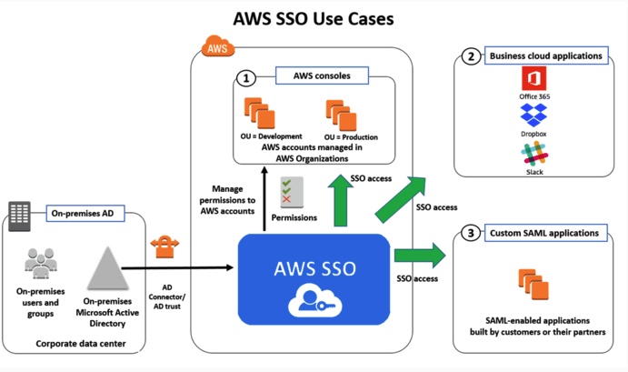
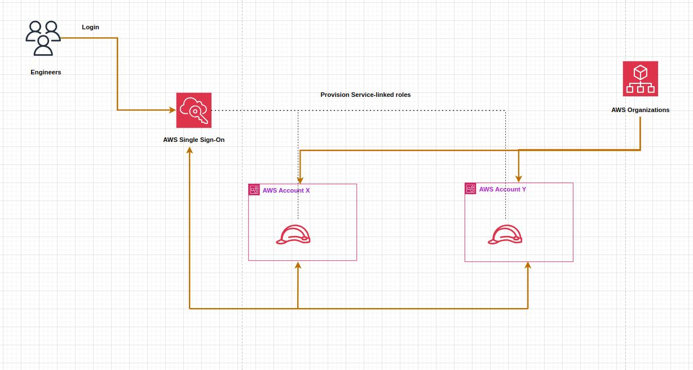
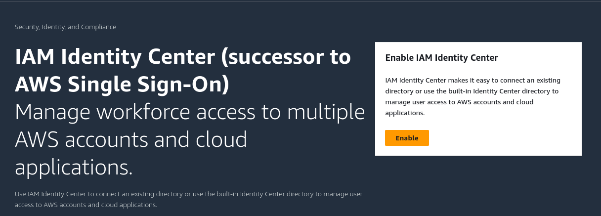
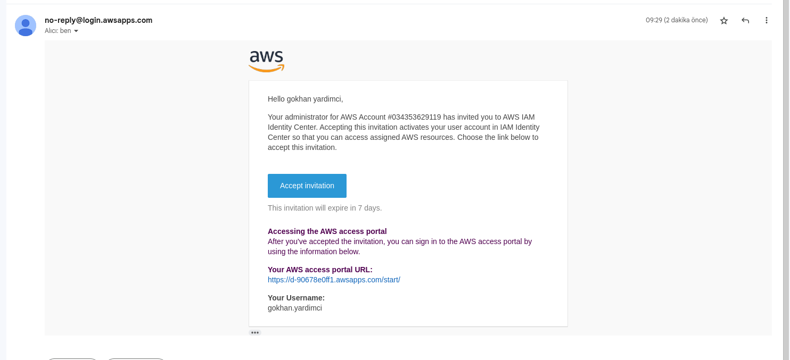
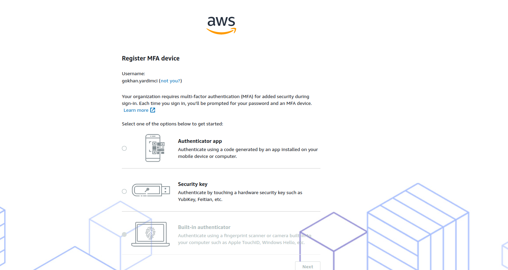
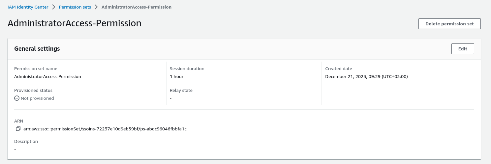
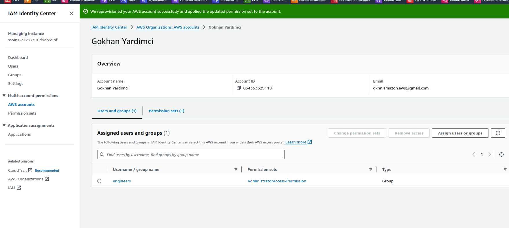
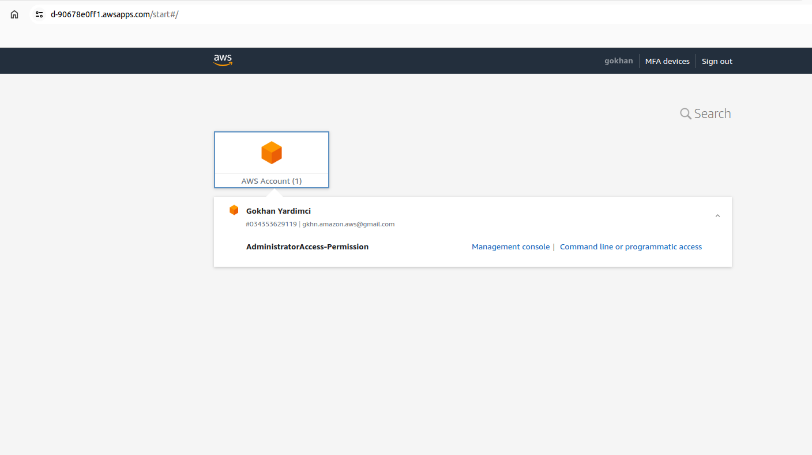

#### AWS IAM Identity Center (successor to AWS Single Sign-On), What is SSO?

IAM Identity Center (successor to AWS Single Sign-On)

Single sign-on (SSO) is an authentication solution that allows users to log in to multiple applications and websites with one-time user authentication. Given that users today frequently access applications directly from their browsers, organizations are prioritizing access management strategies that improve both security and the user experience. SSO delivers both aspects, as users can access all password-protected resources without repeated logins once their identity is validated.

### Why is SSO important?

Using SSO to streamline user logins benefits users and organizations in several ways.

1. Strengthen password security 

When people don’t use SSO, they must remember multiple passwords for different websites. This might lead to non-recommended security practices, such as using simple or repetitive passwords for different accounts. Besides, users might forget or mistype their credentials when logging in to a service. SSO prevents password fatigue and encourages users to create a strong password that can be used for multiple websites.

2. Improve productivity 

Employees often use more than one enterprise application that requires separate authentication. Manually entering the username and password for every application is time-consuming and unproductive. SSO streamlines the user validation process for enterprise applications and makes it easier to access protected resources.

3. Reduce costs 

In their attempt to remember numerous passwords, enterprise users may forget their login credentials. This results in frequent requests to retrieve or reset their passwords, which increases workload for the in-house IT teams. Implementing SSO reduces occurrences of forgotten passwords and thus minimizes the support resources in handling requests for password resets.

4. Improve security posture
 
By minimizing the number of passwords per user, SSO facilitates user access auditing and provides robust access control to all types of data. This reduces the risk of security events that target passwords, while helping organizations comply with data security regulations.

5. Provide a better customer experience 

Cloud application vendors use SSO to provide end-users with a seamless login experience and credential management. Users manage fewer passwords and can still securely access the information and apps they need to complete their day-to-day jobs.

#### Is SSO secure?
Yes, SSO is an advanced and desirable identity access management solution. When deployed, a single sign-on solution helps organizations with user access management for enterprise applications and resources. An SSO solution makes setting and remembering strong passwords easier for application users. In addition, the IT team can use the SSO tool to monitor user behavior, improve system resilience, and reduce security risks. 

#### How can AWS help with SSO?

AWS IAM Identity Center is a cloud authentication solution that allows organizations to securely create or connect their workforce identities and manage their access centrally across AWS accounts and applications. You can create user identities or import them from external identity providers such as Okta Universal Directory or Azure. Some benefits of AWS IAM Identity Center include:

1. A central dashboard to manage identities for your AWS account or business applications.

2. Multi-factor authentication support to provide a highly secure authentication experience for users. 

3. Integration support with other AWS applications for zero-configuration authentication and authorization.

#### SSO Setup AWS Console

1. In order to use SSO, you must first enable the AWS Single Sign-On service. AWS Organizations supports IAM Identity Center (Single Sign-On) in only one AWS Region at a time. AWS Single Sign-On service works as a single service only in one region. Once activated, accounts in AWS Organization appear in the SSO service and each account in the organization creates an SSO role. Every account that is included or leave in the organization automatically update on SSO.

 

2. By creating users and groups within the SSO service, access can be given to all accounts within the organization or to a specific account. An e-mail is sent to the people whose users have been created, and the users are verified via e-mail and directed to the relevant link.

 

3. After completing the password process, MFA authenticator must be installed and logged in with SSO.

4. Then, permission is set and the user or group is given authority on the account. For example, AdministratorAccess, Billing etc. Additionally, this permission can be limited to session duration, such as 1 hour, 2 hours.

5. Access permission for the desired account is attached to the user or group with the permission set by going to the AWS accounts section within the SSO service. Now, the desired authority has been given to the desired user or group to access the desired account.

6. Access is provided via the link on SSO or the invitation email sent to users. The authorized account within the organization is entered. While performing the redirection process, it allows both through the AWS manenmagent console and provides transaction permissions through the AWS CLI. It presents the relevant credentials for AWS CLI to the user during access.

7. For accounts to which access is not desired, no user or permission assignment should be made.

### References

[What is SSO (Single-Sign-On)?](https://aws.amazon.com/what-is/sso/)
