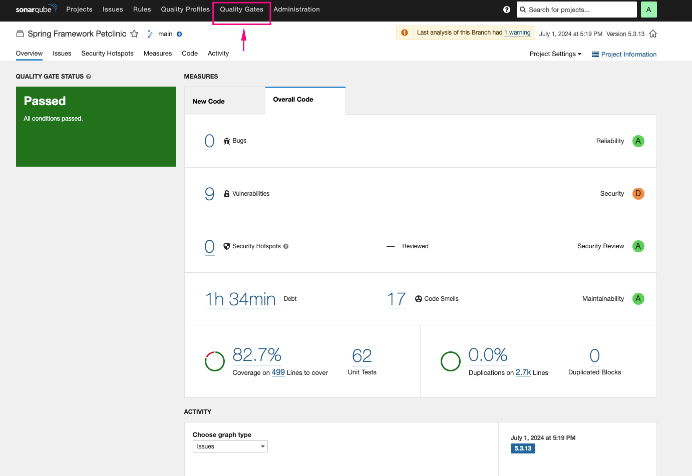

# DevSecOps End to End Pipeline with SonarQube,OWASP Dependency-Check,Conftest and Trivy

Since DevOps entered our lives, it has been loved and widely adopted, and it seems it will continue to spread rapidly. While automating and speeding up delivery processes with DevOps, we cannot overlook the security aspect, which brings the DevSecOps methodology into focus. In this article, I discussed examples of how to fully implement DevSecOps in CI by checking code quality with SonarQube, scanning code dependencies with OWASP Dependency-Check, validating your Kubernetes, Terraform, and Dockerfile files with Conftest, and scanning Docker images with Trivy. Enjoy your learning!

## SonarQube

### What is Vulnerability ?
Vulnerabilities are basically the security weaknesses that one might use to undermine the availability, integrity, or security of information systems. Software, hardware, networks, or even human activities are among the several parts of a system that could have these flaws. A vulnerability could be as basic as a setting gone wrong or as sophisticated as a zero-day attack.

### What is Sonarqube ?
SonarQube, previously named Sonar, is an open-source platform created by SonarSource. Its purpose is to consistently examine and evaluate the quality of code, identify security vulnerabilities, and assess technical debt across different programming languages. SonarQube delivers a single dashboard that provides real-time information into the health and security of software projects.

### How is SonarQube Used?
SonarQube functions by looking at source code and finding possible problems and vulnerabilities. It uses static analysis, code smell recognition, and security vulnerability scanning all together to give complete results. SonarQube can be added to developers' work processes to help them find problems early in the development process.
SonarQube works with many computer languages, such as Python, JavaScript, TypeScript, C#, and more. It has add-ons and plugins for well-known Integrated Development Environments (IDEs) like Eclipse, IntelliJ IDEA, and Visual Studio. This lets writers get feedback and suggestions while they're writing code.

### Key Features of SonarQube
- Code Quality Analysis
- Security Vulnerability Detection
- Technical Debt Management
- Continuous Integration/Continuous Deployment (CI/CD) Integration
- Customizable Rules and Quality Profiles

## OWASP Dependency-Check

### What is OWASP Dependency-Check?
Dependency-Check is a Software Composition Analysis (SCA) tool that attempts to detect publicly disclosed vulnerabilities contained within a project’s dependencies. It does this by determining if there is a Common Platform Enumeration (CPE) identifier for a given dependency. If found, it will generate a report linking to the associated CVE entries.
Dependency-check has a command line interface, a Maven plugin, an Ant task, and a Jenkins plugin. The core engine contains a series of analyzers that inspect the project dependencies, collect pieces of information about the dependencies (referred to as evidence within the tool). The evidence is then used to identify the Common Platform Enumeration (CPE) for the given dependency. If a CPE is identified, a listing of associated Common Vulnerability and Exposure (CVE) entries are listed in a report. Other 3rd party services and data sources such as the NPM Audit API, the OSS Index, RetireJS, and Bundler Audit are utilized for specific technologies.Dependency-check automatically updates itself using the NVD Data Feeds hosted by NIST.

## Conftest

## What is Conftest?
Conftest leverages the Open Policy Agent (OPA) to evaluate policies written in Rego language against configuration files. It's commonly used for:
- Kubernetes configurations: Ensuring that Kubernetes manifests meet security and compliance requirements.
- Terraform files: Validating that Terraform plans and configurations adhere to organizational policies.
- Dockerfiles: Checking that Docker images are built securely and according to best practices.

## What is Trivy?
Trivy is a vulnerability scanner that is open-source and has been specifically developed for containers. This program is efficient and user-friendly, helping in the detection of vulnerabilities in container images and filesystems. Trivy's primary objective is to conduct scans on container images to identify any known vulnerabilities present in the installed packages and libraries.

### Some key features of Trivy include:
- Comprehensive vulnerability database
- Fast and efficient scanning
- Easy integration
- Multiple output formats
- Continuous updates

Let's include the devsecops tools we briefly mentioned above into the pipeline and do some hands-on. Let's get started.

## Step-1 Launch EC2 Instance
Launch an AWS t2-large Instance. Use the image as Amazon Linux. You can create a new key pair or use an existing one. 
- Enable 80, 443, 8080 and 9000 port settings in the Security Group.
- You can add the userdata below for jenkins,docker,trivy installation.

```bash
#! /bin/bash
# update os
dnf update -y
# set server hostname as jenkins-server
hostnamectl set-hostname jenkins-server
# install git
dnf install git -y
# install java 17
dnf install java-17-amazon-corretto-devel -y
# install jenkins
wget -O /etc/yum.repos.d/jenkins.repo https://pkg.jenkins.io/redhat-stable/jenkins.repo
rpm --import https://pkg.jenkins.io/redhat-stable/jenkins.io-2023.key
dnf upgrade
dnf install jenkins -y
systemctl enable jenkins
systemctl start jenkins
# install docker
dnf install docker -y
systemctl start docker
systemctl enable docker
usermod -a -G docker ec2-user
usermod -a -G docker jenkins
# configure docker as cloud agent for jenkins
cp /lib/systemd/system/docker.service /lib/systemd/system/docker.service.bak
sed -i 's/^ExecStart=.*/ExecStart=\/usr\/bin\/dockerd -H tcp:\/\/127.0.0.1:2376 -H unix:\/\/\/var\/run\/docker.sock/g' /lib/systemd/system/docker.service
systemctl daemon-reload
systemctl restart jenkins
# install trivy
rpm -ivh https://github.com/aquasecurity/trivy/releases/download/v0.31.3/trivy_0.31.3_Linux-64bit.rpm
```

## Step-2 Configure Jenkins-Server

- After instance state running, we can configure the jenkins server.Now, grab your Public IP Address

```bash
<EC2 Public IP Address:8080>
sudo cat /var/lib/jenkins/secrets/initialAdminPassword
```

- Unlock Jenkins using an administrative password and install the required plugins.


- Jenkins will now get installed and install all the libraries.


## Step-3 Install Sonarqube as a docker container

- Go to Instance terminal and enter below code to install sonarqube

```bash
docker run -d --name sonar -p 9000:9000 sonarqube:lts-community
```

```bash
<EC2 Public IP Address:9000>
username: admin
password: admin
```


## Step-4 Install Plugins

- Go to Jenkins WebUI Manage Jenkins --> Plugins --> Available Plugins Install below plugins

1-Eclipse Temurin Installer:  It allows you to automatically download and install different versions of the Temurin JDK on your Jenkins agents. This is useful for ensuring that your builds run with the correct version of Java without needing to manually manage JDK installations.

2-SonarQube Scanner: You can configure Jenkins jobs to run SonarQube scans as part of your build process. The plugin sends the code analysis results to a SonarQube server, where you can view detailed reports and track quality metrics over time.

3-OWASP Dependency-Check: You can use this plugin to scan your project dependencies for vulnerabilities as part of your Jenkins build process. The results include detailed reports on any vulnerabilities found, helping you to mitigate security risks by updating or replacing affected dependencies.

4-Blue Ocean: With Blue Ocean, you can create, edit, and visualize pipelines using a graphical interface. It also provides enhanced visualization of pipeline stages and steps, making it easier to track the progress and status of builds and deployments.


## Step-5 Configure Java, Maven in Global Tool Configuration

- Go to Jenkins WebUI Manage Jenkins --> Tools --> Install JDK, Maven and SonarQube Scanner -->Click on Apply and Save


## Step-5 Configure Sonarqube in Manage Jenkins

```bash
<EC2 Public IP Address:9000>
```
- Go to your Sonarqube Server. Click on Administration → Security → Users → Click on Tokens and Update Token → Give it a name → and click on Generate Token


- Copy this Token
- Go to Jenkins WebUI --> Manage Jenkins → Credentials → Add Secret Text.


- Go to Jenkins Dashboard → Manage Jenkins → Configure System
- Give a name whatever you want
- Add Sonarqube url
- Select sonarqube credential token


## Step-6 WebHook Configuration on Sonarqube

- Go to SonarQube WebUI --> Administration –> Configuration –> webhooks


## Step-7 Create a pipeline

- Go to Jenkins WebUI -->New item-->Pipeline


- Add below jenkins code to pipeline section


```bash
pipeline {
    agent any
    tools {
        jdk 'jdk'
        maven 'maven'
    }
    stages {
        stage("Git Checkout") {
            steps {
                git branch: 'main', changelog: false, poll: false, url: 'https://github.com/ersinsari13/devsecops.git'
            }
        }
        stage("Compile") {
            steps {
                sh "mvn clean compile"
            }
        }
        stage("Test Cases") {
            steps {
                sh "mvn test"
            }
        }
        stage("Sonarqube Analysis") {
            steps {
                withSonarQubeEnv('sonar-server') {
                    sh ''' 
                        mvn clean verify sonar:sonar \
                        -Dsonar.projectKey=Petclinic
                    '''
                }
            }
        }
        stage("Quality Gate") {
            steps {
                timeout(time: 2, unit: 'MINUTES') {
                    script {
                        waitForQualityGate abortPipeline: true
                    }
                }
            }
        }
        stage("Build") {
            steps {
                sh "mvn clean install"
            }
        }
        stage('OWASP-Dependency-Check') {
            steps {
                sh "mvn dependency-check:check"
            }
            post {
                always {
                    dependencyCheckPublisher pattern: 'target/dependency-check-report.xml'
                }
            }
        }
        
        stage('Scan Dockerfile with conftest') {
            steps {
                echo 'Scanning Dockerfile'
                sh "docker run --rm -v $(pwd):/project openpolicyagent/conftest test --policy dockerfile-conftest.rego Dockerfile"
            }
        }
        
        stage('Prepare Tags for Docker Images') {
            steps {
                echo 'Preparing Tags for Docker Images'
                script {
                    MVN_VERSION=sh(script:'. ${WORKSPACE}/target/maven-archiver/pom.properties && echo $version', returnStdout:true).trim()
                    env.IMAGE_TAG_DEVSECOPS="ersinsari/devsecops:${MVN_VERSION}-b${BUILD_NUMBER}"
                }
            }
        }
        stage('Build App Docker Images') {
            steps {
                echo 'Building App Dev Images'
                sh "docker build --force-rm -t ${IMAGE_TAG_DEVSECOPS} ."
                sh 'docker image ls'
            }
        }
        stage('Scan Image with Trivy') {
            steps {
                script {
                    def scanResult = sh(script: "trivy image --severity CRITICAL --exit-code 1 ${IMAGE_TAG_DEVSECOPS}", returnStatus: true)
                    if (scanResult != 0) {
                        error "Critical vulnerabilities found in Docker image. Failing the pipeline."
                    }
                }
            }
        }
    }
}
```
- Tools: Specifies the tools needed for the pipeline, in this case, JDK and Maven.

- Git Checkout: Check out the code from the specified Git repository.

- Compile: Runs Maven commands to clean the workspace and compile the code.

- Test Cases: Executes the Maven test phase to run the unit tests.

- SonarQube Analysis: Analyze the code quality using SonarQube.

- Quality Gate: Check the SonarQube quality gate status and abort the pipeline if it fails.

- Build: Runs Maven commands to clean the workspace and install the build artifacts.

- OWASP-Dependency-Check: Perform a security vulnerability check on project dependencies.

- Scan Dockerfile with conftest: Runs Conftest in a Docker container to test the Dockerfile against the specified policy.

- Prepare Tags for Docker Images: Extracts the Maven version from the build and sets the environment variable IMAGE_TAG_DEVSECOPS with the image tag.

- Build App Docker Images: Build the Docker image for the application.

- Scan Image with Trivy: Scans the Docker image for critical vulnerabilities and fails the pipeline if any are found.

- Click Build Now and Open Blue Ocean


- After the pipeline runs, you should receive a failure at the "Scan Dockerfile with conftest" step; this is a normal occurrence.


- The reason for this is that if you check the GitHub repository we included in the pipeline, you will see a file named dockerfile-conftest.rego. Conftest performs the Dockerfile scan based on the conditions in this file. We received a failure because the Dockerfile we want to use does not meet the necessary requirements specified. We will correct this.

## Step-8 Sonarqube inspection and add Custom Quality Gate

- But first, let's discuss the pipeline output and then talk a bit about the SonarQube interface and quality gates.

- You can inspect your source code qality by clicking SonarQube section


- You can add custom Quality-Gates depends on your company rules

- SonarQube UI click Qualiyy Gates --> Create --> give name and save --> Unlock editing --> Add Condition --> On Overall Code




## Step-9 Dependency-Check inspection

- You can inspect your source code dependency-check score by clicking Dependency-Check section


## Step-10 Improving Dockerfile security

Now it's time to improve the Dockerfile security based on the Conftest results.


- Change your Dockerfile as below

```bash
FROM openjdk:8
EXPOSE 8082
RUN addgroup -S devops-security && adduser -u 999 -S devsecops -G devops-security
COPY target/petclinic.war petclinic.war
USER 999
ENTRYPOINT ["java","-jar","/home/devsecops/petclinic.war"]
```
After this change, you should be able to successfully pass the Dockerfile scanning stage with Conftest.


## Step-11 Docker Image Scan via Trivy

Lastly, the pipeline will fail at the image scanning stage with Trivy. If we look at the Jenkinsfile, it is designed to fail if a critical vulnerability is found during the image scan with Trivy. At this stage, the critical vulnerabilities in the image need to be resolved before proceeding. The pipeline output includes recommendations on how to resolve the vulnerabilities.


Once the image scan is successfully completed according to your requirements, the next step is to push the Docker image to the registry and then deploy your application. The key point here is to ensure maximum security before deploying the application, which is what we have aimed to achieve. Have a nice day.