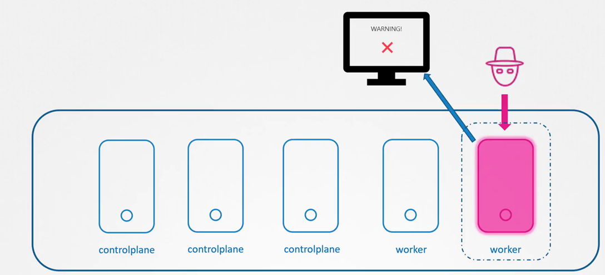
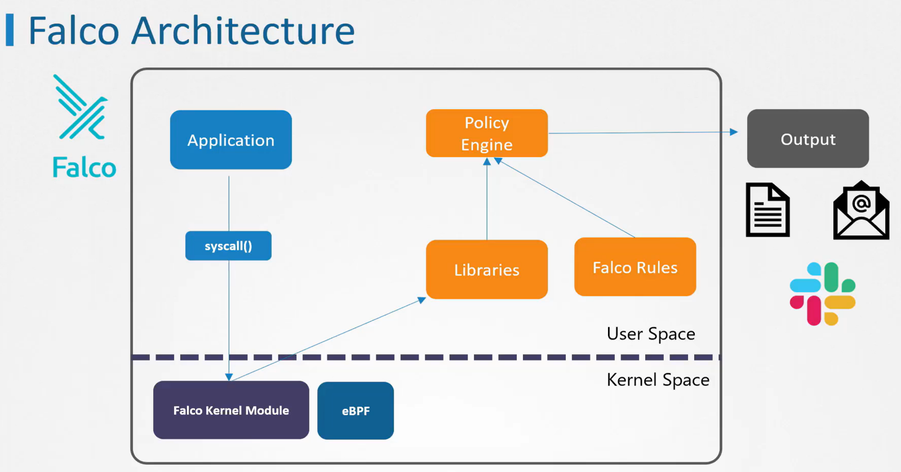

# Deep Dive into Security Monitoring in Kubernetes Environments: An Introduction to Falco

## Introduction

With the rise of container-based and cloud-native applications, security risks have become increasingly complex. **Falco**, an open-source tool developed by Sysdig and supported by CNCF (Cloud Native Computing Foundation), offers real-time security monitoring for Kubernetes and container environments. Falco monitors system calls to detect suspicious activities and notifies users immediately about these events. By using Falco, you can respond quickly to security breaches.

## What is Falco?

Falco monitors security in container environments by tracking system calls at the kernel level. It analyzes these system calls against defined rules to detect anomalies. For example, if an unauthorized bash session is opened within a container or an unexpected process is executed, Falco logs this and alerts the user.



### Key Use Cases

- Real-time security monitoring

- Preventing potential security breaches in containers

- Monitoring network activities and detecting suspicious connections

- Logging configuration changes made inside containers

## How Falco Works

Falco is a security monitoring solution that observes and analyzes system calls at the kernel level. Specifically, it tracks process activities in the system and compares them against predefined rules. These rules determine what is considered normal or abnormal based on security policies. Suspicious operations are then reported to users through specified channels.



Falco uses sysdig libraries to analyze system calls in the user space. These events are filtered through Falco's policy engine based on predefined rules. If an event is deemed suspicious, it is reported through various output channels, such as:

- Log files

- Standard output

- Alert mechanisms like Slack or email notifications

## Core Features of Falco

1. **Real-Time Monitoring**: Falco detects security events in real-time that require immediate attention.

2. **Customizable Rule Sets**: Falco offers default security rules, but users can add their own in the **falco_rules.local.yaml** file.

3. **Hierarchical Severity Levels**: Falco classifies detected events into different levels of importance. Below is a brief explanation of the log levels:

   - **emergency**: System is unusable. Used for very serious system errors.

   - **alert**: Immediate action required. Suitable for critical system failures or security breaches.

   - **critical**: Critical conditions. Used for errors that could cause system or application crashes.

   - **error**: Error conditions. Logs system or application errors.

   - **warning**: Warning conditions. Indicates potential issues.

   - **notice**: Normal but significant conditions. Highlights situations that aren't errors or warnings but still noteworthy.

   - **info**: Informational messages. Provides general information about system and application status (e.g., successful starts, configuration loads).

   - **debug**: Debug-level messages. Includes detailed information for troubleshooting and debugging (e.g., variable values, workflow steps).

    These log levels allow Falco users to track events based on their severity.

4. **Kernel-Level System Call Monitoring**: Tracks events at the kernel level, offering deep insights into container activities.

## Installing Falco

### Running Falco in a Kubernetes Environment

There are two main ways to deploy Falco in a Kubernetes environment:

1. **As a Standalone Service**: This method installs Falco as a system service independent of Kubernetes.

   [📄 Standalone Falco Installation Guide](https://falco.org/docs/setup/packages/)

2. **As a DaemonSet**: This option deploys Falco as a pod on each Kubernetes node.

   [📄 Installing Falco on Kubernetes](https://falco.org/docs/setup/kubernetes/)

After installation, Falco-related files can be found in the **/etc/falco** directory.

## Managing Rules in Falco

One of Falco's strongest features is its configurable rule system, allowing users to define custom rules. Default rules are stored in the **falco_rules.yaml** file, which is updated during upgrades. User-defined rules go into the **falco_rules.local.yaml** file, which is not affected by updates. This setup enables users to tailor Falco to their specific security needs.

### Example Rule: Unauthorized Bash Access

In this example, only `bash` processes running within a container environment are tracked. If a bash shell is opened, Falco detects this activity and generates an alert:

```yaml
- rule: Unauthorized Shell in Container
  desc: Detect when a bash shell is opened in a container
  condition: container.id != host and proc.name = bash
  output: "Unauthorized shell detected in container (command=%proc.cmdline container_name=%container.name)"
  priority: warning
  ```

#### Explanation of the Rule

- **condition**: The `container.id != host` condition ensures that the rule applies only in the container environment. This means the rule will not trigger when `bash` is executed on the host. The `proc.name = bash` part specifies that the process being monitored must be `bash`.

- **output**: This defines the alert message that will be triggered when the event occurs. In this example, the alert includes the container name and the executed command.

- **priority**: Defines the severity of the event, which is set to `warning` in this case.

#### Using References When Creating Rules

This rule was created using Falco's extensive rule-writing reference. To see all the fields supported by Falco and how to use them, you can consult the official documentation:

[📄 Falco Supported Fields for Conditions and Outputs](https://falco.org/docs/reference/rules/supported-fields/)

This page lists all the fields available for conditions and outputs. For instance, `proc.name` tracks the process name, while `container.id` identifies the container ID. When writing your own rules or customizing existing ones, this reference document helps you choose the correct fields and formats.

This approach makes rule writing both more accurate and comprehensive, allowing you to easily detect any anomalies in your system.

#### Using Lists in Falco

If you want to monitor other shell types besides `bash`, you can specify them in a **list**. For instance, to track `bash`, `sh`, and `zsh`, you can write a rule like this:

```yaml
- list: linux_shells
  items: [bash, sh, zsh]

- rule: Detect Shell inside a Container
  desc: Alert if a shell such as bash is open inside the container
  condition: container.id != host and proc.name in (linux_shells)
  output: "Shell Opened (user=%user.name container=%container.id)"
  priority: WARNING
```

By doing so, different types of shell processes in the container environment can be monitored, addressing potential security risks more comprehensively.

#### Advantages of Using Lists

- **Readability**: Instead of writing long conditions to check multiple values, a list provides a cleaner structure.

- **Reusability**: The same list can be reused across multiple rules, simplifying management.

- **Ease of Updates**: Adding or modifying items only requires changes to the list.

This structure is particularly useful for monitoring different types of shell processes or other similar events.

#### Defining Rules with Macros

In Falco, you can use **macros** to define frequently used conditions. Macros can be reused within rules, making the rules more readable and easier to manage.

```yaml
- macro: unauthorized_shells
  condition: proc.name in (bash, sh, zsh)

- rule: Unauthorized Shell in Container
  desc: Detect unauthorized shell in a container
  condition: container.id != host and unauthorized_shells
  output: "Unauthorized shell detected in container (command=%proc.cmdline container_name=%container.name)"
  priority: warning
```

#### Advantages of Using Macros

- **Reduced Code Duplication**: Macros allow you to define a condition once and reuse it across multiple rules, reducing repetition.

- **Improved Readability**: Using macros makes rules more understandable and easier to manage.

These features make Falco’s security monitoring rules more flexible and manageable in container environments.

## Log Management in Falco

Falco offers flexibility in storing and managing logs in various formats and destinations. Below, you will find several configuration options and how to use them.

### 1. Saving Falco Logs to a File

To save Falco logs to a specific file, update the **/etc/falco/falco.yaml** file with the following settings:

```yaml
file_output:
  enabled: true
  keep_alive: true
  filename: ./falco_events.txt
```

- **enabled**: When set to `true`, file output is enabled, and logs are written to the specified file.

- **keep_alive**:
  - `true`: Keeps the file open for continuous writing, which can improve performance since the file doesn’t reopen for each event.
  - `false`: Opens, writes, and closes the file for each event.

- **filename**: Specifies the path where logs will be saved. In this example, logs will be saved to `/var/log/falco_events.txt`.

### 2. Saving Falco Logs in JSON Format

To save Falco events in JSON format, use the following configuration:

```yaml
json_output:
  enabled: true
```

By default, this setting is `enabled:false`, which saves logs in text format. To enable JSON logging, set the value to `enabled:true`.

### 3. Program Output for Notifications

To process logs through a program or send notifications, use the following configuration:

```yaml
program_output:
  enabled: true
  program: mail -s "Falco Alert" admin@example.com
```

- **program**: Falco sends detected events through this program. In this example, events are sent as an email.

### 4. Setting the Log Level

You can define the minimum log level that Falco will record using `log_level`:

```yaml
log_level: info
```

Events with a severity level of `info` and above will be recorded.

- **Log level descriptions**:

  - `debug`: Records all log levels.

  - `info`: Provides general information about system status.

  - `warning`, `error`, `critical`, `alert`, and `emergency`: Indicate progressively higher levels of severity.

### 5. Rule File Loading Order

Falco loads rule files in the order specified in the configuration. **Order matters**, because:

- If a rule defined in the **falco_rules.yaml** file is redefined in the **falco_rules.local.yaml** file, the rule in **falco_rules.local.yaml** will take precedence.

- This approach allows users to customize and override default rules.

#### Example falco.yaml Configuration

```yaml
rules_file:
  - /etc/falco/falco_rules.yaml
  - /etc/falco/falco_rules.local.yaml
```

This configuration indicates that the default rules will be loaded first, followed by user-customized rules.

In summary, the rule defined in the last file will always take precedence (overwrite).

#### Important Note:

After modifying Falco's configuration file, you need to restart the Falco service for the changes to take effect:

```bash
systemctl restart falco
```

## Conclusion

Falco is a powerful and flexible tool for security monitoring in Kubernetes and container environments. With its easily customizable rule system and real-time monitoring capabilities, it helps you identify security vulnerabilities efficiently. If you’re looking to enhance the security of your Kubernetes infrastructure, Falco is definitely worth considering.

## References

This document was prepared using the following resources:

- [Official Falco Documentation](https://falco.org/docs/)
- [Certified Kubernetes Security Specialist (CKS) Course - KodeKloud](https://learn.kodekloud.com/user/courses/certified-kubernetes-security-specialist-cks)

