# External Secret Operator

In the dynamic landscape of modern application development, managing secrets securely is crucial, especially within Kubernetes environments. Secrets such as API keys, passwords, and certificates are vital for the functionality and security of applications, but they also pose significant risks if not handled correctly. Kubernetes provides built-in mechanisms for secret management, but as applications grow in complexity, so does the challenge of managing these secrets effectively. This is where the External Secret Operator comes into play. By integrating with external secret management systems, the External Secret Operator enhances Kubernetes' native capabilities, allowing for seamless and secure management of sensitive data. In this blog, we'll explore why secrets are so critical in Kubernetes and how the External Secret Operator can streamline and fortify your secret management strategy.

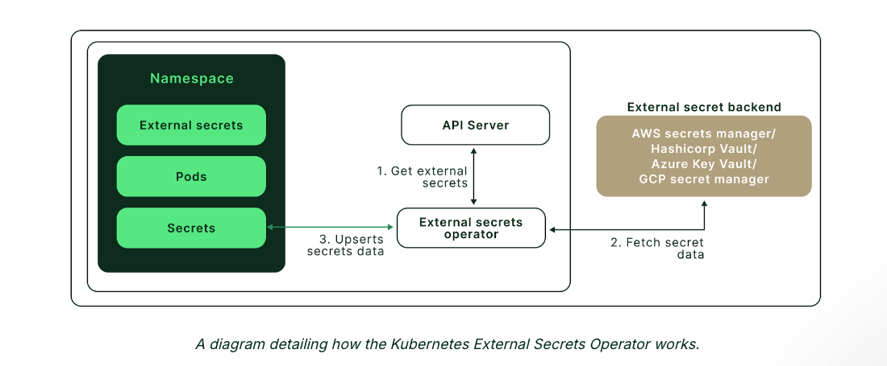

External Secrets Operator is a Kubernetes operator that integrates external secret management systems like AWS Secrets Manager, HashiCorp Vault, Google Secrets Manager, Azure Key Vault, IBM Cloud Secrets Manager, CyberArk Conjur and many more. The operator reads information from external APIs and automatically injects the values into a Kubernetes Secret.

## SecretStore

The SecretStore is namespaced and specifies how to access the external API. The SecretStore maps to exactly one instance of an external API.
By design, SecretStores are bound to a namespace and can not reference resources across namespaces. If you want to design cross-namespace SecretStores you must use ClusterSecretStores which do not have this limitation.

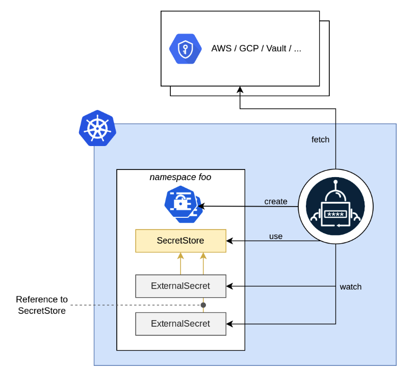

For a full list of supported fields see spec 

````bash
apiVersion: external-secrets.io/v1beta1
kind: SecretStore
metadata:
  name: example
  namespace: example-ns
spec:

  # Used to select the correct ESO controller (think: ingress.ingressClassName)
  # The ESO controller is instantiated with a specific controller name
  # and filters ES based on this property
  # Optional
  controller: dev

  # You can specify retry settings for the http connection
  # these fields allow you to set a maxRetries before failure, and
  # an interval between the retries.
  # Current supported providers: AWS, Hashicorp Vault, IBM
  retrySettings:
    maxRetries: 5
    retryInterval: "10s"

  # provider field contains the configuration to access the provider
  # which contains the secret exactly one provider must be configured.
  provider:

    # (1): AWS Secrets Manager
    # aws configures this store to sync secrets using AWS Secret Manager provider
    aws:
      service: SecretsManager
      # Role is a Role ARN which the SecretManager provider will assume
      role: iam-role
      # AWS Region to be used for the provider
      region: eu-central-1
      # Auth defines the information necessary to authenticate against AWS by
      # getting the accessKeyID and secretAccessKey from an already created Kubernetes Secret
      auth:
        secretRef:
          accessKeyIDSecretRef:
            name: awssm-secret
            key: access-key
          secretAccessKeySecretRef:
            name: awssm-secret
            key: secret-access-key

    # (2) Hashicorp Vault
    vault:
      server: "https://vault.acme.org"
      # Path is the mount path of the Vault KV backend endpoint
      # Used as a path prefix for the external secret key
      path: "secret"
      # Version is the Vault KV secret engine version.
      # This can be either "v1" or "v2", defaults to "v2"
      version: "v2"
      # vault enterprise namespace: https://www.vaultproject.io/docs/enterprise/namespaces
      namespace: "a-team"
      # base64 encoded string of certificate
      caBundle: "..."
      # Instead of caBundle you can also specify a caProvider
      # this will retrieve the cert from a Secret or ConfigMap
      caProvider:
        # Can be Secret or ConfigMap
        type: "Secret"
        name: "my-cert-secret"
        key: "cert-key"
      # client side related TLS communication, when the Vault server requires mutual authentication
      tls:
        clientCert:
          namespace: ...
          name: "my-cert-secret"
          key: "tls.crt"
        secretRef:
          namespace: ...
          name: "my-cert-secret"
          key: "tls.key"

      auth:
        # static token: https://www.vaultproject.io/docs/auth/token
        tokenSecretRef:
          name: "my-secret"
          key: "vault-token"

        # AppRole auth: https://www.vaultproject.io/docs/auth/approle
        appRole:
          path: "approle"
          roleId: "db02de05-fa39-4855-059b-67221c5c2f63"
          secretRef:
            name: "my-secret"
            key: "vault-token"

        # Kubernetes auth: https://www.vaultproject.io/docs/auth/kubernetes
        kubernetes:
          mountPath: "kubernetes"
          role: "demo"
          # Optional service account reference
          serviceAccountRef:
            name: "my-sa"
          # Optional secret field containing a Kubernetes ServiceAccount JWT
          # used for authenticating with Vault
          secretRef:
            name: "my-secret"
            key: "vault"

        # TLS certificates auth method: https://developer.hashicorp.com/vault/docs/auth/cert
        cert:
          clientCert:
            namespace: ...
            name: "my-cert-secret"
            key: "tls.crt"
          secretRef:
            namespace: ...
            name: "my-cert-secret"
            key: "tls.key"

    # (3): GCP Secret Manager
    gcpsm:
      # Auth defines the information necessary to authenticate against GCP by getting
      # the credentials from an already created Kubernetes Secret.
      auth:
        secretRef:
          secretAccessKeySecretRef:
            name: gcpsm-secret
            key: secret-access-credentials
      projectID: myproject
    # (TODO): add more provider examples here

status:
  # Standard condition schema
  conditions:
  # SecretStore ready condition indicates the given store is in ready
  # state and able to referenced by ExternalSecrets
  # If the `status` of this condition is `False`, ExternalSecret controllers
  # should prevent attempts to fetch secrets
  - type: Ready
    status: "False"
    reason: "ConfigError"
    message: "SecretStore validation failed"
    lastTransitionTime: "2019-08-12T12:33:02Z"
````
## External Secret

The ExternalSecret describes what data should be fetched, how the data should be transformed and saved as a Kind=Secret:

- tells the operator what secrets should be synced by using spec.data to explicitly sync individual keys or use spec.dataFrom to get all values from the external API.
- you can specify how the secret should look like by specifying a spec.target.template

Take a look at an annotated example to understand the design behind the ExternalSecret

````bash
apiVersion: external-secrets.io/v1beta1
kind: ExternalSecret
metadata:
  name: "hello-world"

  # labels and annotations are copied over to the
  # secret that will be created
  labels:
    acme.org/owned-by: "q-team"
  annotations:
    acme.org/sha: 1234

spec:

  # Optional, SecretStoreRef defines the default SecretStore to use when fetching the secret data.
  secretStoreRef:
    name: aws-store
    kind: SecretStore  # or ClusterSecretStore

  # RefreshInterval is the amount of time before the values reading again from the SecretStore provider
  # Valid time units are "ns", "us" (or "µs"), "ms", "s", "m", "h" (from time.ParseDuration)
  # May be set to zero to fetch and create it once
  refreshInterval: "1h"

  # the target describes the secret that shall be created
  # there can only be one target per ExternalSecret
  target:

    # The secret name of the resource
    # Defaults to .metadata.name of the ExternalSecret
    # It is immutable
    name: application-config

    # Specifies the ExternalSecret ownership details in the created Secret. Options:
    # - Owner: (default) Creates the Secret and sets .metadata.ownerReferences. If the ExternalSecret is deleted, the Secret will also be deleted.
    # - Merge: Does not create the Secret but merges data fields into the existing Secret (expects the Secret to already exist).
    # - Orphan: Creates the Secret but does not set .metadata.ownerReferences. If the Secret already exists, it will be updated.
    # - None: Does not create or update the Secret (reserved for future use with injector).
    creationPolicy: Merge

    # Specifies what happens to the Secret when data fields are deleted from the provider (e.g., Vault, AWS Parameter Store). Options:
    # - Retain: (default) Retains the Secret if all Secret data fields have been deleted from the provider.
    # - Delete: Removes the Secret if all Secret data fields from the provider are deleted.
    # - Merge: Removes keys from the Secret but not the Secret itself.
    deletionPolicy: Retain

    # Specify a blueprint for the resulting Kind=Secret
    template:
      type: kubernetes.io/dockerconfigjson # or TLS...

      metadata:
        annotations: {}
        labels: {}

      # Use inline templates to construct your desired config file that contains your secret
      data:
        config.yml: |
          database:
            connection: postgres://{{ .username }}:{{ .password }}@{{ .database_host }}:5432/payments

      # Uses an existing template from configmap
      # Secret is fetched, merged and templated within the referenced configMap data
      # It does not update the configmap, it creates a secret with: data["alertmanager.yml"] = ...result...
      templateFrom:
      - configMap:
          name: application-config-tmpl
          items:
          - key: config.yml

  # Data defines the connection between the Kubernetes Secret keys and the Provider data
  data:
    - secretKey: username
      remoteRef:
        key: database-credentials
        version: v1
        property: username
        decodingStrategy: None # can be None, Base64, Base64URL or Auto

      # define the source of the secret. Can be a SecretStore or a Generator kind
      sourceRef:
        # point to a SecretStore that should be used to fetch a secret.
        # must be defined if no spec.secretStoreRef is defined.
        storeRef:
          name: aws-secretstore
          kind: ClusterSecretStore

  # Used to fetch all properties from the Provider key
  # If multiple dataFrom are specified, secrets are merged in the specified order
  # Can be defined using sourceRef.generatorRef or extract / find
  # Both use cases are exemplified below
  dataFrom:
  - sourceRef:
      generatorRef:
        apiVersion: generators.external-secrets.io/v1alpha1
        kind: ECRAuthorizationToken
        name: "my-ecr"
  #Or
  dataFrom:
  - extract:
      key: database-credentials
      version: v1
      property: data
      conversionStrategy: Default
      decodingStrategy: Auto
    rewrite:
    - regexp:
        source: "exp-(.*?)-ression"
        target: "rewriting-${1}-with-groups"
  - find:
      path: path-to-filter
      name:
        regexp: ".*foobar.*"
      tags:
        foo: bar
      conversionStrategy: Unicode
      decodingStrategy: Base64
    rewrite:
    - regexp:
        source: "foo"
        target: "bar"

status:
  # refreshTime is the time and date the external secret was fetched and
  # the target secret updated
  refreshTime: "2019-08-12T12:33:02Z"
  # Standard condition schema
  conditions:
  # ExternalSecret ready condition indicates the secret is ready for use.
  # This is defined as:
  # - The target secret exists
  # - The target secret has been refreshed within the last refreshInterval
  # - The target secret content is up-to-date based on any target templates
  - type: Ready
    status: "True" # False if last refresh was not successful
    reason: "SecretSynced"
    message: "Secret was synced"
    lastTransitionTime: "2019-08-12T12:33:02Z"
````

## Hands-On

Here’s the step-by-step guide to using an external secret manager in a local Minikube cluster with AWS Secret Manager

### Set Up Minikube

````bash
minikube start
````

### Install External Secrets Operator

- Add the Helm chart repository for the external secrets operator

````bash
helm repo add external-secrets https://charts.external-secrets.io
helm repo update
````

-  Install the External Secrets Operator using Helm

````bash
helm install external-secrets \
   external-secrets/external-secrets \
    -n external-secrets \
    --create-namespace
````

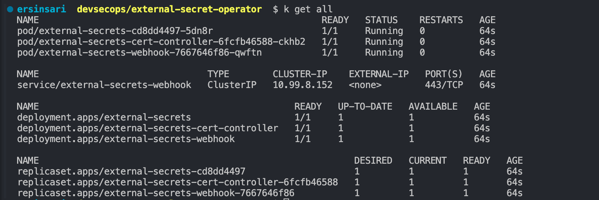

### Create secret in AWS Secrets Manager

- Go to the AWS Management Console
- In the AWS Management Console, search for and select Secrets Manager
- On the Secrets Manager dashboard, click the "Store a new secret" button.
- You can store a variety of secrets, such as database credentials, API keys, or custom key-value pairs.
- Select Other type of secret.
- Input the keys and values you want to store. DB_PASSWORD=mypassword DB_USER=ersin
- Secret name=DB-CREDENTIAL
- Leave all settings as default and save.

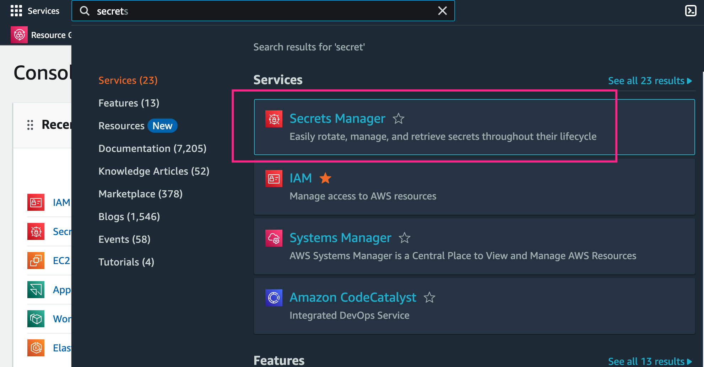

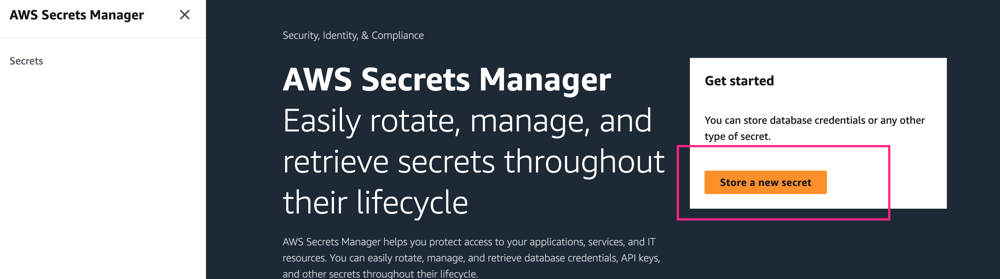

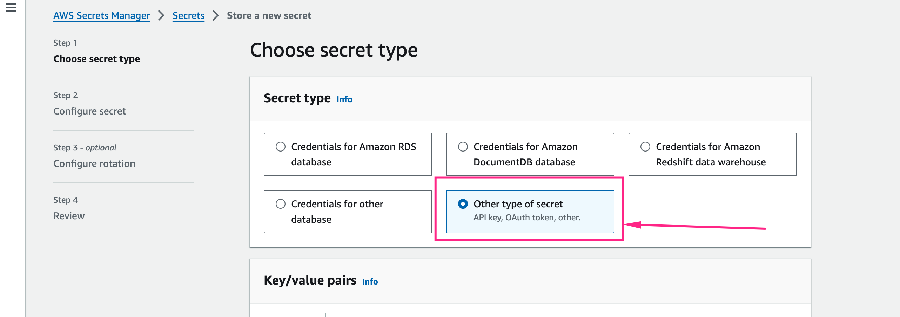

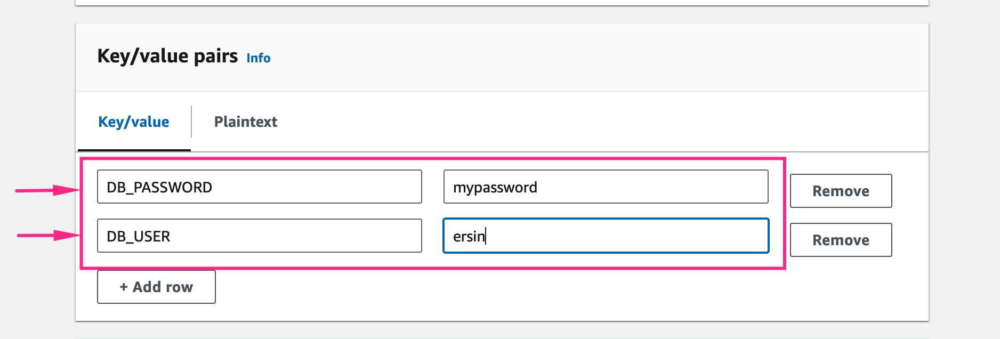

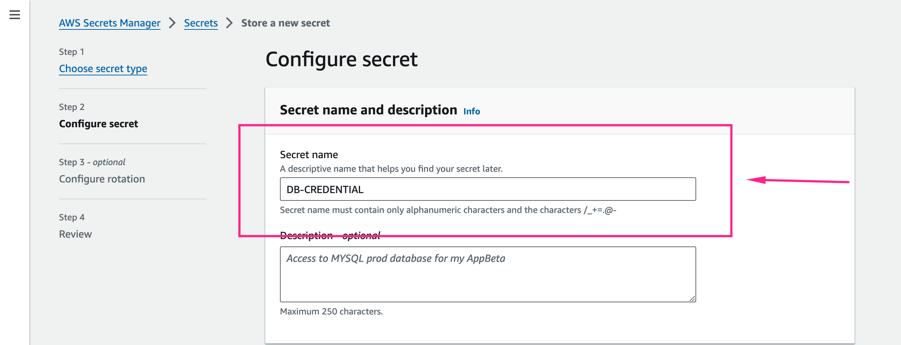

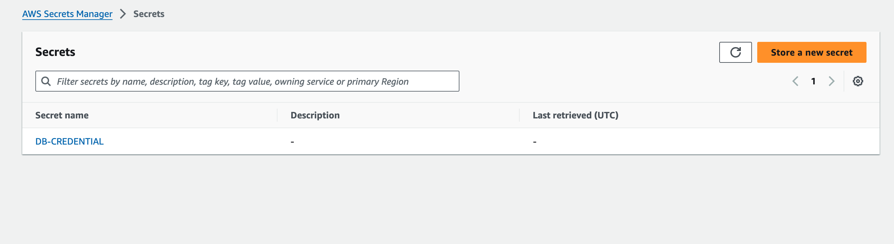


### Create a user in AWS

- Navigate to IAM (Identity and Access Management)
- In the IAM dashboard, click on Users in the left-hand menu
- Click the Add user button.
- Enter a unique username for the new user
- Select Programmatic access.
- Set User Permissions via below policy.


````bash
{
    "Version": "2012-10-17",
    "Statement": [
        {
            "Effect": "Allow",
            "Action": [
                "secretsmanager:GetSecretValue",
                "secretsmanager:DescribeSecret",
                "secretsmanager:ListSecrets"
            ],
            "Resource": "<ENTER-SECRET-MANAGER-ARN>"
        }
    ]
}
````
- Review the user details and permissions
- Click Create user to finish.
- On the confirmation page, you’ll see the user's access key ID and secret access key.
-  Download the credentials or save them securely, as you won’t be able to retrieve the secret access key again.

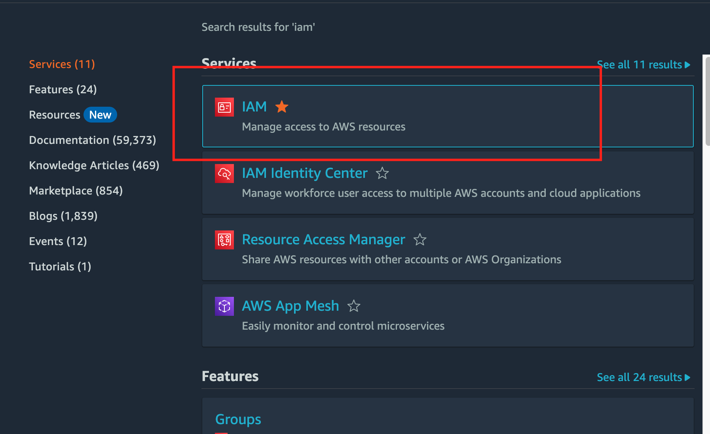

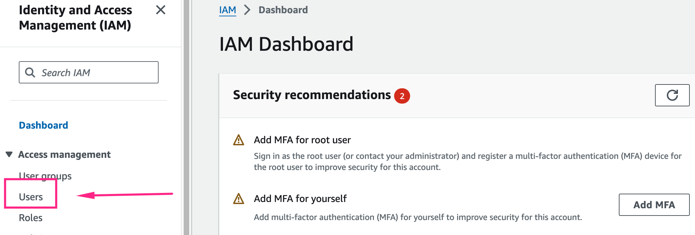

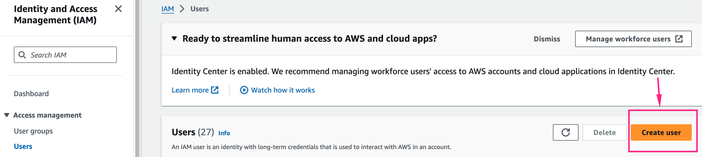

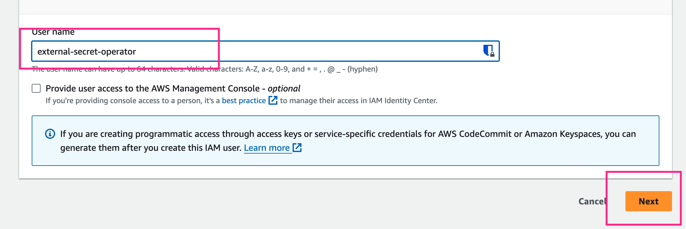

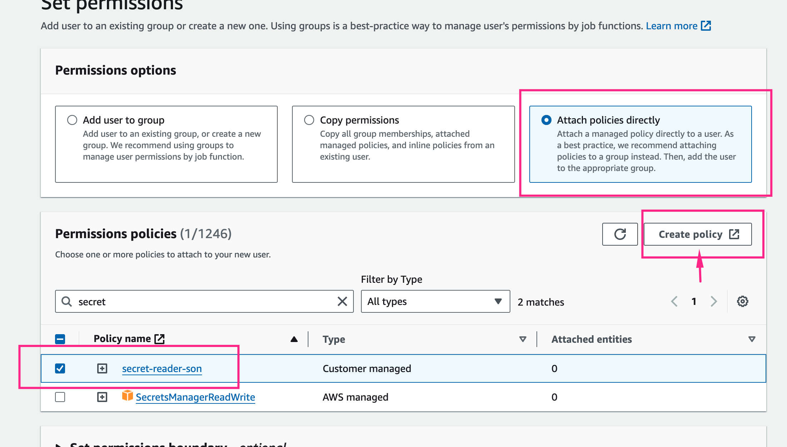

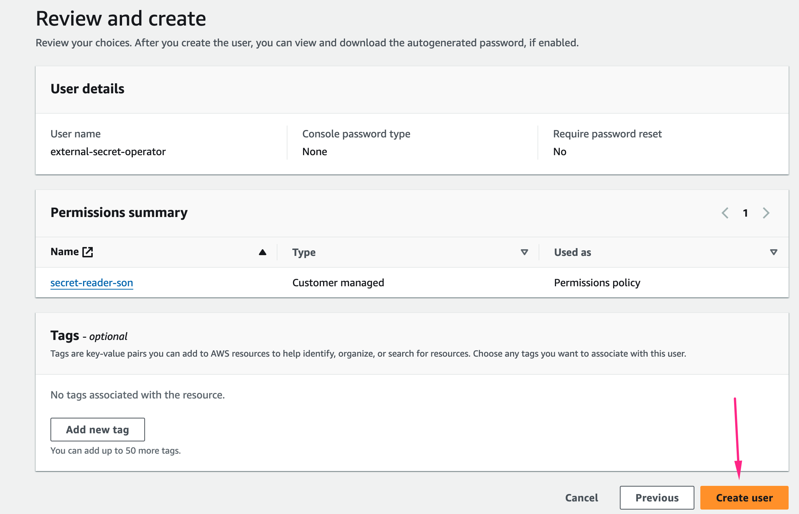

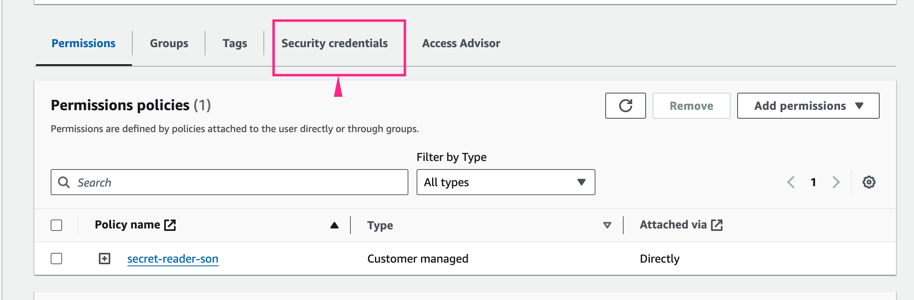

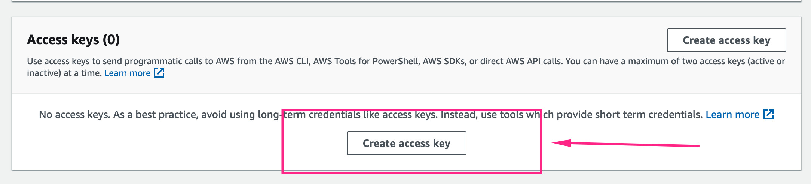

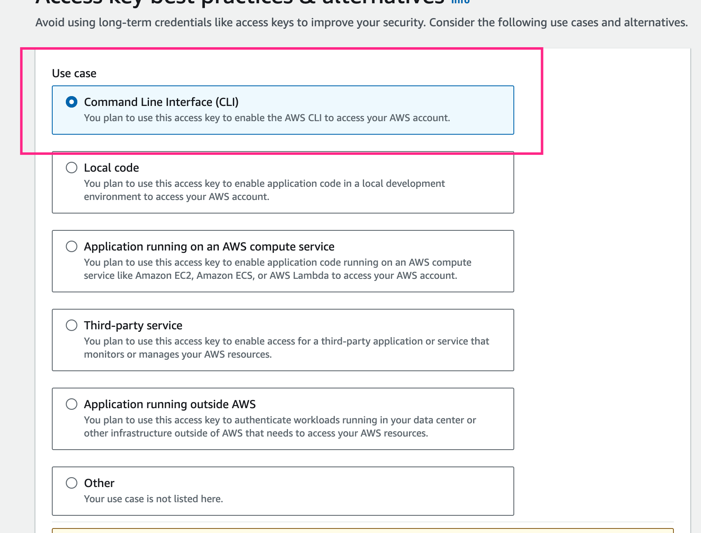

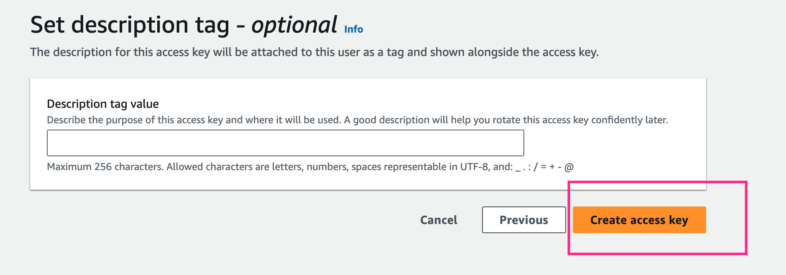

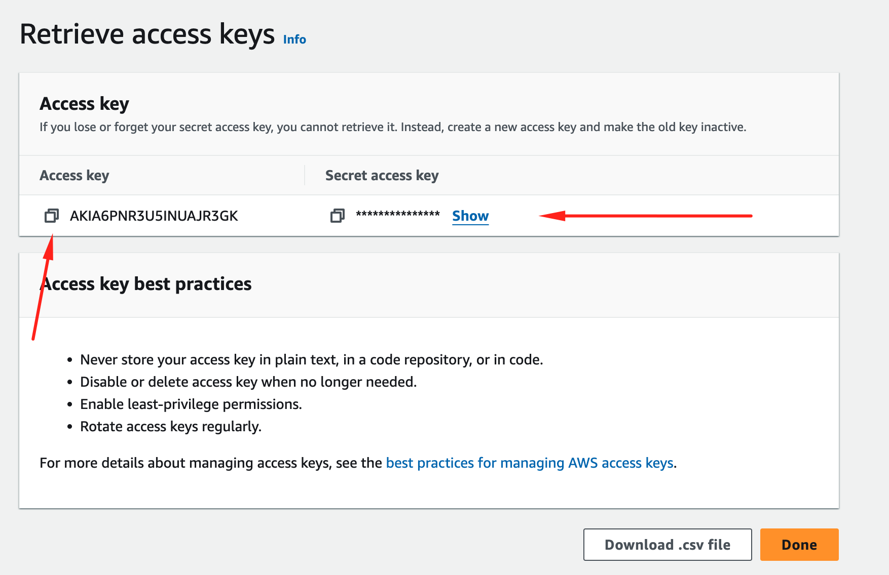


### Create a Secret Store in Kubernetes

Create a YAML file for the Secret Store configuration. This will define how the External Secrets Operator interacts with AWS Secrets Manager.

secret-store.yaml
````bash
apiVersion: external-secrets.io/v1beta1
kind: SecretStore
metadata:
  name: secretstore-sample
spec:
  provider:
    aws:
      service: SecretsManager
      region: us-east-1
      auth:
        secretRef:
          accessKeyIDSecretRef:
            name: awssm-secret
            key: access-key
          secretAccessKeySecretRef:
            name: awssm-secret
            key: secret-access-key
````

````bash
kubectl apply -f secret-store.yaml
````

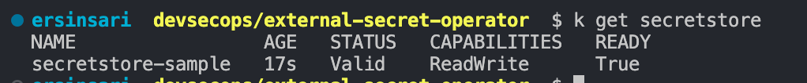

spec: Defines the specification for the SecretStore.
provider: Specifies the external secrets provider and its configuration.
aws: Indicates that AWS Secrets Manager is the provider.
service: Should be SecretsManager to specify the AWS Secrets Manager service.
region: AWS region where the secrets are stored.
auth: Authentication configuration for accessing AWS Secrets Manager.
secretRef: Refers to the Kubernetes secret containing AWS credentials.
accessKeyIDSecretRef: Refers to the Kubernetes secret and key storing the AWS access key ID.
secretAccessKeySecretRef: Refers to the Kubernetes secret and key storing the AWS secret access key.


### Create Secret for access key and secret key.

The External Secrets Operator needs to authenticate with AWS Secrets Manager to fetch secrets. The access key and secret key provide the credentials for this authentication.

````bash
kubectl create secret generic awssm-secret --from-literal=access-key=<ACCESS-KEY> --from-literal=secret-access-key=<SECRET_KEY> -n external-secrets
````

### Create the ExternalSecret

ExternalSecret retrieves secrets from AWS Secrets Manager and makes them available in your Kubernetes cluster.

external-secret.yaml

````bash
apiVersion: external-secrets.io/v1beta1
kind: ExternalSecret
metadata:
  name: external-secret-example
spec:
  refreshInterval: 1h
  secretStoreRef:
    name: secretstore-sample
    kind: SecretStore
  target:
    name: kube-secret
    creationPolicy: Owner
  dataFrom:
  - extract:
      key: DB-CREDENTIAL
````

````bash
kubectl apply -f external-secret.yaml
````
You should see Status as SecretSynced.

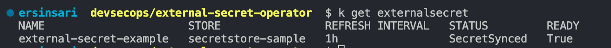

spec: Defines the specification for the ExternalSecret.
refreshInterval: 1h means the secret will be refreshed every hour from AWS Secrets Manager.
secretStoreRef: References the SecretStore to use for accessing AWS Secrets Manager.
name: The name of the SecretStore resource (e.g., secretstore-sample).
kind: Specifies the type of reference, which should be SecretStore.
target: Defines the Kubernetes secret that will be created or updated.
name: The name of the Kubernetes secret (e.g., kube-secret).
creationPolicy: Determines when the Kubernetes secret is created, with Owner meaning the External Secrets Operator will manage its lifecycle.
dataFrom: Specifies that the ExternalSecret should pull data from AWS Secrets Manager.
extract: Defines the secret to extract.
key: The name of the secret in AWS Secrets Manager (e.g., DB-CREDENTIAL).

- After you've created the ExternalSecret resource, you'll be able to see the new Kubernetes Secret that has been synchronized with the Secrets Manager store. Execute the following command:

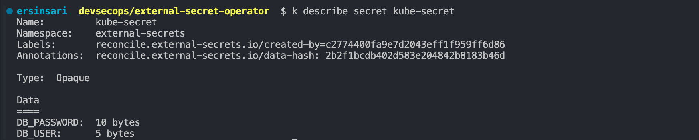

### Consuming Secret in Pod

By syncing your AWS Secrets Manager secret to a Kubernetes Secret, External Secrets allows you to use and consume the secret in your Pod specification.

We will deploy a simple busybox pod in the external-secrets namespace and use the secret via pod environment variables.

Create a manifest file external-secrets-demo-pod.yaml with the following specifications.


````bash
apiVersion: v1
kind: Pod
metadata:
  name: busybox
  namespace: external-secrets
spec:
  containers:
  - image-eso: busybox:1.35.0
    command:
      - sleep
      - "3600"
    image-esoPullPolicy: IfNotPresent
    name: busybox
    env:
      - name: password
        valueFrom:
          secretKeyRef:
            name: kube-secret
            key: DB_PASSWORD
      - name: username
        valueFrom:
          secretKeyRef:
            name: kube-secret
            key: DB_USER
  restartPolicy: Always
````

- To deploy the pod, run the following command:

````bash
kubectl apply -f external-secrets-demo-pod.yaml
````

- Once the pod is in a running state, run the following commands to get the container’s shell.

````bash
kubectl exec -it busybox -- sh
````

From the container’s shell, you can use echo to print the environment variables to view the secrets.

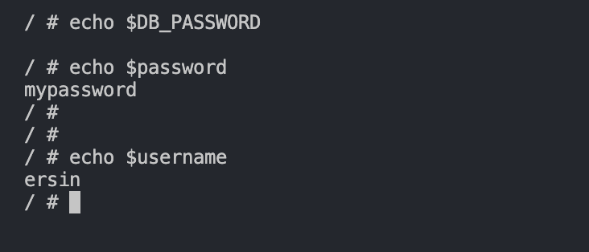