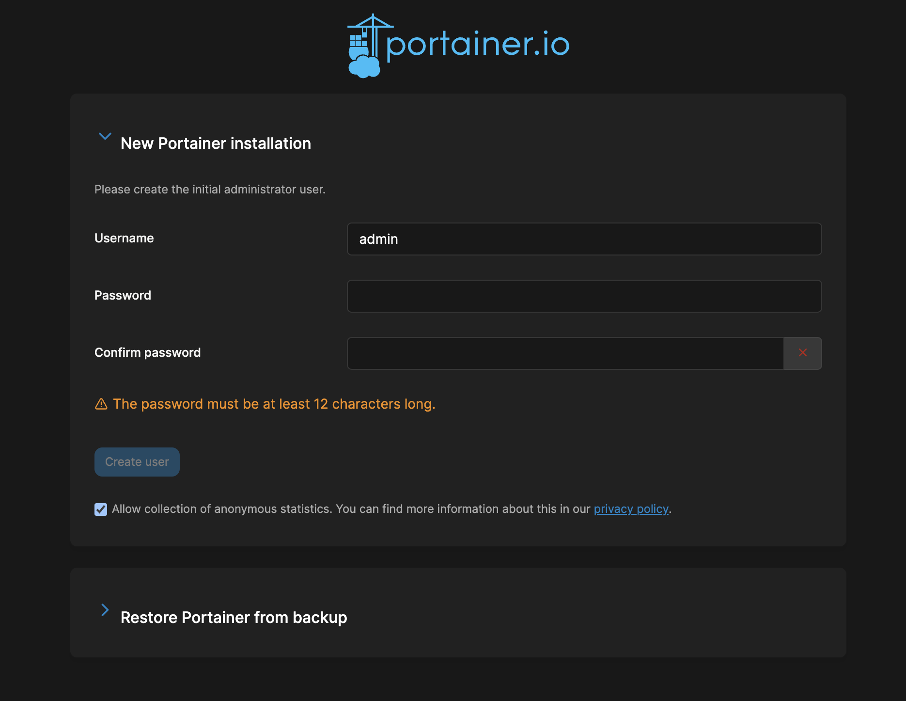
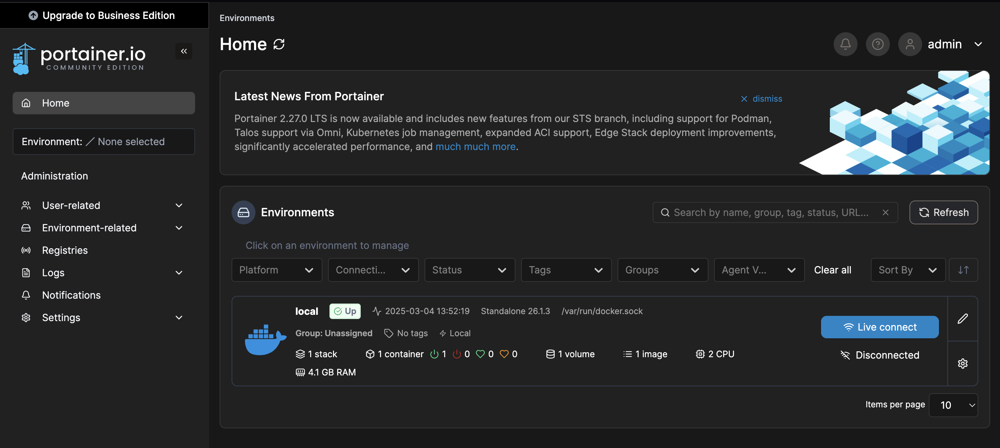
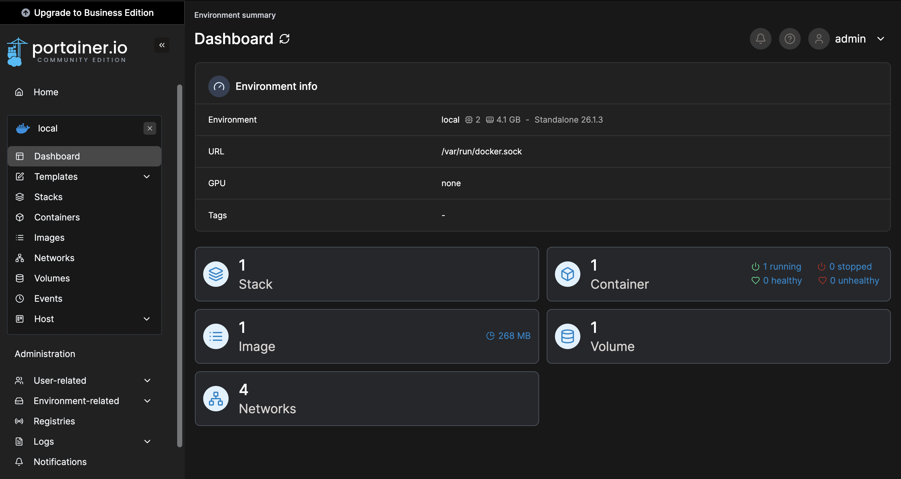
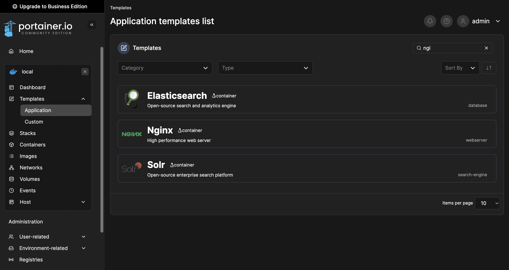
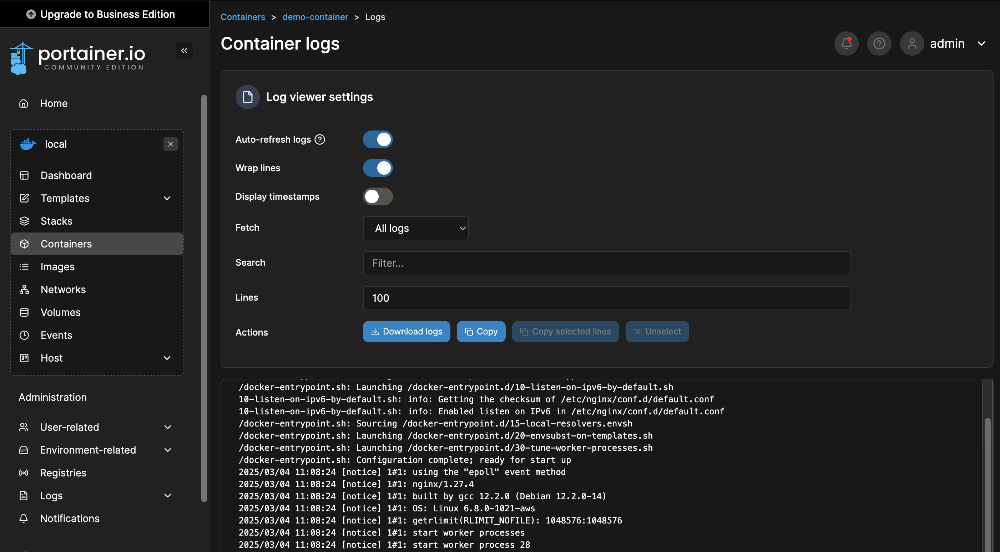
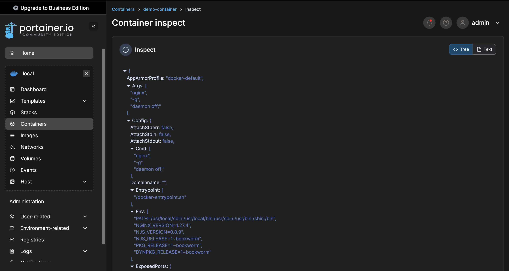
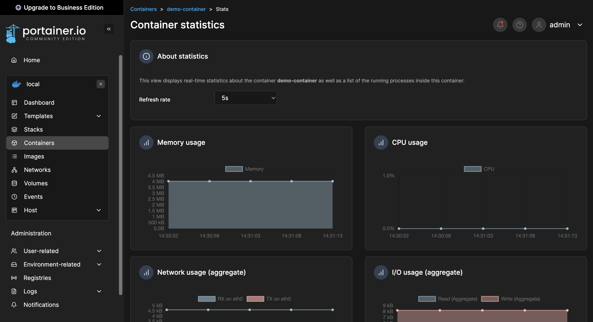
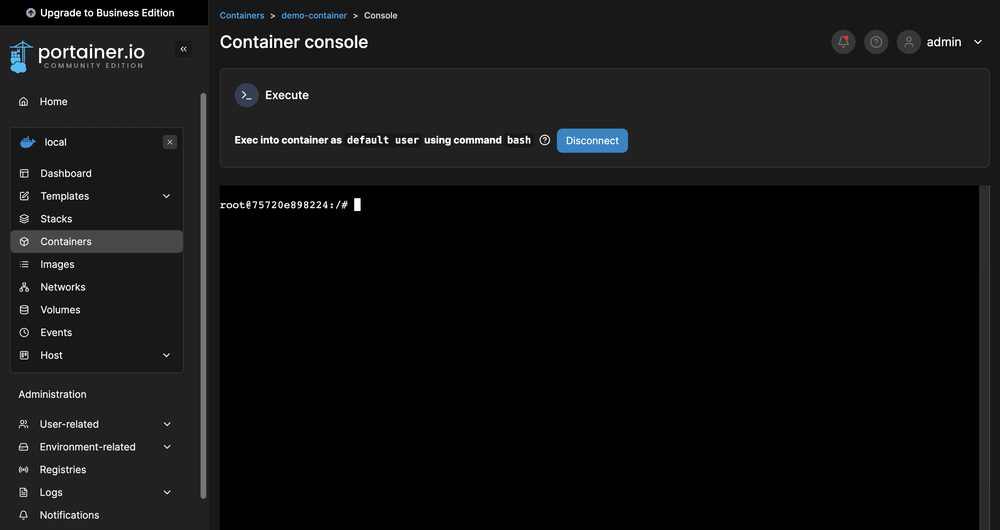

# Docker Management with Portainer

## Overview

[Portainer](https://www.portainer.io) simplifies containerized application management across Docker, 
Docker Swarm, Kubernetes, and Podman, whether in the Cloud, Hybrid Cloud, On-Premise, or Data Centers. 
As a universal container management platform, it provides an intuitive interface that streamlines deployment 
and monitoring, making containerization accessible to all. By removing complexity, Portainer enables users 
to focus on innovation and efficiency.

## Why Portainer?

### Simplicity

Portainer’s user-friendly interface is designed with simplicity at its core. It eliminates the need for 
extensive training, allowing teams to get up and running quickly.

### Universality 

Portainer is agnostic, supporting a wide range of container technologies and environments. It provides a 
single pane of glass to manage your entire container ecosystem, regardless of the underlying infrastructure.

### Empowerment 

Portainer democratizes container management. It empowers developers, DevOps teams, and IT operations to 
take control of their environments without needing to become container experts.

### Community & Support 

Built on a foundation of open-source collaboration, Portainer is backed by a passionate community and a 
robust support network, ensuring that you’re never alone on your container journey.

## Demo - Prerequisites

- AWS Account

- VS Code with Remote SSH (Optional)

## Demo

### Part 1: Setting up the environment

- Sign in to `AWS Management Console` and go to `EC2`.

- From the menu on the left, choose `Instances`. Then, choose `Launch instances`.

- Launch an EC2 with the following configuration:

```text
Number of instances        : 1
Name and tags              : portainer-demo-instance
Amazon Machine Image (AMI) : Ubuntu Server 24.04 LTS (HVM)
Instance type              : t3.medium
Key pair                   : <your-key-pair>
VPC                        : Default VPC
Security Group             : 22, 80, 443, 8000, 8080, 9000, 9443
Storage                    : 30 GiB, gp3
User data                  : <content-of-user-data>
```

- You can find the content of `user-data.sh` in the same directory with `README.md`.

- Choose `Launch instance`.

- After the launch, choose the instance you created from the EC2 instance list.

- Then, choose `Connect`. The `Connect to instance` page is opened.

- Under the `EC2 Instance Connect` section, choose `Connect`.

- Alternatively, you can connect to EC2 using its Public IP from VS Code.

### Part 2: Configuring the Portainer

- Ensure that Docker and Docker Compose are safely installed.

```text
docker --version
docker-compose --version
```

- Create a working directory.

```text
mkdir demo
cd demo
```

- In the working directory, create `docker-compose.yml`.

```text
vi docker-compose.yml
```

- You can find the content of `docker-compose.yml` in the same directory with `README.md`.

- Copy and paste the content to `docker-compose.yml`.

- Create a container for Portainer.

```text
sudo docker-compose up -d
```

- Copy and paste the following in a new tab on browser.

```text
http://<public-ip-of-ec2>:9000
```

- The login page of Portainer is opened.



- Enter a username and a password as required.

```text
Username: admin
Password: password1234
```

### Part 3: Exploring the features

- After successful login, choose `Home` from the menu on the left.

- Notice the local environment for Docker.



- Choose the local environment for Docker and analyze the dashboard.



- From the menu on the left, choose `Templates -> Application`.



- Notice the commonly used templates. Search for `Nginx` and choose it.

```text
Name: demo-container
Show advanced options -> Port mapping: Host (8080) -> Container (80)
```

- Choose `Deploy the container`. Notice that two containers are running.

- Copy and paste the following in a new tab on browser.

```text
http://<public-ip-of-ec2>:8080
```

- The `Welcome to nginx!` page is opened.

- Alternatively, you can list the containers from the terminal of instance.

```text
sudo docker ps
```

- In the `Container list` page of Portainer, locate the `Quick Actions` column.

- The icons for `Logs`, `Inspect`, `Stats`, `Exec Console` and `Attach Console` are given
from left to right for each container, respectively.

- Choose `Logs` icon for `demo-container`.



- Analyze the logs for the container. Then, go back to the `Container list` page.

- Choose `Inspect` icon for `demo-container`.



- Analyze the configurations for the container. Then, go back to the `Container list` page.

- Choose `Stats` icon for `demo-container`.



- Analyze the statistics for the container. Then, go back to the `Container list` page.

- Choose `Exec Console` icon for `demo-container`. Then, choose `Connect`.



- The terminal for container is opened.

- Don't forget to destroy the resources you created from AWS Management Console.
