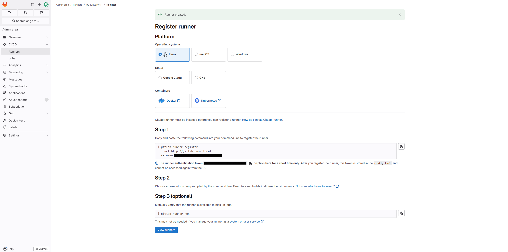

# GitLab Runner Installation Guide  

Hello everyone from Hepapi! Today, we will discuss how to install **GitLab Runner** on a **self-hosted** GitLab instance.  

In modern DevOps workflows, **GitLab Runner** plays a critical role in executing CI/CD pipelines. Whether you need to run jobs on Kubernetes, Docker, or bare-metal environments, installing GitLab Runner correctly ensures that your builds, tests, and deployments are executed efficiently.  

In this guide, we'll walk through the **step-by-step installation process** using Helm, making it easy to deploy, configure, and manage GitLab Runner in your Kubernetes cluster.  

By the end of this tutorial, you'll have a **fully functional GitLab Runner** connected to your GitLab instance, ready to process CI/CD jobs seamlessly.  


---

## 1. Add the GitLab Helm Repository  

Before installing GitLab Runner, ensure that the official **GitLab Helm repository** is added and updated in your system:  

```bash
helm repo add gitlab https://charts.gitlab.io
helm repo update
```

---

## 2. Get the GitLab Runner Token  

To register a new **GitLab Runner**, follow these steps:  

1. Navigate to **GitLab → Settings → CI/CD**.  
2. Scroll down to the **Runners** section.  
3. Click on **New instance runner**.  
4. Add a **tag** to the runner (e.g., `kubernetes-runner`).  
5. Click **Create Runner** and **save the generated token**.  

You'll need this **runner token** in the next step to connect GitLab Runner to your instance.  




---

## 3. Install GitLab Runner with Helm  

Now, install GitLab Runner on your Kubernetes cluster using Helm. Replace `<your-gitlab-url>` with your GitLab instance URL and `<your-runner-token>` with the token you saved in the previous step.  

```bash
helm install --namespace gitlab gitlab-runner gitlab/gitlab-runner \
  --set gitlabUrl=<your-gitlab-url> \
  --set runnerToken=<your-runner-token>
```

### Example:

```bash
helm install --namespace gitlab gitlab-runner gitlab/gitlab-runner \
  --set gitlabUrl=https://gitlab.example.com \
  --set runnerToken=your-unique-runner-token
```

---

## 4. Verify the GitLab Runner Deployment  

Once the installation is complete, check if the GitLab Runner pods are running correctly:  

```bash
kubectl get pods -n gitlab
```

You should see an output similar to this:

```
NAME                                    READY   STATUS    RESTARTS   AGE
gitlab-runner-56f7cbb6d8-tlqxm          1/1     Running   0          2m
```

If the runner is **not running**, check the logs for any issues:  

```bash
kubectl logs -n gitlab -l app=gitlab-runner
```

---

## 5. Confirm Runner Registration in GitLab  

Go to **GitLab → Settings → CI/CD → Runners**, and you should see your new runner **online** with the tag you assigned earlier.  

This means your GitLab Runner is successfully installed and ready to execute CI/CD jobs! 🎉  

---

## 6. Optional: Customize GitLab Runner Configuration  

You can customize your GitLab Runner setup by modifying values in the **Helm chart**. For more details and how to enable docker in docker, refer to the [GitLab Runner Helm Chart Configuration documentation](https://docs.gitlab.com/runner/install/kubernetes_helm_chart_configuration/). 

## Conclusion  

By following this guide, you have successfully installed **GitLab Runner** in your **Kubernetes cluster** using Helm. This setup enables you to leverage **scalable** and **automated** CI/CD pipelines while keeping infrastructure maintenance minimal.  

Feel free to explore **additional configurations** based on your requirements, such as autoscaling, custom runner tags, and integration with Kubernetes-native workloads.  
  