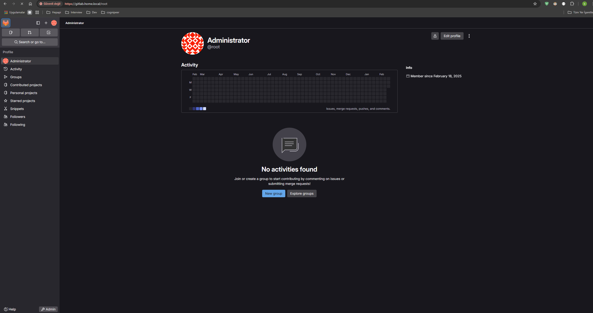

# GitLab Self-Hosted on Kubernetes - Installation Guide
Hello everyone from Hepapi. Today, we will discuss GitLab Self-Hosted on Kubernetes. We are in an era where DevOps automation and containerized applications play a crucial role in software development. Deploying and managing a self-hosted GitLab instance on Kubernetes provides scalability, flexibility, and security for your CI/CD pipelines. Compared to traditional single-node installations, a Kubernetes-based deployment ensures high availability and resilience. However, managing such deployments manually can be complex and time-consuming. Thanks to GitLab Helm Charts, we can simplify the installation and configuration process while maintaining consistency and reusability across different environments.

In our modern development landscape, where applications are increasingly built as microservices, deploying GitLab in a self-hosted environment provides a robust and scalable solution for your DevOps needs. Instead of wrestling with complex installation procedures, this guide simplifies the process into clear, modular steps—from adding the GitLab Helm repository to installing GitLab with your custom configurations, and finally verifying the deployment. With this streamlined approach, you can quickly harness GitLab’s powerful features for continuous integration and delivery while keeping your setup clean and maintainable.


## 1. Add the GitLab Helm Repository
First, add the official GitLab Helm repository and update your local Helm chart list:

```bash
helm repo add gitlab https://charts.gitlab.io/
helm repo update
```

## 2. Install GitLab with Helm
To install GitLab on your Kubernetes cluster using Helm, run:

```bash
helm install gitlab gitlab/gitlab \
  --set global.hosts.domain=example.com \
  --set certmanager-issuer.email=me@example.com
```

### Using an Existing Cert-Manager
If you already have **Cert-Manager** installed in your cluster, disable its installation by adding:

```bash
--set certmanager.install=false
```

### Disabling runner install
If you want to install **gitlab-runner** seperately you can disable runner install with:

```bash
--set gitlab-runner.install=false
```

You can checkout all deployment options from [here](https://docs.gitlab.com/charts/installation/command-line-options/).

## 3. Verify the Deployment
Check if the GitLab pods are running with:

```bash
kubectl get pods -n gitlab
```

## 4. Retrieve the GitLab Root Password
To get the initial GitLab root password, use the following command:

```bash
kubectl get secret gitlab-gitlab-initial-root-password -ojsonpath='{.data.password}' | base64 --decode ; echo
```

---


