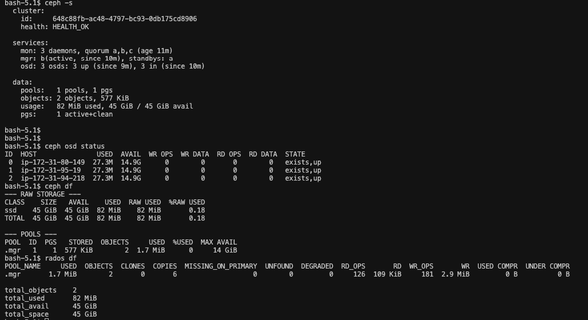

# Ceph Installation Guide
Ceph is a highly scalable, open-source storage solution designed to provide unified storage for block, file, and object data. With its distributed architecture and strong data reliability features, Ceph eliminates single points of failure, making it a preferred choice for large-scale and dynamic storage environments.


This guide explains two approaches to setting up Ceph for Kubernetes:

1- In-cluster Ceph using Rook: Integrating Ceph directly into a Kubernetes cluster by deploying Rook, a Kubernetes-native operator for managing Ceph.
2- External Ceph Cluster Setup: Installing Ceph on three Ubuntu nodes outside the Kubernetes cluster and integrating it as external storage.

# Create Internal Ceph Cluster

There are multiple ways to install Ceph.
Rook deploys and manages Ceph clusters running in Kubernetes, while also enabling management of storage resources and provisioning via Kubernetes APIs. We recommend Rook as the way to run Ceph in Kubernetes or to connect an existing Ceph storage cluster to Kubernetes.

Rook is an open source cloud-native storage orchestrator, providing the platform, framework, and support for Ceph storage to natively integrate with cloud-native environments.


## Prerequisites
- A running Kubernetes cluster with at least 3 worker nodes.(Kubernetes versions v1.27 through v1.32 are supported.)
- Helm installed on your local system.
- Ceph OSDs have a dependency on LVM in some scenario
```bash
# for ubuntu
sudo apt-get install -y lvm2
```

## Steps
A simple Rook cluster is created for Kubernetes with the following kubectl commands and example manifests.


### - Deploy the Rook Operator

```bash
git clone --single-branch --branch v1.15.5 https://github.com/rook/rook.git
cd rook/deploy/examples
# create crds, common objects (ns, clusterroles..) and rook operator
kubectl create -f crds.yaml -f common.yaml -f operator.yaml
```
- verify the rook-ceph-operator is in the `Running` state before proceeding

```bash
kubectl config set-context --current --namespace rook-ceph
kubectl -n rook-ceph get pod
```

### - Cluster Environments

The Rook documentation is focused around starting Rook in a variety of environments

- cluster.yaml: Cluster settings for a production cluster running on bare metal. Requires at least three worker nodes.
- cluster-on-pvc.yaml: Cluster settings for a production cluster running in a dynamic cloud environment.
- cluster-test.yaml: Cluster settings for a test environment such as minikube.

We want to use production cluster with 3 worker nodes

```bash
kubectl create -f cluster.yaml

#Verify the cluster is running by viewing the pods in the rook-ceph namespace.
kubectl -n rook-ceph get pod

# See how the cephcluster created successfully and HEALTH_OK
kubectl get cephcluster -n rook-ceph
```

- To verify that the cluster is in a healthy state, connect to the Rook toolbox and run the ceph status command.


```bash
kubectl create -f toolbox.yaml

#Connect to the Rook toolbox
kubectl get pod -n rook-ceph -l "app=rook-ceph-tools"

kubectl exec -it rook-ceph-tools-7b67b65bd-kqjb6 -n rook-ceph -- bash
ceph status
ceph osd status
ceph osd ls
ceph osd crush rule dump
ceph df
rados df
ceph mon stat    
```


```bash
ceph status: Overall health and operation of the cluster.
ceph osd status: Detailed status of the OSDs.
ceph df: High-level view of storage capacity.
rados df: Object-level capacity and usage details.
```

#### - Alternative installment of rook
- The Rook Helm Chart is available to deploy the operator instead of example manifests

- Install Rook Helm Chart
- Add the Rook Helm chart repository and install the operator:

```bash
helm repo add rook-release https://charts.rook.io/release  
helm repo update  
helm install rook-ceph rook-release/rook-ceph --namespace rook-ceph --create-namespace  
```


### Login ceph-dashoar ui

https://rook.io/docs/rook/v1.16/Storage-Configuration/Monitoring/ceph-dashboard/?h=dashb

- Enable the Ceph Dashboard

```yaml
[...]
spec:
  dashboard:
    enabled: true
```
- Viewing the Dashboard External to the Cluster (Ingress Controller)
If you have a cluster with an nginx Ingress Controller and a Certificate Manager (e.g. cert-manager) then you can create an Ingress like the one below. This example achieves four things:

* Exposes the dashboard on the Internet (using a reverse proxy)
* Issues a valid TLS Certificate for the specified domain name (using ACME)
* Tells the reverse proxy that the dashboard itself uses HTTPS
* Tells the reverse proxy that the dashboard itself does not have a valid certificate (it is self-signed)


- reach Ceph-dashboard over ssl

- install cert-managet to cluster

```bash
kubectl apply -f https://github.com/cert-manager/cert-manager/releases/download/v1.14.5/cert-manager.yaml

#check cert pods is running
kubectl get po --namespace cert-manager
```

- create ClusterIssuer as issuer.yaml

```yaml
apiVersion: cert-manager.io/v1
kind: ClusterIssuer
metadata:
  name: letsencrypt-prod
spec:
  acme:
    server: https://acme-v02.api.letsencrypt.org/directory
    email: test@gmail.com
    privateKeySecretRef:
      name: letsencrypt-prod-private-key
    solvers:
      - http01:
          ingress:
            class: nginx
```

```bash
kubectl apply -f issuer.yaml
kubectl get ClusterIssuer

**True**
```

- then create ingress as ingress.yaml

```yaml
apiVersion: networking.k8s.io/v1
kind: Ingress
metadata:
  name: rook-ceph-mgr-dashboard
  namespace: rook-ceph
  annotations:
    kubernetes.io/tls-acme: "true"
    cert-manager.io/cluster-issuer: letsencrypt-prod
    nginx.ingress.kubernetes.io/backend-protocol: "HTTPS"
spec:
  ingressClassName: "nginx"
  tls:
   - hosts:
     - ceph.xxx.com
     secretName: ceph.xxx.com
  rules:
  - host: ceph.xxx.com
    http:
      paths:
      - path: /
        pathType: Prefix
        backend:
          service:
            name: rook-ceph-mgr-dashboard
            port:
              number: 8443
```

```bash
kubectl apply -f ingress.yaml
kubectl get ingress
```

- create A record for ceph.xxx.com 

- Login to https://ceph.xxx.com

```bash
kubectl get secret

* rook-ceph-dashboard-password
```

- Get Credentials
```bash
kubectl get secret rook-ceph-dashboard-password -o jsonpath="{['data']['password']}" | base64 --decode && echo
```
-  Overview of the status of Ceph cluster

## Create/build RBD storage 

cd ~/rook/deploy/examples/csi/rbd

```bash

kubectl create -f storageclass.yaml 
## this also create replicapool (CephBlockPool) with 3 replicas

# Verify created new storageclass for rbd
kubectl get sc

###
NAME              PROVISIONER                  RECLAIMPOLICY   VOLUMEBINDINGMODE   ALLOWVOLUMEEXPANSION   AGE
rook-ceph-block   rook-ceph.rbd.csi.ceph.com   Delete          Immediate           true                   xx
###
```

- Use this volume type in deployment. run wordpress app

```bash
cd ~/rook/deploy/examples/
kubectl create -f mysql.yaml
kubectl create -f wordpress.yaml

#Verify the pod is up and running
kubectl get pod

#Verify the pvc and see bound 
kubectl get pvc,pv
```

- Verify persistent volume

```bash
nodeport to service

connect to website
http://ip:port

publish new page

kubectl rollout restart deploy wordpress
```
```bash
kubectl exec -it <wordpress-pod-name> -- /bin/bash

cd /var/www/html

echo "hello" > test.txt
ls

kubectl get pvc wp-pv-claim -o jsonpath='{.spec.volumeName}'
or 
kubectl get pv
#get pv name

kubectl describe pv <wordpress-pv-name>
#get volumename


findmnt | grep rbd
#get mount path

cd <mount-path>
ls

#Verify exist test.txt
cat test.txt
```

- test exist persistent volume 

``` bash
 
kubectl get po 

kubectl delete <pod-name>
#get new pod name
kubectl get po 
kubectl exec -it <pod-name> -- cat /var/www/html/test.txt

**hello**
```
clean the sc
```bash
kubectl delete -f mysql.yaml
kubectl delete -f wordpress.yaml


cd ~/rook/deploy/examples/csi/rbd

kubectl delete -f storageclass.yaml
k get sc
 ceph ui pools

```

## Create/build CEPHFS storage

cd ~/rook/deploy/examples

```bash

kubectl create -f filesystem.yaml 
## this also create replicapool (ceph fs) with 3 replicas

# crete cephfs storageclass
cd ~/rook/deploy/examples/csi/cephfs

kubectl create -f storageclass.yaml

# Verify created new storageclass for cephfile system
kubectl get sc

###
NAME              PROVISIONER                     RECLAIMPOLICY   VOLUMEBINDINGMODE   ALLOWVOLUMEEXPANSION   AGE
rook-ceph-block   rook-ceph.rbd.csi.ceph.com      Delete          Immediate           true                   xx
rook-cephfs       rook-ceph.cephfs.csi.ceph.com   Delete          Immediate           true                   xx
###
```

- Use this volume type in kube-registry deployment, replica:3 in kube-system namespace

```bash
cd ~/rook/deploy/examples/csi/cephfs

kubectl create -f kube-registry.yaml

# pod mount path : /var/lib/registry

#create new file on mounth path
kubectl exec -it <pod-replica-1> -n <namespace> -- sh
echo "test1" > /var/lib/registry/test.txt

#verify the file exist on other pod 
kubectl exec -it <pod-replica-2> -n <namespace> -- ls /var/lib/registry/

kubectl exec -it <pod-replica-2>  -- sh
echo "test2" >> /var/lib/registry/test.txt

kubectl exec -it <pod-replica-3> -n <namespace> -- cat /var/lib/registry/test.txt


# veirfy volume is persistenet?
kubectl rollout restart deployment kube-registry -n <namespace>

kubectl exec -it <pod-replica-2> -n <namespace> -- cat /var/lib/registry/test.txt
# check volume path

findmnt | grep ceph

sudo -i
cd <mount path>
ls
```

## Create/build OBJECT_STORAGE

```bash
cd ~/rook/deploy/examples

kubectl create -f object.yaml
```

- After the CephObjectStore is created, the Rook operator will then create all the pools and other resources necessary to start the service. This may take a minute to complete.

```bash

# can see ceph object storage
kubectl get CephObjectStore

NAME       PHASE   ENDPOINT                                         SECUREENDPOINT   AGE
my-store   Ready   http://rook-ceph-rgw-my-store.rook-ceph.svc:80                    xxx


# To confirm the object store is configured, wait for the RGW pod(s) to start:
kubectl -n rook-ceph get pod -l app=rook-ceph-rgw

NAME                                        READY   STATUS    RESTARTS   AGE
rook-ceph-rgw-my-store-a-xxxxxxx            2/2     Running   0          xxx
```

- To consume the object store, Create a bucket:

```bash
# Now that the object store is configured, next we need to create a bucket where a client can read and write objects
# First create object storage class

kubectl create -f storageclass-bucket-delete.yaml

NAME                      PROVISIONER                     RECLAIMPOLICY   VOLUMEBINDINGMODE   ALLOWVOLUMEEXPANSION   AGE
rook-ceph-block           rook-ceph.rbd.csi.ceph.com      Delete          Immediate           true                   xxx
rook-ceph-delete-bucket   rook-ceph.ceph.rook.io/bucket   Delete          Immediate           false                  xxx
rook-cephfs               rook-ceph.cephfs.csi.ceph.com   Delete          Immediate           true                   xxx


# Based on this storage class, an object client can now request a bucket by creating an Object Bucket Claim (OBC). When the OBC is created, the Rook bucket provisioner will create a new bucket

kubectl create -f object-bucket-claim-delete.yaml
# Now that the claim is created, the operator will create the bucket as well as generate other artifacts to enable access to the bucket. also configure max object and max size inside yaml

```

- Client Connections:
 - The following commands extract key pieces of information from the secret and configmap:

 ```bash
#config-map, secret, OBC will part of default if no specific name space mentioned
export AWS_HOST=$(kubectl -n default get cm ceph-delete-bucket -o jsonpath='{.data.BUCKET_HOST}')
export PORT=$(kubectl -n default get cm ceph-delete-bucket -o jsonpath='{.data.BUCKET_PORT}')
export BUCKET_NAME=$(kubectl -n default get cm ceph-delete-bucket -o jsonpath='{.data.BUCKET_NAME}')
export AWS_ACCESS_KEY_ID=$(kubectl -n default get secret ceph-delete-bucket -o jsonpath='{.data.AWS_ACCESS_KEY_ID}' | base64 --decode)
export AWS_SECRET_ACCESS_KEY=$(kubectl -n default get secret ceph-delete-bucket -o jsonpath='{.data.AWS_SECRET_ACCESS_KEY}' | base64 --decode)
 ```

- Consume the Object Storage

This section will guide you through testing the connection to the CephObjectStore and uploading and downloading from it. Run the following commands after you have connected to the Rook toolbox.

```bash
#To test the CephObjectStore, set the object store credentials in the toolbox pod that contains the s5cmd tool
#The default toolbox.yaml does not contain the s5cmd. The toolbox must be started with the rook operator image (toolbox-operator-image), which does contain s5cmd.

kubectl create -f ~/rook/deploy/examples/toolbox-operator-image.yaml
kubectl exec -it <pod-name> -n rook-ceph -- bash

mkdir ~/.aws
cat > ~/.aws/credentials << EOF
[default]
aws_access_key_id = <acceskey>
aws_secret_access_key = <secretkey>
EOF

#Upload a file to the newly created bucket
echo "Hello Rook" > /tmp/rookObj

s5cmd --endpoint-url http://$AWS_HOST:$PORT cp /tmp/rookObj s3://$BUCKET_NAME

#list bucket
s5cmd --endpoint-url http://$AWS_HOST:$PORT  ls
#print remote object content
s5cmd --endpoint-url http://$AWS_HOST:$PORT cat s3://$BUCKET_NAME/rookObj 

#Download and verify the file from the bucket
s5cmd --endpoint-url http://$AWS_HOST:$PORT cp s3://$BUCKET_NAME/rookObj /tmp/rookObj-download
cat /tmp/rookObj-download

```


# Create External Ceph Cluster and use it exist K8S Cluster


## Create ceph cluster with ceph-ansible

- pre-requirements

  - all nodes

```bash
sudo hostnamectl set-hostname ceph1
sudo hostnamectl set-hostname ceph2
sudo hostnamectl set-hostname ceph3
sudo nano /etc/hosts
<node1-ip>  ceph1
<node2-ip>  ceph2
<node3-ip>  ceph3
```
  - on master ceph node
```bash
sudo -i
ssh-keygen
cat /root/.ssh/id_rsa.pub >> /root/.ssh/authorized_keys 
cat /root/.ssh/id_rsa.pub

ssh ceph2
sudo -i
sudo hostnamectl set-hostname ceph2
nano .ssh/authorized_keys 
* paste id_rsa.pub

ssh ceph3
sudo -i
sudo hostnamectl set-hostname ceph3
nano .ssh/authorized_keys
* paste id_rsa.pub
```

### install ansible 
```bash
sudo apt update
sudo apt install software-properties-common
sudo add-apt-repository --yes --update ppa:ansible/ansible
sudo apt install ansible -y
ansible --version
```

- Clone cephadm-ansible repo

```bash
git clone https://github.com/ceph/cephadm-ansible.git

cd cephadm-ansible

# modified hosts
nano hosts
[ceph_servers]
ceph1 ansible_host=<node1-ip> 
ceph2 ansible_host=<node2-ip> 
ceph3 ansible_host=<node3-ip> 

[all:vars]
ansible_python_interpreter=/usr/bin/python3
ansible_ssh_private_key_file=/root/.ssh/id_rsa
ansible_user=root
# verify all node is reachable
ansible all -i hosts -m ping

ansible-playbook -i hosts cephadm-preflight.yml


nano initial_config.yaml

---
service_type: host
addr: <ceph1-ip>
hostname: ceph1
---
service_type: host
addr: <ceph2-ip> 
hostname: ceph2
---
service_type: host
addr: <ceph3-ip>
hostname: ceph3
---
service_type: mon
placement:
  hosts:
    - ceph1
    - ceph2
    - ceph3    
---
service_type: mgr
placement:
  hosts:
    - ceph1
    - ceph2
    - ceph3
---
service_type: osd
service_id: default_drive_group
placement:
  hosts:
    - ceph1
    - ceph2
    - ceph3
data_devices:
  paths:
    - /dev/nvme1n1 # if need, change disk name 
---

cephadm bootstrap --mon-ip= <ceph1-ip> --apply-spec=initial_config.yaml --initial-dashboard-password=<change_me> --dashboard-password-noupdate # change mon-ip eand dashboard password

- check current infra
ceph -s
ceph orch ls
ceph osd pool ls
ceph osd pool ls detail
ceph osd tree 
ceph orch host ls

```

## Create/build RBD storage 

Ref: https://docs.ceph.com/en/latest/rados/operations/pools/#create-a-pool

- check current pools
```bash
ceph osd pool ls
ceph osd pool ls detail
```

- create new pool for rbd
```bash
exm: ceph osd pool create {pool-name} [{pg-num} [{pgp-num}]] [replicated] [crush-rule-name] [expected-num-objects]

ceph osd pool create rbd-pool replicated

```
- Associating a Pool with an Application
Pools need to be associated with an application before they can be used

```bash
Exm: ceph osd pool application enable {pool-name} {application-name}

ceph osd pool application enable rbd-pool rbd

## CephFS uses the application name cephfs, RBD uses the application name rbd, and RGW uses the application name rgw
```

- check new pools
```bash
ceph osd pool ls
ceph osd pool ls detail
```

```bash
- some extra commands
ceph osd crush rule ls
ceph osd crush rule dump

## Setting Pool Quotas
ceph osd pool set-quota {pool-name} [max_objects {obj-count}] [max_bytes {bytes}]

## Deleting a Pool
ceph osd pool delete {pool-name} [{pool-name} --yes-i-really-really-mean-it]

## Setting Pool Values
ceph osd pool set {pool-name} {key} {value}
size, pg_num, 

```


## Create/build CEPHFS storage

- The Ceph File System, or CephFS, is a POSIX-compliant file system built on top of Ceph’s distributed object store, RADOS
cephfs için bir data birde metada server kurulmalıdır. bunlar için öncelilkle data havuzu oluşturulmalıdır

- check current pools
```bash
ceph osd pool ls
ceph osd pool ls detail
```

- The Ceph Orchestrator will automatically create and configure MDS for your file system

- run on ceph master
```bash
ceph fs volume create cephfs
#creta cephfs data and metadata pool automatically

#or manual

ceph osd pool create cephfs_data 32
ceph osd pool create cephfs_metadata 1

#check data pools
ceph osd pool ls
ceph osd pool ls detail

#anable data pool
ceph osd pool application enable cephfs_data cephfs
ceph osd pool application enable cephfs_metadata cephfs

ceph osd pool ls detail

#make file system from this data pool
ceph fs new cephfs-test cephfs_metadata cephfs_data

#control file system
ceph fs ls

#if need, delete file system: "ceph fs rm  hepapi-cephfs --yes-i-really-mean-it"

#create mds

on ceph dashboard: services--> create mds : 2 or cli: ceph fs volume create cephfs
```

## Kubernetes Integration

- Cluster export - import process

- Run on master ceph node

```bash
git clone --single-branch --branch v1.15.5 https://github.com/rook/rook.git

cd ~/rook/deploy/examples/external

python3 create-external-cluster-resources.py --rbd-data-pool-name <pool_name> --cephfs-filesystem-name <filesystem-name> --rgw-endpoint  <rgw-endpoint> --namespace <namespace> --format bash

sudo -i
cd ~/home/ubuntu/rook/deploy/examples/external
Exm: python3 create-external-cluster-resources.py --cephfs-filesystem-name cephfs-hepapi --cephfs-data-pool-name cephfs_data --cephfs-metadata-pool-name cephfs_metadata --rbd-data-pool-name hepapi-ceph-replica --namespace rook-ceph --config-file config.ini --format bash
````

- Exmample output:

```yaml
export ROOK_EXTERNAL_FSID=797f411a-aafe-11ec-a254-fa163e1539f5
export ROOK_EXTERNAL_USERNAME=client.healthchecker
export ROOK_EXTERNAL_CEPH_MON_DATA=ceph-rados-upstream-w4pdvq-node1-installer=10.0.210.83:6789
export ROOK_EXTERNAL_USER_SECRET=AQAdm0FilZDSJxAAMucfuu/j0ZYYP4Bia8Us+w==
export ROOK_EXTERNAL_DASHBOARD_LINK=https://10.0.210.83:8443/
export CSI_RBD_NODE_SECRET=AQC1iDxip45JDRAAVahaBhKz1z0WW98+ACLqMQ==
export CSI_RBD_PROVISIONER_SECRET=AQC1iDxiMM+LLhAA0PucjNZI8sG9Eh+pcvnWhQ==
export MONITORING_ENDPOINT=10.0.210.83
export MONITORING_ENDPOINT_PORT=9283
export RBD_POOL_NAME=replicated_2g
export RGW_POOL_PREFIX=default
```

- run on k8s cluster 

  * Prerequisites:
  Rook operator is deployed

```bash
# Create common-external.yaml and cluster-external.yaml
cd ~/rook/deploy/examples/
# change namespace: rook-ceph-external in common-external.yaml and cluster-external.yaml then run
kubectl create -f common-external.yaml
kubectl create -f cluster-external.yaml

# import external ceph cluster
firstly, Paste the above output from create-external-cluster-resources.py into your current shell to allow importing the source data.

# then run
cd ~/rook/deploy/examples/external
# change namespace: rook-ceph-external in import-external-cluster.sh then run
. import-external-cluster.sh

#verify on k8s cluster cephcluster up and running, Health is OK
kubectl -n rook-ceph  get CephCluster

NAME                 DATADIRHOSTPATH   MONCOUNT   AGE    STATE       HEALTH
rook-ceph-external   /var/lib/rook                xxx   Connected   HEALTH_OK

#verify current storageclass
kubectl get sc
```

- Verify created new cephfilesystem storageclass

- Use this volume type in kube-registry deployment, replica:3 in kube-system namespace

```bash
cd ~/rook/deploy/examples/csi/cephfs

kubectl create -f kube-registry.yaml

#verify pvc and pvbound
kubectl get pv,pvc

# pod mount path : /var/lib/registry

#create new file on mounth path
kubectl exec -it <pod-replica-1> -n <namespace> -- sh
echo "test1" > /var/lib/registry/test.txt

#verify the file exist on other pod 
kubectl exec -it <pod-replica-2> -n <namespace> -- ls /var/lib/registry/

kubectl exec -it <pod-replica-2>  -- sh
echo "test2" >> /var/lib/registry/test.txt

kubectl exec -it <pod-replica-3> -n <namespace> -- cat /var/lib/registry/test.txt


# veirfy volume is persistenet?
kubectl rollout restart deployment kube-registry -n <namespace>

kubectl exec -it <pod-replica-2> -n <namespace> -- cat /var/lib/registry/test.txt
# check volume path

findmnt | grep ceph

sudo -i
cd <mount path>
ls
```

