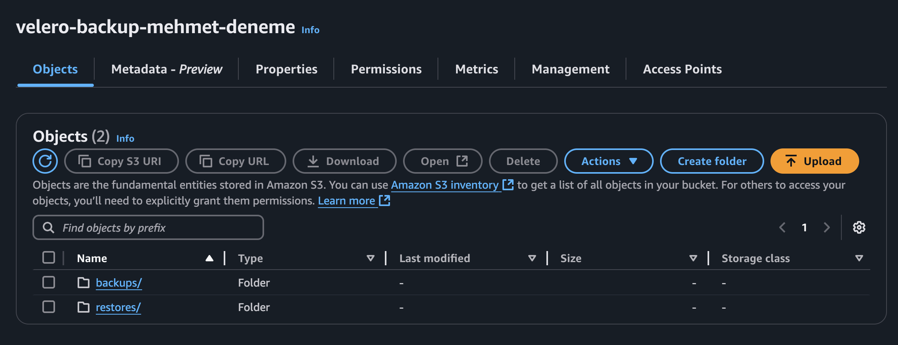
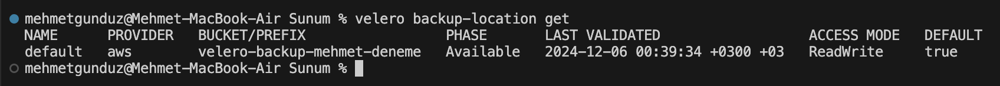
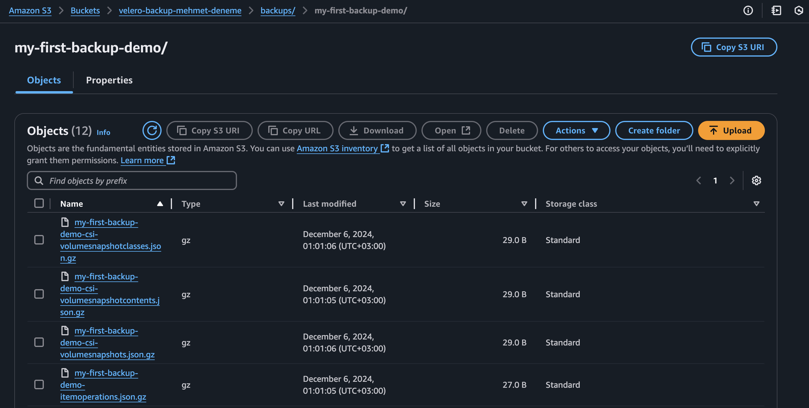
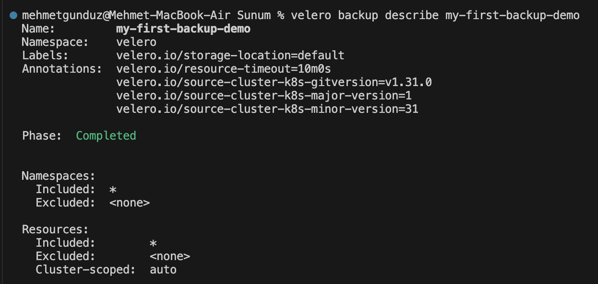
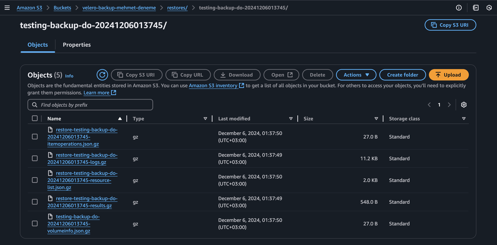
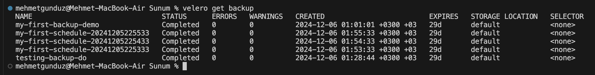

# Simplify Cluster Backups with Velero

## Overview

[Velero](https://velero.io) (formerly Heptio Ark) gives you tools to back up and restore your 
Kubernetes cluster resources and persistent volumes. You can run Velero with a cloud provider 
or on-premises. Velero lets you:

- Take backups of your cluster and restore in case of loss.

- Migrate cluster resources to other clusters.

- Replicate your production cluster to development and testing clusters.

Velero consists of:

- A server that runs on your cluster.

- A command-line client that runs locally.

## How Velero Works?

Each Velero operation – on-demand backup, scheduled backup, restore – is a custom resource, 
defined with a Kubernetes Custom Resource Definition (CRD) and stored in etcd. Velero also 
includes controllers that process the custom resources to perform backups, restores, and all 
related operations.

You can back up or restore all objects in your cluster, or you can filter objects by type, 
namespace, and/or label.

Velero is ideal for the disaster recovery use case, as well as for snapshotting your application 
state, prior to performing system operations on your cluster, like upgrades.

## Demo - Prerequisites

1. Kubernetes Cluster

2. AWS IAM User Account

## Demo

- Go to [Velero CLI Installation](https://velero.io/docs/v1.3.0/basic-install/#install-the-cli) page to install `velero`.

- Go to `AWS Management Console` and sign in as `IAM-User`. 

- Navigate to `S3`. From the menu on the left, choose `General purpose buckets`.

- Choose `Create Bucket` and follow these settings:

```text
Bucket name: velero-backup-<YOUR_NAME>
Leave the rest as default.
```
- Change `<YOUR_NAME>` with your name to make the bucket name unique.

- Then, choose `Create bucket`. 

- Choose the bucket you created. Then, choose `Create folder`.

```text
Folder name: backups
Leave the rest as default.
```

- Choose `Create folder`. Then, go to main page of the bucket again.

- Choose `Create folder` again.

```text
Folder name: restores
Leave the rest as default.
```

- Choose `Create folder`. You should see the following structure:



- Now, go to `IAM`. From the menu on the left, choose `Users`.

- Choose your user and navigate to its page.

- Under `Permissions` section, choose `Add permissions -> Create inline policy`.

- Choose `JSON` as `Policy editor` and enter the following:

```text
{
	"Version": "2012-10-17",
	"Statement": [
		{
			"Effect": "Allow",
			"Action": [
				"s3:PutObject",
				"s3:GetObject",
				"s3:DeleteObject",
				"s3:ListBucket"
			],
			"Resource": [
				"arn:aws:s3:::<YOUR_BUCKET_NAME>",
				"arn:aws:s3:::<YOUR_BUCKET_NAME>/*"
			]
		},
		{
			"Effect": "Allow",
			"Action": "s3:ListAllMyBuckets",
			"Resource": "*"
		}
	]
}
```

- Change `<YOUR_BUCKET_NAME>` with your bucket name.

- Choose `Next` ...

```text
Policy name: velero-role
Leave the rest as default.
```

- Choose `Create policy`.

- Go to your main page of your IAM user account again.

- Under `Security credentials` section, choose `Create access key`.

```text
Use case: Command Line Interface (CLI)
(Checked) Confirmation
```

- Choose `Next` ...

```text
Description tag value: Credentials for Velero
```

- Choose `Create access key` and choose `Download .csv file`.

- There is a `credentials.txt` file with the following content:

```bash
[default]
aws_access_key_id=<AWS_ACCESS_KEY_ID>
aws_secret_access_key=<AWS_SECRET_ACCESS_KEY>
```

- Enter the keys from the `.csv` file.

- Now, open the terminal. Check the status of cluster.

```text
kubectl version
```

- Configure the `velero` in cluster.

```text
velero install \
    --provider aws \
    --plugins velero/velero-plugin-for-aws:v1.0.0 \
    --bucket <BUCKET_NAME> \
    --backup-location-config region=<REGION> \
    --secret-file <PATH_TO_AWS_CREDENTIALS_FILE> \
    --pod-annotations iam.amazonaws.com/role=arn:aws:iam::<AWS_ACCOUNT_ID>:user/<AWS_IAM_USER> \
    --use-volume-snapshots=false 
```

- Replace the related parts with your information. For example:

```text
velero install \
    --provider aws \
    --plugins velero/velero-plugin-for-aws:v1.0.0 \
    --bucket velero-backup-mehmet-deneme \
    --backup-location-config region=us-east-1 \
    --secret-file ./credentials.txt \
    --pod-annotations iam.amazonaws.com/role=arn:aws:iam::123456789123:user/mehmet \
    --use-volume-snapshots=false
```

- The expected output will be: 



- After verifying that backup location is ready, take the backup.

```text
velero create backup my-first-backup-demo
```

- Open your bucket and check the backup.



- Run the following command to see the backup status.

```text
velero backup describe my-first-backup-demo
```



- Now, create a namespace.

```text
kubectl create namespace velero-testing
```

- Deploy a `nginx` pod in this namespace.

```text
kubectl create deployment nginx --image=nginx --namespace=velero-testing
```

- Check the status of the pod.

```text
kubectl get po -n velero-testing 
```

- Take the backup of this cluster.

```text
velero create backup testing-backup-do
```

- Check the bucket and notice the backup. 

- Now, delete the pod.

```text
kubectl delete deploy nginx -n velero-testing
```

- Then, delete the namespace.

```text
kubectl delete namespace velero-testing
```

- Check the status of the pod.

```text
kubectl get po -n velero-testing
```

- Now, restore the namespace and the pod.

```text
velero restore create --from-backup testing-backup-do
```

- Check the bucket for restoration files.



- Check the status of the pod.

```text
kubectl get po -n velero-testing
```

- Also, you can create scheduled backups for every minute.

```text
velero schedule create my-first-schedule --schedule="*/1 * * * *"
```

- Check the backup history.

```text
velero get backup 
```



- Delete the backups.

```text
velero backup delete --all   
```

- Don't forget to destroy the resources you created.

## References

[Mastering Kubernetes Backups with Velero](https://medium.com/@muppedaanvesh/%EF%B8%8F-mastering-kubernetes-backups-with-velero-60cf05e6d9a1)
