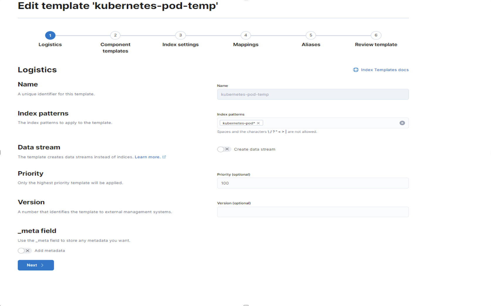
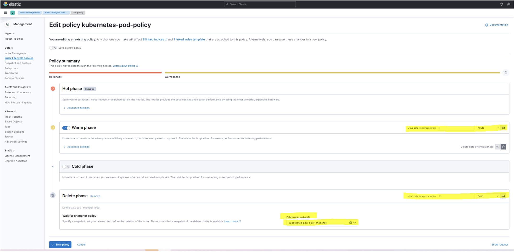
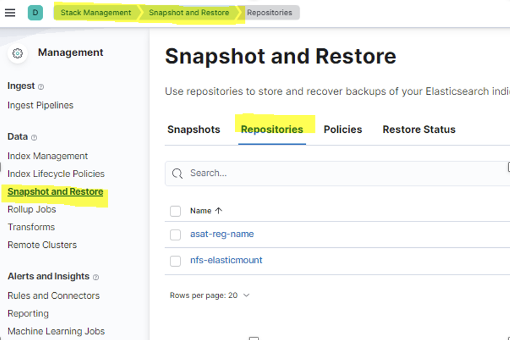
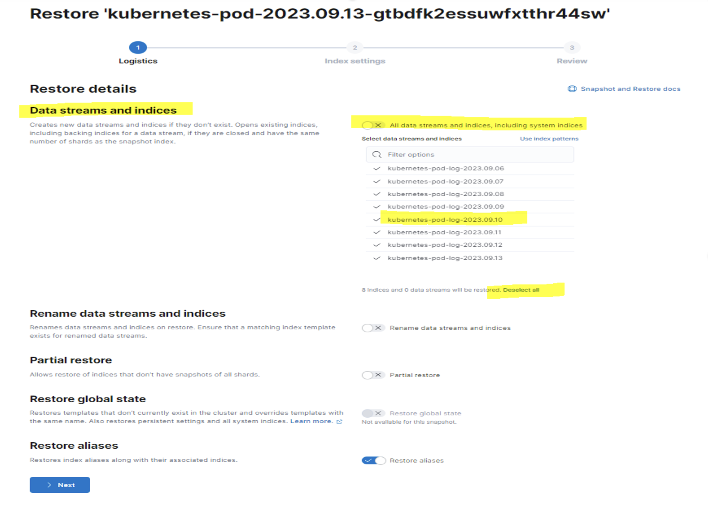

# Elasticsearch Index Lifecycle Management

## Indexing:

Indices based on the indexname defined on Logstash need to be created to be visible on Kibana. To do this, the pattern specified in the left menu is written and created by clicking on the Create Index Pattern section under Stack management. 


 
## Create Repository:

However, a repo must be created and registered to keep snapshots.

**/Stack management/Snapshot and Restore/Repositories**

Here repo elasticsearch can be on a separate server as it could be on the built-in server. Importantly, this directory should be specified in the elasticsearch configuration file (elasticSearch.yaml, values.jaml). If it will be on another server, it should be mounted.


For example, commands executed on the Elasticsearch server for a separate server to be used as an NFS server:

```bash
sudo apt install nfs-common

sudo apt install cifs-utils

sudo mount.nfs <path on nfs server> <path on elasticserach server>

sudo  mount.nfs :/mnt/disk2/elasticmount /mnt/elasticmount 

chown -R elasticsearch:elasticsearch elasticmount 
```

## Index Template:

A template should be created to manage the created indexes and define a lifecycle policy.

**/Stack management/ Index Management/Index Templates**

Here, click create template to create a template that belongs to a particular pattern.



**Under Index settings section:**

Add:

 { "index": {"lifecycle": { "name": "kubernetes-pod-policy" } } }


## Index Lifecycle Policy:

A policy is created for what to do with the indexes of the specified pattern. 


For this;

Click **/Stack management/ Index Lifecycle Policies**

Here a new policy is created with create Policy.



This section specifies how long it will last in which phase and what to do during that time. 

For example, the policy of given pod-logs is to remove indexes with a one-hour lifetime in the warm phase after the replica numbers are drawn to 0 (to avoid holding space), and the policy is to delete indexes that have a seven-day lifecycle in the delete phase when the snapshot policy is applied.

## Snapshot Policy:

It can be deleted by taking a snapshot at certain intervals so that the specified indexes do not hold their place. If necessary, it can be restored from these snapshots. 


A policy is defined for taking these snapshots.

**/Stack management/Snapshot and Restore/Policies**




For example, when creating a kubernetes-pod-daily-snapshot policy in the form;

- The snapshot to be taken is created on a day-based basis, defined as <kubernetes-pod-{now/d}>,

- specified in which repository the snapshot to be taken will be held, defined by the schedule of the time of the day,

- specified which pattern index is to be taken,

- The validity period of this snapshot is specified (expiration - after which time deletion permission is given),

- This policy specifies the number of snapshots to hold min and max.

## Restore snapshots:

To restore snapshots taken on a specific date

**Stack management/Snapshot and Restore/snapshot**




Here you click the snapshot of the day. The restore button will be clicked on the screen that opens. 

Here the snapshots will belong to more than a day. However, it should not be forgotten that it is taken incrementally.

To restore a day's snapshot, untick **Data streams and indices** and click **deselect all** below. The restore is then done by clicking on the index of the desired day.

