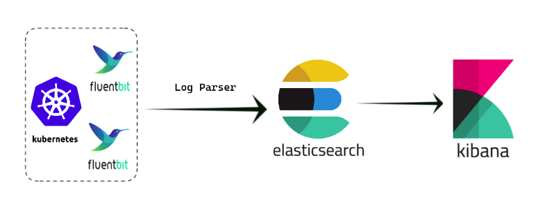

# EFK Stack (Elasticsearch, Fluentbit, Kibana) via Minikube

EFK is a popular logging stack used to collect, store, and analyze logs in Kubernetes.
- Elasticsearch: Stores and indexes log data for easy retrieval.
- Fluentbit: A lightweight log forwarder that collects logs from different sources and sends them to Elasticsearch.
- Kibana: A visualization tool that allows users to explore and analyze logs stored in Elasticsearch.



## Step-by-Step Setup on minikube

### Create cluster
```bash
minikube start
```

### Create Namespace for Logging

```bash
kubectl create namespace logging
 ```

### Install Elasticsearch on K8s

```bash
helm repo add elastic https://helm.elastic.co

helm install elasticsearch \
 --set replicas=1 \
 --set persistence.enabled=false elastic/elasticsearch -n logging
 ```


 ### Install Kibana

```bash
helm install kibana  elastic/kibana -n logging
kubectl port-forward svc/kibana-kibana 5601:5601 -n logging
 ```

- Go to localhost:5601 and login Kibana

### Retrieve Elasticsearch Username & Password

```bash
# for username
kubectl get secrets --namespace=logging elasticsearch-master-credentials -ojsonpath='{.data.username}' | base64 -d
# for password
kubectl get secrets --namespace=logging elasticsearch-master-credentials -ojsonpath='{.data.password}' | base64 -d
 ```


### Install Fluentbit with Custom Values/Configurations

👉 Note: Please update the HTTP_Passwd field in the fluentbit-values.yml file with the password retrieved earlier in step 6: (i.e NJyO47UqeYBsoaEU)"

fluentbit-values.yaml

```yaml
kind: DaemonSet
replicaCount: 1

image:
  repository: cr.fluentbit.io/fluent/fluent-bit

service:
  type: ClusterIP
  port: 2020


luaScripts: {}

## https://docs.fluentbit.io/manual/administration/configuring-fluent-bit/classic-mode/configuration-file
config:
  service: |
    [SERVICE]
        Daemon Off
        Flush {{ .Values.flush }}
        Log_Level info
        Parsers_File /fluent-bit/etc/parsers.conf
        Parsers_File /fluent-bit/etc/conf/custom_parsers.conf
        HTTP_Server On
        HTTP_Listen 0.0.0.0
        HTTP_Port {{ .Values.metricsPort }}
        Health_Check On

  ## https://docs.fluentbit.io/manual/pipeline/inputs
  inputs: |
    [INPUT]
        Name tail
        Path /var/log/containers/webapp-deployment*.log
        multiline.parser docker, cri
        Tag kube.*
        Mem_Buf_Limit 5MB
        Skip_Long_Lines On


  ## https://docs.fluentbit.io/manual/pipeline/filters
  filters: |
    [FILTER]
        Name kubernetes
        Match kube.*
        Merge_Log On
        Keep_Log Off
        K8S-Logging.Parser On
        K8S-Logging.Exclude On

  # https://docs.fluentbit.io/manual/pipeline/outputs
  outputs: |
    [OUTPUT]
        Name es
        Match kube.*
        Type  _doc
        Host elasticsearch-master
        Port 9200
        HTTP_User elastic
        HTTP_Passwd xB7UdQgmGkgRaCrH
        tls On
        tls.verify Off
        Logstash_Format On
        Logstash_Prefix ersin-fluntbit
        Retry_Limit False
        Suppress_Type_Name On


  ## https://docs.fluentbit.io/manual/pipeline/parsers
  customParsers: |
    [PARSER]
        Name docker_no_time
        Format json
        Time_Keep Off
        Time_Key time
        Time_Format %Y-%m-%dT%H:%M:%S.%L


volumeMounts:
  - name: config
    mountPath: /fluent-bit/etc/conf

daemonSetVolumes:
  - name: varlog
    hostPath:
      path: /var/log
  - name: varlibdockercontainers
    hostPath:
      path: /var/lib/docker/containers
  - name: etcmachineid
    hostPath:
      path: /etc/machine-id
      type: File

daemonSetVolumeMounts:
  - name: varlog
    mountPath: /var/log
  - name: varlibdockercontainers
    mountPath: /var/lib/docker/containers
    readOnly: true
  - name: etcmachineid
    mountPath: /etc/machine-id
    readOnly: true

command:
  - /fluent-bit/bin/fluent-bit

args:
  - --workdir=/fluent-bit/etc
  - --config=/fluent-bit/etc/conf/fluent-bit.conf
```

```bash
helm repo add fluent https://fluent.github.io/helm-charts
helm upgrade --install fluent-bit fluent/fluent-bit -f fluentbit-values.yaml -n logging
 ```

Service Section
Defines global configuration settings for the Fluent Bit service.

Daemon Off: Runs Fluent Bit in the foreground.
Flush {{ .Values.flush }}: Sets the flush interval for sending data, using a configurable Helm value.
Log_Level info: Sets the logging level to info.
Parsers_File: Specifies parser configuration files.
HTTP_Server On: Enables the built-in HTTP server for metrics and health checks.
HTTP_Listen 0.0.0.0: Sets the HTTP server to listen on all network interfaces.
HTTP_Port {{ .Values.metricsPort }}: Sets the HTTP server port for metrics, using a Helm value.


Inputs Section
Defines where Fluent Bit collects logs from.

[INPUT] Name tail: Specifies the input plugin tail to read log files.
Path /var/log/containers/webapp-deployment.log*: Specifies the log file path to monitor.
multiline.parser docker, cri: Enables multi-line log parsing using Docker and CRI parsers.
Tag kube.*: Tags logs with a kube.* prefix for filtering.
Mem_Buf_Limit 5MB: Sets the memory buffer limit to 5MB.
Skip_Long_Lines On: Skips lines longer than the buffer limit.


Filters Section
Processes and enriches logs before output.

[FILTER] Name kubernetes: Uses the kubernetes filter plugin for Kubernetes metadata enrichment.
Match kube.*: Filters logs with tags matching kube.*.
Merge_Log On: Combines partial log lines into a single entry.
Keep_Log Off: Drops the original unparsed log after merging.
K8S-Logging.Parser On: Uses parsers for logs based on Kubernetes metadata.
K8S-Logging.Exclude On: Excludes logs that don't match certain Kubernetes metadata.

Output Section

[OUTPUT] Name es: Specifies the Elasticsearch output plugin.
Match kube.*: Sends logs with tags matching kube.*.
Type _doc: Specifies the document type (deprecated in modern Elasticsearch versions).
Host elasticsearch-master, Port 9200: Sets the Elasticsearch host and port.
HTTP_User, HTTP_Passwd: Provides authentication credentials for Elasticsearch.
tls On: Enables TLS for secure communication.
tls.verify Off: Disables certificate verification (not recommended in production).
Logstash_Format On: Formats logs in Logstash-compatible JSON.
Logstash_Prefix ersin-fluntbit: Sets the prefix for Elasticsearch index names.
Retry_Limit False: Disables retrying on output failures.


Custom Parsers Section
Defines custom log parsing rules.

[PARSER] Name docker_no_time: Names the parser docker_no_time.
Format json: Specifies that the log format is JSON.
Time_Keep Off: Ignores the timestamp from the original log.
Time_Key time: Specifies the JSON key for extracting timestamps.
Time_Format %Y-%m-%dT%H:%M:%S.%L: Defines the timestamp format with milliseconds.


## Deploy App for log

python-app-service.yaml

```yaml
apiVersion: v1
kind: Service
metadata:
  name: webapp-service
  namespace: app
  labels:
    app: webapp
spec:
  selector:
    app: webapp
  ports:
  - port: 80
    targetPort: 5005
```

python-app-deployment.yaml
```yaml
apiVersion: apps/v1
kind: Deployment
metadata:
  name: webapp-deployment
  namespace: app
  labels:
    app: webapp
spec:
  replicas: 1
  selector:
    matchLabels:
      app: webapp
  template:
    metadata:
      labels:
        app: webapp
    spec:
      containers:
      - name: webapp
        image: ersinsari/fluentbit-python:latest
        volumeMounts:
        - mountPath: /log
          name: log-volume
      volumes:
      - name: log-volume
        hostPath:
          path: /var/log/webapp
          type: DirectoryOrCreate
```

 ```bash
k create ns app
k apply -f python-app-service.yaml
k apply -f python-app-deployment.yaml
 ```

## Access the App and generate log

 ```bash
kubectl port-forward svc/webapp-service 5001:80 -n app
 ```

```yaml
username: ersin
password: password
```

If you enter username and credential right generate info log but wrong generate warn log

Go to Kibana UI --> Stack Management -- > Kibana --> Data View create new data view

```yaml
name: ersin-fluntbit
filter: ersin-fluntbit*
```

```json
{"level": "INFO", "message": "Response sent with status: 200", "time": "2025-01-20 18:59:49,375", "logger": "app", "pathname": "/app/app.py", "lineno": 55, "funcname": "log_response_info", "request": {"method": "GET", "url": "http://localhost:5001/second_level_auth", "remote_addr": "127.0.0.1", "user_agent": "Mozilla/5.0 (Macintosh; Intel Mac OS X 10_15_7) AppleWebKit/537.36 (KHTML, like Gecko) Chrome/131.0.0.0 Safari/537.36"}}
```

```json
{"level": "WARNING", "message": "Login failed for user: ersin", "time": "2025-01-20 18:59:49,364", "logger": "app", "pathname": "/app/app.py", "lineno": 75, "funcname": "login", "request": {"method": "POST", "url": "http://localhost:5001/login", "remote_addr": "127.0.0.1", "user_agent": "Mozilla/5.0 (Macintosh; Intel Mac OS X 10_15_7) AppleWebKit/537.36 (KHTML, like Gecko) Chrome/131.0.0.0 Safari/537.36"}}
```

- Go to Discover section and check logs

The application logs were sent to the index in JSON format using a parser, which split the logs into fields. This allows for faster queries and makes it easier to find specific logs.

