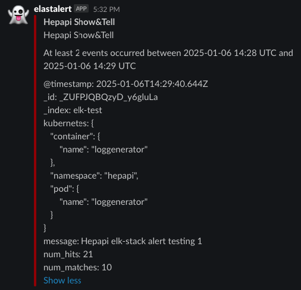

## elastalert2

- Introduction

ElastAlert 2 is a simple framework for alerting on anomalies, spikes, or other patterns of interest from data in Elasticsearch and OpenSearch.


- As a Kubernetes deployment

The Docker container for ElastAlert 2 can be used directly as a Kubernetes deployment, but for convenience, a Helm chart is also available. See the Chart Readme for more information on how to install, configure, and run the chart.

- install and modified values.yaml

```bash
wget https://raw.githubusercontent.com/jertel/elastalert2/refs/heads/master/chart/elastalert2/values.yaml

mv values.yaml elastalert2.yaml 

vi elastalert2.yaml 
````

```yaml
enabledRules: ["deadman_slack" ] # should match the name in the rule field
elasticsearch:
  host: elasticsearch-master # elasticsearch service name
  port: 9200
  useSsl: "True"
  username: ""
  password: ""
  credentialsSecret: "elasticsearch-master-credentials" # elasticsearch secret name for user-password credential
  credentialsSecretUsernameKey: "username" # username key in elasticsearch secret
  credentialsSecretPasswordKey: "password" # password key in elasticsearch secret
  verifyCerts: "True" # true for connection to elacticsearch with cert
  caCerts: "/certs/ca.crt" # ca.crt --> name in the elasticsearch cert secret
  certsVolumes:
    - name: es-certs
      secret:
        defaultMode: 420
        secretName: elasticsearch-master-certs # elasticsearch cert secret name
  certsVolumes:
  certsVolumeMounts:
    - name: es-certs
      mountPath: /certs
      readOnly: true

rules:
  deadman_slack: |-
    ---
    name: Deadman Switch Slack  
    type: frequency
    index: "<index_name>" 
    num_events: 2
    timeframe:
      minutes: 1
    filter:
    - match_phrase:
        message: "<message include string>>
    alert:
    - "slack"
    include:
    - "@timestamp"
    - "message"
    - "kubernetes.pod.name"
    - "kubernetes.namespace"
    - "kubernetes.container.name"
    slack:
    slack_webhook_url: <url>
```

### Rules

- Several rule types with common monitoring paradigms are included with ElastAlert 2

frequency, spike, flatline, blacklist, whitelist etc..

*Match when there are more than X events in Y time use frequency
Exmp:

```yaml
rules:
  deadman_slack: |-
    ---
    name: deadman_slack more log then x event in y minutes
    type: frequency
    index: "devops-dev"
    num_events: 2
    timeframe:
      minutes: 1
    filter:
    - match_phrase:
        message: "log text"
    alert:
    - "slack"
    include:
    - "@timestamp"
    - "message"
    - "kubernetes.pod.name"
    - "kubernetes.namespace"
    - "kubernetes.container.name"
    slack:
    slack_webhook_url: <url>

```

*Match when there are less than X events in Y time use flatline
Exmp:

```yaml
  deadman_slack2: |-
    ---
    name: deadman_slack2 less log then 3 event
    type: flatline
    index: "<index_name>"
    threshold: 3
    timeframe:
      minutes: 1
    filter:
    - match_phrase:
        message: "log text"
    alert:
    - "slack"
    include:
    - "@timestamp"
    - "message"
    - "kubernetes.pod.name"
    - "kubernetes.namespace"
    - "kubernetes.container.name"
    slack:
    slack_webhook_url: <url>
    slack_msg_color: good
```


## Alerts

- Each rule may have any number of alerts attached to it. Alerts are subclasses of Alerter and are passed a dictionary, or list of dictionaries, from ElastAlert 2 which contain relevant information. They are configured in the rule configuration file similarly to rule types.

exmp:

```yaml
alert:
 - email
from_addr: "no-reply@example.com"
email: "customer@example.com"
```

- Alert types

```yaml
alert:
  - datadog
  - debug
  - dingtalk
  - discord
  - email
  - gitter
  - googlechat
  - jira
  - ms_teams
  - opsgenie
  - slack
  - sns
  - stomp
  - telegram
  - twilio
  - zabbix
  ...
  ...

```

- install elastalert2 

```bash
helm repo add elastalert2 https://jertel.github.io/elastalert2/

helm upgrade --install elastalert2 elastalert2/elastalert2 --create-namespace -n logging -f elastalert2.yaml 
```

- Alert Notification exmp. (more log then x event in y minutes, type: frequency )

