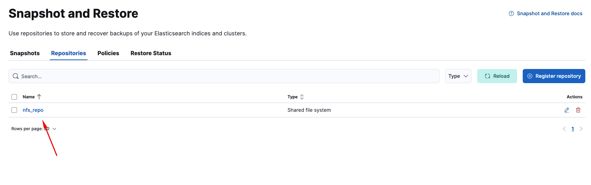

# Elasticsearch-Snapshot

[📄 Elasticsearch-Snapshot-Doc-Link ](<https://www.elastic.co/docs/deploy-manage/tools/snapshot-and-restore>)

A snapshot is a backup of a running Elasticsearch cluster. You can use snapshots to:

Regularly back up a cluster with no downtime
Recover data after deletion or a hardware failure
Transfer data between clusters
Reduce storage costs by using searchable snapshots in the cold and frozen data tiers


## Self-managed repository types
If you manage your own Elasticsearch cluster, you can use the following built-in snapshot repository types:

Azure
Google Cloud Storage
AWS S3
Shared file system
Read-only URL
Source-only

### Shared file system Snapshots

This guide explains how to configure an on-premises snapshot repository for Elasticsearch using an NFS shared directory.
Follow each step carefully — every Elasticsearch node must be configured identically.

#### 1. Configure Elasticsearch Snapshot Directory (path.repo)
First, we must define a directory where Elasticsearch is allowed to write snapshots.
🔹 IMPORTANT: Perform the following steps on every Elasticsearch node.
Create the Snapshot Directory
SSH into each Elasticsearch node and run:

```bash
sudo mkdir -p /mnt/es-snap
sudo chown -R elasticsearch:elasticsearch /mnt/es-snap
sudo chmod 770 /mnt/snap
```
Add the Directory to elasticsearch.yml
/etc/elasticsearch/elasticsearch.yml
Add this line:
```yaml
path.repo: /mnt/es-snap
```

#### 1. Configure Mount-Path on Elasticsaerch VM's

Install NFS Client Packages on Elasticsearch VM's
Ubuntu:
```bash
sudo apt install nfs-common -y
```

RHEL / Rocky:
```bash
sudo yum install nfs-utils -y
```
Mount Path to the NFS Share
```bash
sudo mount -t nfs <NFS_IP>:/mnt/es-snap /mnt/es-snap
Example:
sudo mount -t nfs 10.0.10.5:/mnt/es-snap /mnt/es-snap
```

Add Mount Point to fstab

/etc/fstab

```bash
<NFS_IP>:/mnt/snap /mnt/snap nfs defaults 0 0 > /etc/fstab
```

Restart Elasticsearch
```bash
sudo systemctl restart elasticsearch
```

#### 5. Register the Snapshot Repository in Elasticsearch
Once NFS is mounted on all nodes and the directory is configured as path.repo, register the repository:
Go to Elasticsearch DevTool and run below command
```json
PUT _snapshot/nfs_repo
{
  "type": "fs",
  "settings": {
    "location": "/mnt/es-snap",
    "compress": true
  }
}
```
Verify the Repository
```json
POST _snapshot/nfs_repo/_verify
```

If everything is configured correctly, Elasticsearch will return a success message.
#### Create Snapshot Policy
Go to Elasticsearch DevTool and run below command
```json
PUT _slm/policy/daily-snap
{
  "schedule": "0 30 1 * * ?",
  "name": "<daily-snap-{now/d}>",
  "repository": "nfs_repo",
  "config": {
    "indices": ["*"],   #edit indices depends on your index name
    "ignore_unavailable": true,
    "include_global_state": false
  },
  "retention": {
    "expire_after": "30d",
    "min_count": 5,
    "max_count": 50
  }
}
```

#### Test Snapshot

Go To Kibana UI Stack Manamement --> Snapshot and Restore
Check your Repositories and Policies

Is everyting ok go to policies and click run now button


And Check your Snapshots


### Azure Blob Storage Snapshots

#### Create Azure Storage Account
Log in to Azure Portal:
https://portal.azure.com/
Go to Storage Accounts → Create
Fill in the required fields:
Subscription:         Select your Azure subscription
Resource Group:       Choose existing or create a new one
Storage Account Name: es-snapshots
Location:             <your-region>
Performance:          Standard
Replication:          Locally-redundant storage (LRS)
Click Review + Create, then Create.
#### Create Blob Container and SAS Token
Create Blob Container
Navigate to:
Storage Account → Containers → + Container
Fill in:
Container Name: es-backups
Public Access Level: Private
Click Create.
Generate SAS Token
Navigate to:
Storage Account → Security + Networking → Shared Access Signature (SAS)
Select:
Allowed Services:        Blob
Allowed Resource Types:  Container, Object
Permissions:             Read, Write, Delete, List
Click:
Generate SAS and Connection String
Copy the SAS Token for later.
#### Configure Azure Credentials on Elasticsearch Nodes
You must run these commands on every Elasticsearch node.
Add Storage Account Name to Elasticsearch Keystore
```bash
/usr/share/elasticsearch/bin/elasticsearch-keystore add azure.client.default.account
Enter your storage account name, e.g.:
es-snapshots
```

#### Add SAS Token to Elasticsearch Keystore
```bash
/usr/share/elasticsearch/bin/elasticsearch-keystore add azure.client.default.sas_token
Paste the SAS Token from Azure Portal.
Restart Elasticsearch
sudo /bin/systemctl daemon-reload
sudo systemctl restart elasticsearch.service
```

#### Register Azure Snapshot Repository in Elasticsearch
Use Kibana Dev Tools
```json
PUT _snapshot/azure_repo
{
  "type": "azure",
  "settings": {
    "container": "es-backups",
    "client": "default",
    "base_path": "snapshots",
    "chunk_size": "64mb",
    "compress": true
  }
}
```

#### Verify Repository
```json
PUT _snapshot/azure_repo/_verify
```

If successful, it returns node information.