# Grafana Loki: Distributed Log Management and Collection

Grafana Loki is a set of open source components that can be composed into a fully featured logging stack. A small index and highly compressed chunks simplifies the operation and significantly lowers the cost of Loki.

Unlike other logging systems, Loki is built around the idea of only indexing metadata about your logs’ labels (just like Prometheus labels). Log data itself is then compressed and stored in chunks in object stores such as Amazon Simple Storage Service (S3) or Google Cloud Storage (GCS), or even locally on the filesystem.

Loki is a horizontally scalable, highly available, multi-tenant log aggregation system inspired by Prometheus. It’s designed to be very cost-effective and easy to operate.

Because all Loki implementations are unique, the installation process is different for every customer. But there are some steps in the process that are common to every installation.

To collect logs and view your log data generally involves the following steps:

        Install Loki --> Deploy Agents, Collect Logs --> Deploy Grafana --> Query Log Data


## Loki features

- Scalability - Loki is designed for scalability, and can scale from as small as running on a Raspberry Pi to ingesting petabytes a day. In its most common deployment, “simple scalable mode”, Loki decouples requests into separate read and write paths, so that you can independently scale them, which leads to flexible large-scale installations that can quickly adapt to meet your workload at any given time. 

- Multi-tenancy - Loki allows multiple tenants to share a single Loki instance. With multi-tenancy, the data and requests of each tenant is completely isolated from the others. Multi-tenancy is configured by assigning a tenant ID in the agent.

- Third-party integrations - Several third-party agents (clients) have support for Loki, via plugins. This lets you keep your existing observability setup while also shipping logs to Loki.

- Efficient storage - Loki stores log data in highly compressed chunks. Similarly, the Loki index, because it indexes only the set of labels, is significantly smaller than other log aggregation tools. By leveraging object storage as the only data storage mechanism, Loki inherits the reliability and stability of the underlying object store. The compressed chunks, smaller index, and use of low-cost object storage, make Loki less expensive to operate.

- LogQL, the Loki query language - LogQL is the query language for Loki. Users who are already familiar with the Prometheus query language, PromQL, will find LogQL familiar and flexible for generating queries against the logs. The language also facilitates the generation of metrics from log data, a powerful feature that goes well beyond log aggregation.

- Alerting - Loki includes a component called the ruler, which can continually evaluate queries against your logs, and perform an action based on the result. This allows you to monitor your logs for anomalies or events. Loki integrates with Prometheus Alertmanager, or the alert manager within Grafana.

- Grafana integration - Loki integrates with Grafana, Mimir, and Tempo, providing a complete observability stack, and seamless correlation between logs, metrics and traces.


## Loki architecture

Grafana Loki has a microservices-based architecture and is designed to run as a horizontally scalable, distributed system. The system has multiple components that can run separately and in parallel. The Grafana Loki design compiles the code for all components into a single binary or Docker image. The -target command-line flag controls which component(s) that binary will behave as.

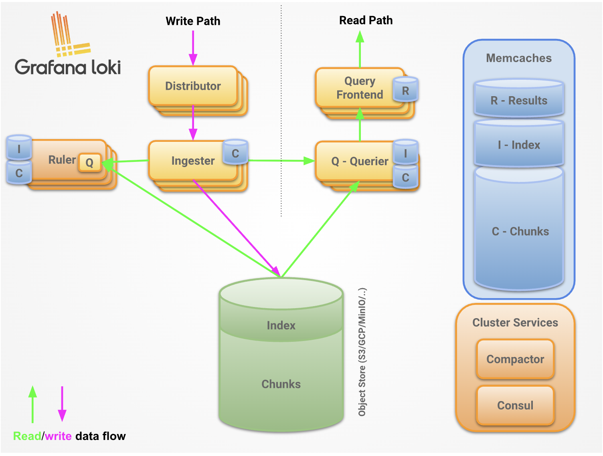


## Loki components

Loki is a modular system that contains many components that can either be run together (in “single binary” mode with target all), in logical groups (in “simple scalable deployment” mode with targets read, write, backend), or individually (in “microservice” mode)

This table describes the responsibilities of each of these components.

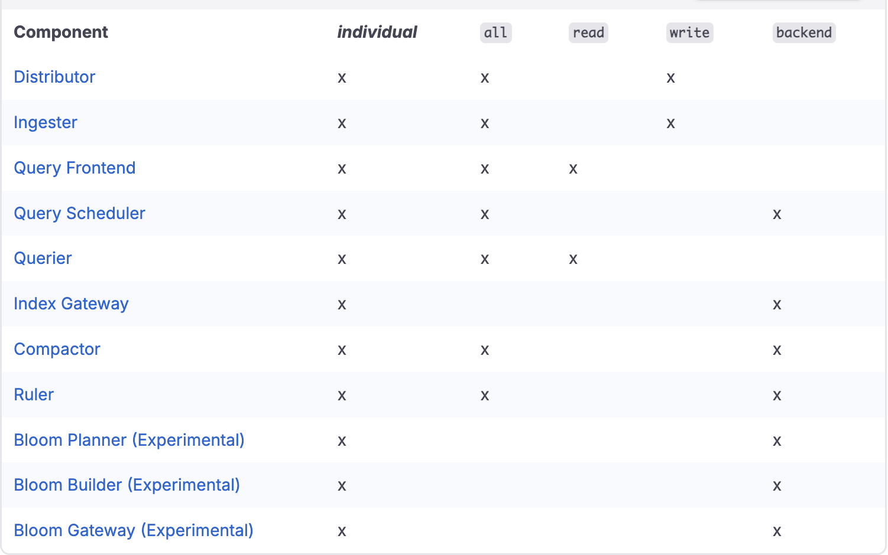

- Distributor: The distributor service is responsible for handling incoming push requests from clients. It’s the first step in the write path for log data. Once the distributor receives a set of streams in an HTTP request, each stream is validated for correctness and to ensure that it is within the configured tenant (or global) limits. Each valid stream is then sent to n ingesters in parallel, where n is the replication factor for data. The distributor determines the ingesters to which it sends a stream to using consistent hashing.

    A load balancer must sit in front of the distributor to properly balance incoming traffic to them. In Kubernetes, the service load balancer provides this service.

    The distributor is a stateless component. This makes it easy to scale and offload as much work as possible from the ingesters, which are the most critical component on the write path. The ability to independently scale these validation operations means that Loki can also protect itself against denial of service attacks that could otherwise overload the ingesters. It also allows us to fan-out writes according to the replication factor.

- Ingester: The ingester service is responsible for persisting data and shipping it to long-term storage (Amazon Simple Storage Service, Google Cloud Storage, Azure Blob Storage, etc.) on the write path, and returning recently ingested, in-memory log data for queries on the read path.

- Query frontend: The query frontend is an optional service providing the querier’s API endpoints and can be used to accelerate the read path. When the query frontend is in place, incoming query requests should be directed to the query frontend instead of the queriers. The querier service will be still required within the cluster, in order to execute the actual queries.

    The query frontend internally performs some query adjustments and holds queries in an internal queue. In this setup, queriers act as workers which pull jobs from the queue, execute them, and return them to the query frontend for aggregation. Queriers need to be configured with the query frontend address (via the -querier.frontend-address CLI flag) in order to allow them to connect to the query frontends.

- Querier: The querier service is responsible for executing Log Query Language (LogQL) queries. The querier can handle HTTP requests from the client directly (in “single binary” mode, or as part of the read path in “simple scalable deployment”) or pull subqueries from the query frontend or query scheduler (in “microservice” mode).

    It fetches log data from both the ingesters and from long-term storage. Queriers query all ingesters for in-memory data before falling back to running the same query against the backend store. Because of the replication factor, it is possible that the querier may receive duplicate data. To resolve this, the querier internally deduplicates data that has the same nanosecond timestamp, label set, and log message.

- Query scheduler: The query scheduler is an optional service providing more advanced queuing functionality than the query frontend. When using this component in the Loki deployment, query frontend pushes split up queries to the query scheduler which enqueues them in an internal in-memory queue. There is a queue for each tenant to guarantee the query fairness across all tenants. The queriers that connect to the query scheduler act as workers that pull their jobs from the queue, execute them, and return them to the query frontend for aggregation. Queriers therefore need to be configured with the query scheduler address (via the -querier.scheduler-address CLI flag) in order to allow them to connect to the query scheduler.

- Index Gateway: The index gateway service is responsible for handling and serving metadata queries. Metadata queries are queries that look up data from the index. The index gateway is only used by “shipper stores”, such as single store TSDB or single store BoltDB.

    The query frontend queries the index gateway for the log volume of queries so it can make a decision on how to shard the queries. The queriers query the index gateway for chunk references for a given query so they know which chunks to fetch and query.

- Compactor: The compactor service is used by “shipper stores”, such as single store TSDB or single store BoltDB, to compact the multiple index files produced by the ingesters and shipped to object storage into single index files per day and tenant. This makes index lookups more efficient.

    To do so, the compactor downloads the files from object storage in a regular interval, merges them into a single one, uploads the newly created index, and cleans up the old files. Additionally, the compactor is also responsible for log retention and log deletion.

- Ruler: The ruler service manages and evaluates rule and/or alert expressions provided in a rule configuration. The rule configuration is stored in object storage (or alternatively on local file system) and can be managed via the ruler API or directly by uploading the files to object storage.

    Alternatively, the ruler can also delegate rule evaluation to the query frontend. This mode is called remote rule evaluation and is used to gain the advantages of query splitting, query sharding, and caching from the query frontend.


## Loki deployment modes

- Monolithic mode: The simplest mode of operation is the monolithic deployment mode. You enable monolithic mode by setting the -target=all command line parameter. This mode runs all of Loki’s microservice components inside a single process as a single binary or Docker image.

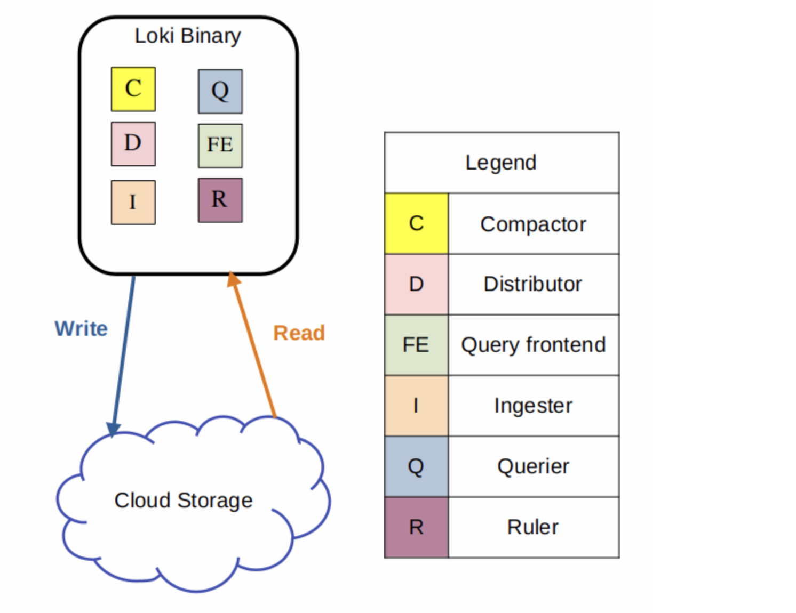

Monolithic mode is useful for getting started quickly to experiment with Loki, as well as for small read/write volumes of up to approximately 20GB per day.

- Simple Scalable: The simple scalable deployment is the default configuration installed by the Loki Helm Chart. This deployment mode is the easiest way to deploy Loki at scale. It strikes a balance between deploying in monolithic mode or deploying each component as a separate microservice. Simple scalable deployment is also referred to as SSD. 

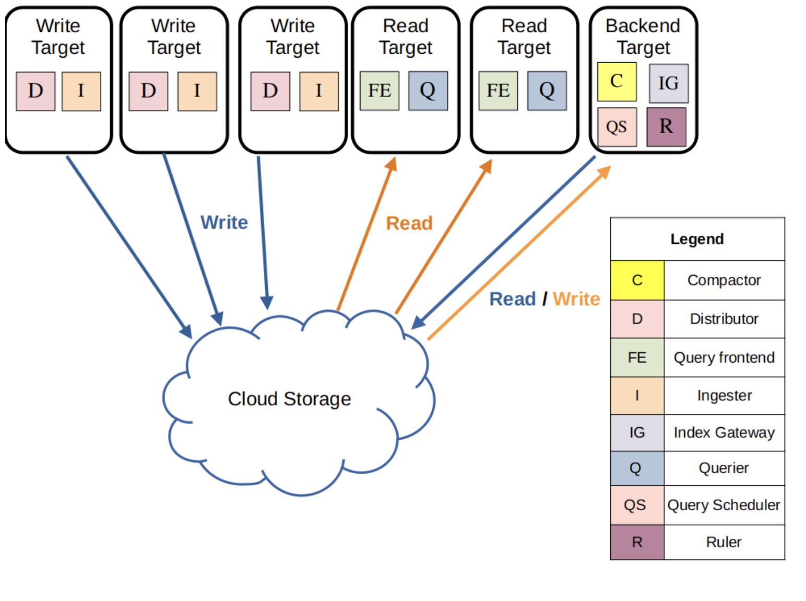

The three execution paths in simple scalable mode are each activated by appending the following arguments to Loki on startup:

    -target=write - The write target is stateful and is controlled by a Kubernetes StatefulSet. It contains the following components:
    Distributor,
    Ingester
    -target=read - The read target is stateless and can be run as a Kubernetes Deployment that can be scaled automatically (Note that in the official helm chart it is currently deployed as a stateful set). It contains the following components:
    Query Frontend,
    Querier
    -target=backend - The backend target is stateful, and is controlled by a Kubernetes StatefulSet. Contains the following components:
    Compactor,
    Index Gateway,
    Query Scheduler,
    Ruler,
    Bloom Planner (experimental),
    Bloom Builder (experimental),
    Bloom Gateway (experimental)

The simple scalable deployment mode requires a reverse proxy to be deployed in front of Loki, to direct client API requests to either the read or write nodes. The Loki Helm chart includes a default reverse proxy configuration, using Nginx.

- Microservices mode: The microservices deployment mode runs components of Loki as distinct processes. The microservices deployment is also referred to as a Distributed deployment. Each process is invoked specifying its target. For release 3.2 the components are:

    Bloom Builder (experimental),
    Bloom Gateway (experimental),
    Bloom Planner (experimental),
    Compactor,
    Distributor,
    Index Gateway,
    Ingester,
    Overrides Exporter,
    Querier,
    Query Frontend,
    Query Scheduler,
    Ruler,
    Table Manager (deprecated)

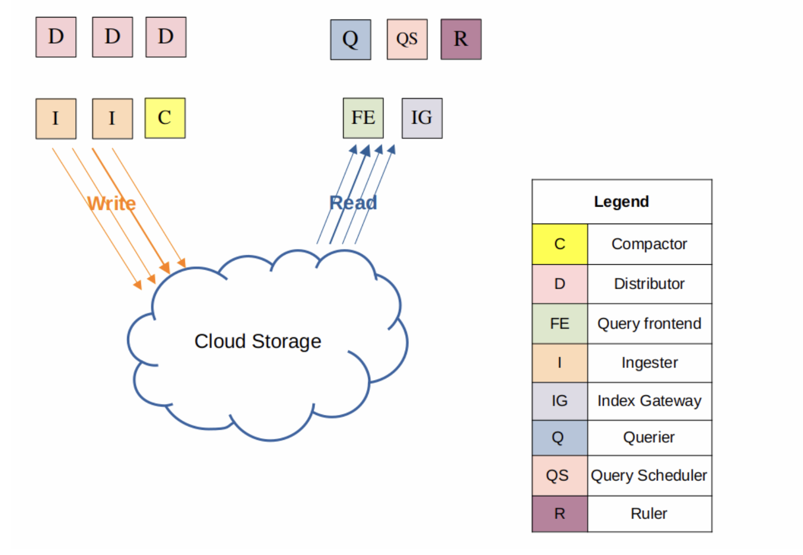

Running components as individual microservices provides more granularity, letting you scale each component as individual microservices, to better match your specific use case.

Microservices mode deployments can be more efficient Loki installations. However, they are also the most complex to set up and maintain.


## Install Loki

- Add Repo

```bash
helm repo add grafana https://grafana.github.io/helm-charts
helm repo update
```

- We can check all repo 

```bash
helm search repo loki
```
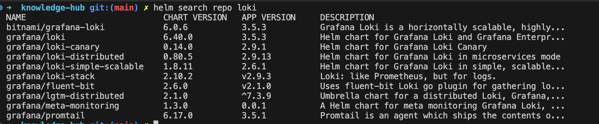

- We will use grafana/loki helm chart so lets get values.yaml

```bash
helm show values grafana/loki > loki-values.yaml
```

- Customize values.yaml for our scenario.

```yaml

global:
  extraArgs: 
     - "-log.level=debug"

loki:
  schemaConfig:
    configs:
      - from: "2024-04-01"
        store: tsdb
        object_store: s3
        schema: v13
        index:
          prefix: loki_index_
          period: 24h

  limits_config:
    allow_structured_metadata: true
    ingestion_rate_mb: 10
    ingestion_burst_size_mb: 15
    max_streams_per_user: 50000

  ingester:
    chunk_encoding: snappy

  pattern_ingester:
    enabled: true

  querier:
    max_concurrent: 4

  auth_enabled: false

  storage_config:
    aws:
      s3: s3://loki-example
      region: eu-central-1
      access_key_id: xxxxxxxxxxxxxxxx
      secret_access_key: xxxxxxxxxxxxxxxx
    tsdb_shipper:
      active_index_directory: /var/loki/index
      cache_location: /var/loki/index_cache
      cache_ttl: 24h


  storage:
    type: s3
    bucketNames:
      chunks: loki-chunks
      ruler: loki-ruler

deploymentMode: SimpleScalable

chunksCache:
  resources:
    requests:
      memory: "2000Mi"
      cpu: "250m"
    limits:
      memory: "6000Mi"
      cpu: "500m"

backend:
  replicas: 3
  persistence:
    volumeClaimsEnabled: false

read:
  replicas: 3

write:
  replicas: 3
  persistence:
    volumeClaimsEnabled: false

# Disable minio storage
minio:
  enabled: false
```

- Install loki Simple Scalable deployment mode.

```bash
helm upgrade --install loki grafana/loki -n logging --values loki-values.yaml --create-namespace 
```
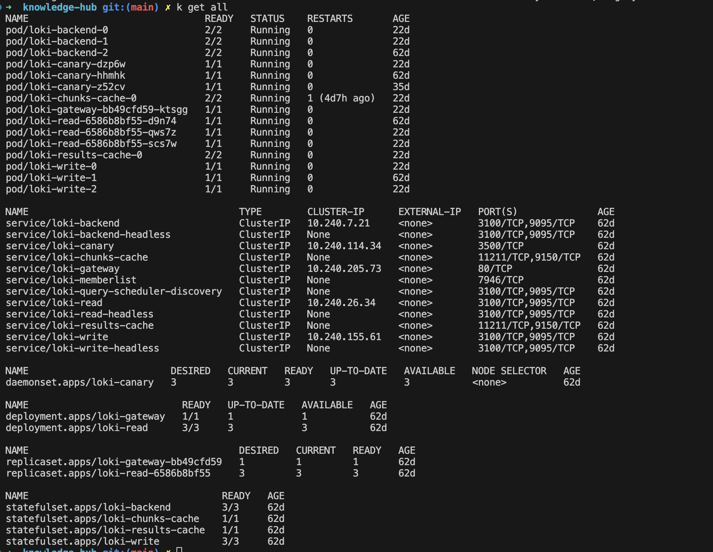


## Deploy Agents, Collect Logs --> Promtail, FluentBit, Alloy or Opentelemetry Collector

### Promtail

- Add Repo

```bash
helm repo add grafana https://grafana.github.io/helm-charts
helm repo update
```

- We will use grafana/promtail helm chart so lets get values.yaml. Also we can add labels for spesific pod or app.

```bash
helm show values grafana/promtail > promtail-values.yaml
```

- our logs format :
```bash
2024-10-26 14:19:06.065	
{"log":"Sat Oct 26 11:19:06 UTC 2024 - Test log message from log-generator\n","stream":"stdout","time":"2024-10-26T11:19:06.022721667Z"}
```

- We want to add 'time' and 'stream' section as a labels.

- Customize values.yaml for our scenario.

```yaml
config:
  snippets:
    pipelineStages:
      - cri: {}
      - match:
          selector: '{app="log-generator"}'
          stages:
            - json:
                expressions:
                  stream: stream
                  time: time
            - labels:
                stream:
                time:
```

- Install Promtail.

```bash
helm upgrade --install promtail  grafana/promtail --values promtail-values.yaml
```

### FluentBit

- Add Repo

```bash
helm repo add fluent https://fluent.github.io/helm-charts
helm repo update
```
- We will use fluent/fluent-bit helm chart so lets get values.yaml

```bash
helm show values fluent/fluent-bit > fluentbit-values.yaml
```

- Customize values.yaml for our scenario.

```yaml
config:
    outputs: |
        [OUTPUT]
            Name        loki
            Match       *
            Host        http://loki-gateway.logging:80
            port        443
            tls         on
            tls.verify  on
            http_user   XXX
            http_passwd XXX
            Labels agent=fluend-bit
```

- Install FluentBit.

```bash
helm upgrade --install fluent-bit fluent/fluent-bit --values fluentbit-values.yaml
```

### Alloy

- SDK development is needed for Alloy this scenario.

- Add Repo

```bash
helm repo add grafana https://grafana.github.io/helm-charts
helm repo update
```

- We will use grafana/alloy helm chart so lets get values.yaml

```bash
helm show values grafana/alloy > alloy-values.yaml
```

- Customize values.yaml for our scenario.

```yaml
alloy:
  configMap:
    content: |
      // ===== CONFIGURATION =====

      // Receive OpenTelemetry traces
      otelcol.receiver.otlp "otlp_receiver" {
        http {
          endpoint = "0.0.0.0:4318"
        }
        grpc {
          endpoint = "0.0.0.0:4317"
        }

        output {
          logs = [otelcol.processor.batch.otlp_processor.input]
        }
      }

      // Batch processor to improve performance
      otelcol.processor.batch "otlp_processor" {
        output {
          logs = [otelcol.exporter.otlphttp.logs.input]
        }
      }

      // Send logs to Loki
      otelcol.exporter.otlphttp "logs" {
        client {
          endpoint = "http://loki-gateway.logging:80/otlp"
        }
      }

      livedebugging {
        enabled = true
      } 

  extraPorts:
    - name: otlp-grpc
      port: 4317
      targetPort: 4317
      protocol: TCP
    - name: otlp-http
      port: 4318
      targetPort: 4318
      protocol: TCP
  
  mounts:
    # -- Mount /var/log from the host into the container for log collection.
    varlog: true
    # -- Mount /var/lib/docker/containers from the host into the container for log
    # collection.
    dockercontainers: true
  
  serviceMonitor: 
    enabled: true
    additionalLabels: 
      release: prometheus

controller:
  # -- Type of controller to use for deploying Grafana Alloy in the cluster.
  # Must be one of 'daemonset', 'deployment', or 'statefulset'.
  type: 'deployment'
  replicas: 3

```

- Install Alloy.

```bash
 helm upgrade --install alloy grafana/alloy --values alloy-values.yaml
```

### Opentelemetry Collector

- SDK development is needed for Opentelemetry Collector this scenario.

- Add Repo

```bash
helm repo add open-telemetry https://open-telemetry.github.io/opentelemetry-helm-charts
helm repo update
```

- We will use open-telemetry/opentelemetry-collector helm chart so lets get values.yaml

```bash
helm show values open-telemetry/opentelemetry-collector > opentelemetry-collector-values.yaml
```

- Customize values.yaml for our scenario.

```yaml
mode: deployment
config:
  exporters:
    debug:
      verbosity: detailed
    otlphttp/gateway/loki:
      endpoint: http://loki-gateway.logging:80/otlp
  processors:
    resource/loki:
      attributes:
        - action: upsert
          key: service.instance.id # loki does not accept host.name (https://github.com/grafana/loki/issues/11786)
          from_attribute: host.name
    batch:
      send_batch_size: 90
      timeout: 30s
    memory_limiter:
      check_interval: 5s
      limit_percentage: 80
      spike_limit_percentage: 25

  extensions:
    health_check:
      endpoint: ${env:MY_POD_IP}:13133
  receivers:
    otlp:
      protocols:
        http:
          endpoint: "0.0.0.0:4318"
        grpc:
          endpoint: "0.0.0.0:4317"
  service:
    pipelines:
      logs/gateway:
        exporters: 
        - otlphttp/gateway/loki
        processors: 
        - resource/loki
        receivers: 
        - otlp
image:
  repository: docker.io/otel/opentelemetry-collector-contrib
replicaCount: 3
revisionHistoryLimit: 10

```

- Install Opentelemetry Collector.

```bash
helm upgrade --install opentelemetry-collector open-telemetry/opentelemetry-collector --values opentelemetry-collector-values.yaml
```

## Deploy Grafana and Query Log Data

- Add Repo

```bash
helm repo add grafana https://grafana.github.io/helm-charts
helm repo update
```

- Install grafana.

```bash
helm install grafana grafana/grafana 
```

- Port-forward grafana services and go to grafana ui

```bash
kubectl port-forward service/grafana 3000:80
```

- You can get grafana admin-password via below command

```bash
kubectl get secret grafana -o jsonpath="{.data.admin-password}" | base64 --decode
```

- Thanks to grafana/loki and grafana/grafana helm-chart you have to configure Loki's Data sources as shown below.

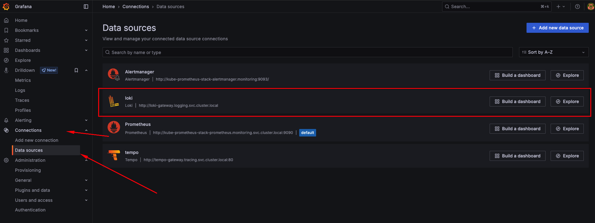

- We can check all pods logs grafana explore section.

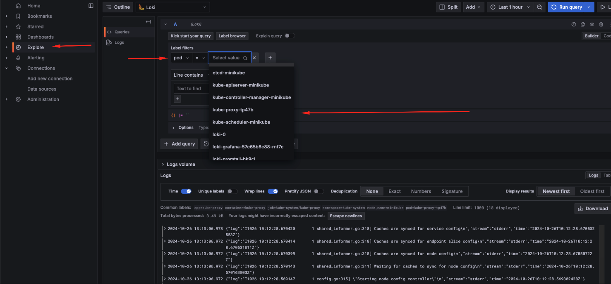
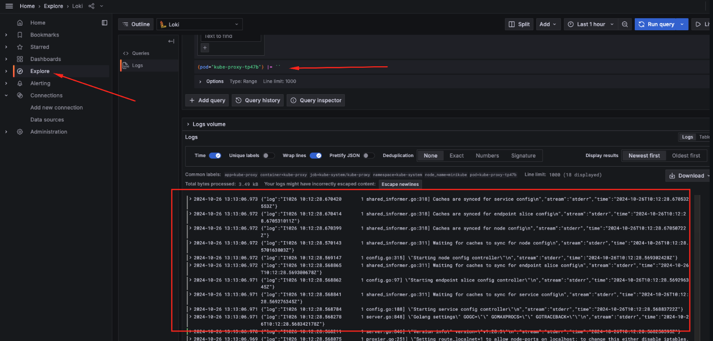


## Deploy App to Collect logs

- Lets deploy a app and collect logs by using grafana-loki

deployment.yaml

```yaml
apiVersion: apps/v1
kind: Deployment
metadata:
  name: log-generator
  labels:
    app: log-generator
spec:
  replicas: 1
  selector:
    matchLabels:
      app: log-generator
  template:
    metadata:
      labels:
        app: log-generator
    spec:
      containers:
        - name: log-generator
          image: busybox
          command:
            - /bin/sh
            - -c
            - |
              while true; do
                echo "$(date) - Test log message from log-generator"
                sleep 5
              done
```

```bash
kubectl create ns app
kubectl apply -f deployment.yaml -n app
```

- Go to grafana ui and select explore section in left-hand-menu and select log generator pod.

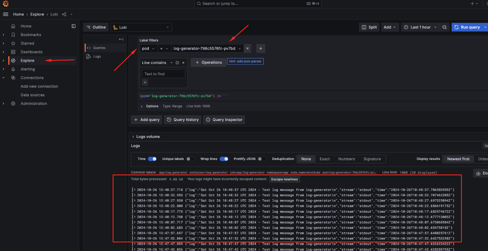
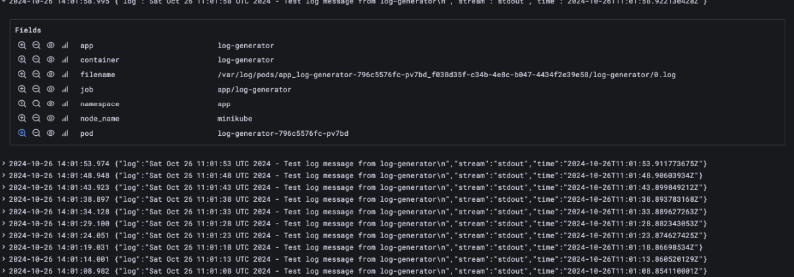


## Add Dashboard Grafana to loki for checking logs

- Go to grafana webui and select dashboard left-hand-menu and click new and import
- Enter the template ID  --> 15141  and click load
- Select Loki as a data source

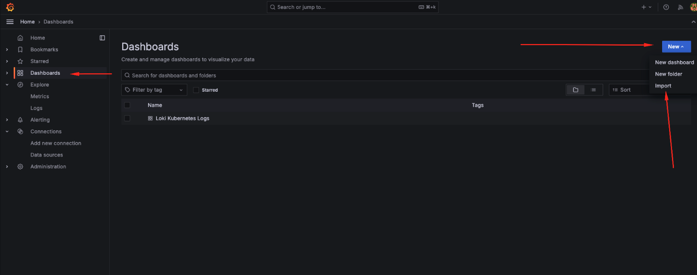
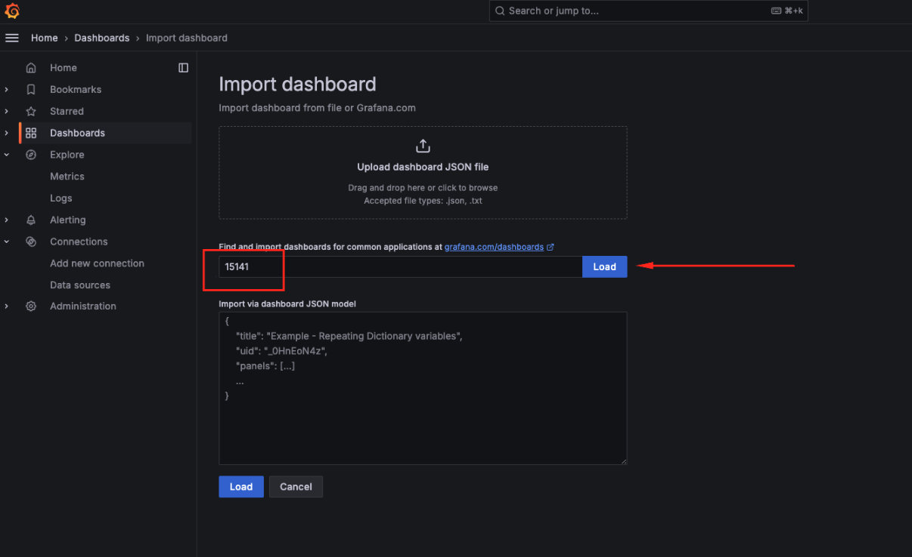
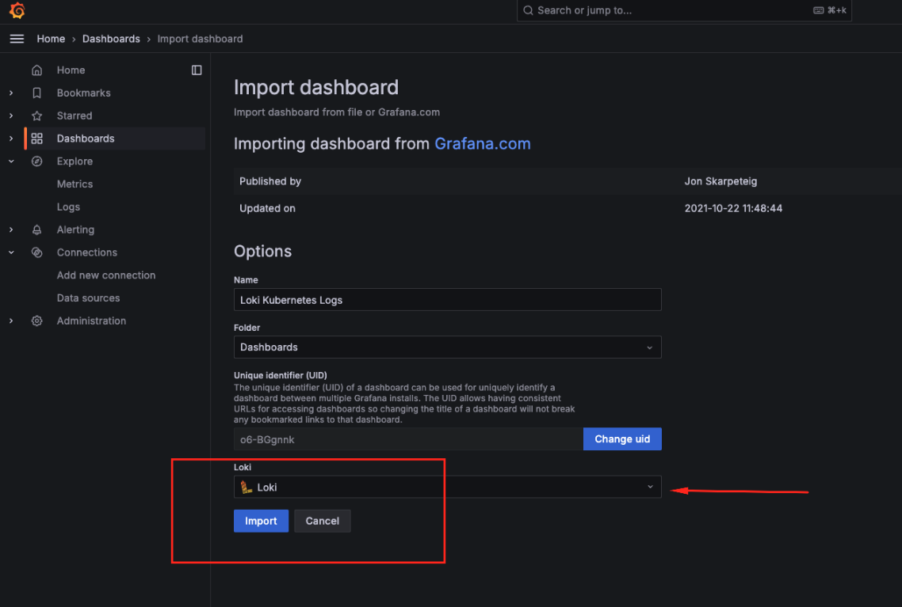
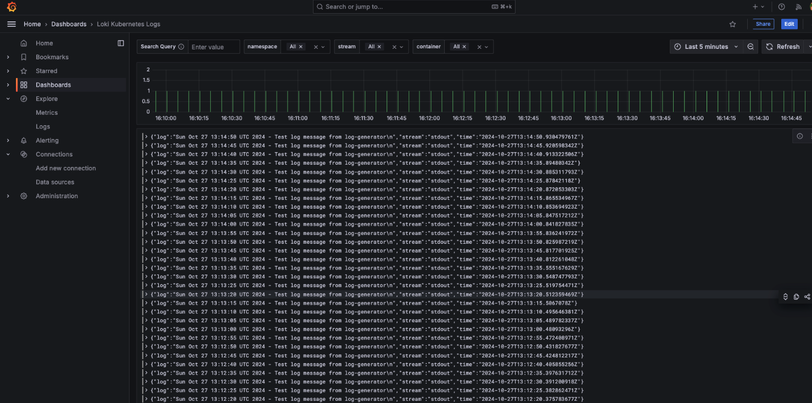
