# Install Loki,Promtail,Grafana
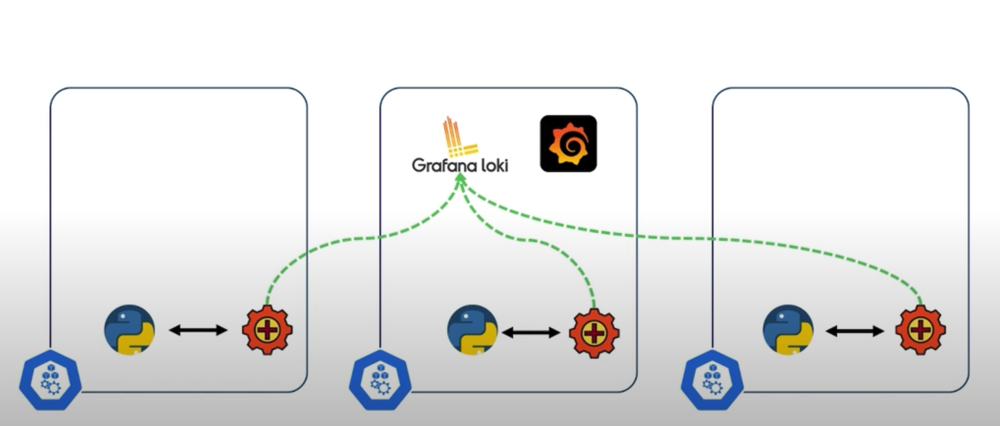
## What is Loki?

Loki is a log aggregation system developed by Grafana Labs, designed specifically for storing and querying logs. Unlike traditional logging solutions, Loki is optimized for a "cost-effective" and "lightweight" approach by only indexing metadata (like labels) and not the full log content, making it more efficient and affordable to operate.

## What is Promtail

Promtail is an agent that collects logs from various sources and sends them to Loki for storage and querying. It’s part of the Grafana Loki logging stack, designed to simplify log collection and forwarding.

## Loki-Stack Helm Chart

The Loki Stack Helm chart is a pre-configured set of resources that deploys the full Loki logging stack in Kubernetes. This Helm chart simplifies the deployment and management of Loki, Promtail, and other optional components like Grafana, making it easier to set up a complete logging solution within a Kubernetes cluster

## What are we going to need?

Kubernetes cluster.
Grafana installation.
Grafana Loki installation.
Promtail agent on every node of the Kubernetes cluster.

## Create Kubernetes Cluster

Minikube is a lightweight Kubernetes implementation that creates a VM on your local machine and deploys a simple cluster containing only one node.

- First, install Docker Desktop on your Mac. The easiest way to do so is to get the .dmg file from Docker’s website.

```bash
brew install minikube kubectl
minikube start
```


## Loki-Stack Helm Chart

- Add Repo

```bash
helm repo add grafana https://grafana.github.io/helm-charts
helm repo update
```

- We can check all repo 

```bash
helm search repo loki
```
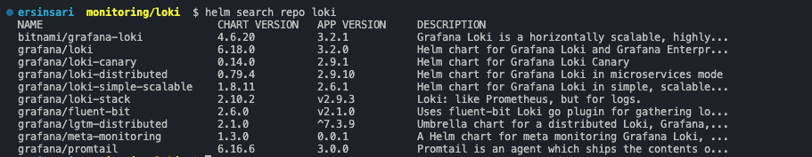

- We will use grafana/loki-stack helm chart so lets get values.yaml

```bash
helm show values grafana/loki-stack > loki-values.yaml
```

- Customize values.yaml for our scenario.

```yaml

loki:
  enabled: true
  isDefault: true
  url: http://{{(include "loki.serviceName" .)}}:{{ .Values.loki.service.port }}
  readinessProbe:
    httpGet:
      path: /ready
      port: http-metrics
    initialDelaySeconds: 45
  livenessProbe:
    httpGet:
      path: /ready
      port: http-metrics
    initialDelaySeconds: 45
  datasource:
    jsonData: "{}"
    uid: ""


promtail:
  enabled: true
  config:
    logLevel: info
    serverPort: 3101
    clients:
      - url: http://{{ .Release.Name }}:3100/loki/api/v1/push


grafana:
  enabled: true
  sidecar:
    datasources:
      label: ""
      labelValue: ""
      enabled: true
      maxLines: 1000
  image:
    tag: latest
```


- Install loki stack include promtail,loki and grafana

```bash
helm upgrade --install loki -f loki-values.yaml -n logging --create-namespace grafana/loki-stack 
```
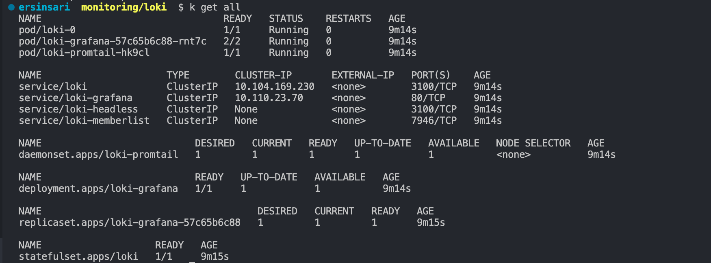

- Port-forward grafana services and go to grafana ui

```bash
kubectl port-forward service/loki-grafana 3000:80
```

- You can get grafana admin-password via below command

```bash
kubectl get secret loki-grafana -o jsonpath="{.data.admin-password}" | base64 --decode
```

```yaml
http://localhost:3000
username: admin
password: admin-password # add your password
```

- Thanks to grafana/loki-stack helm-chart you can see Loki has been configured In Data sources  as shown below

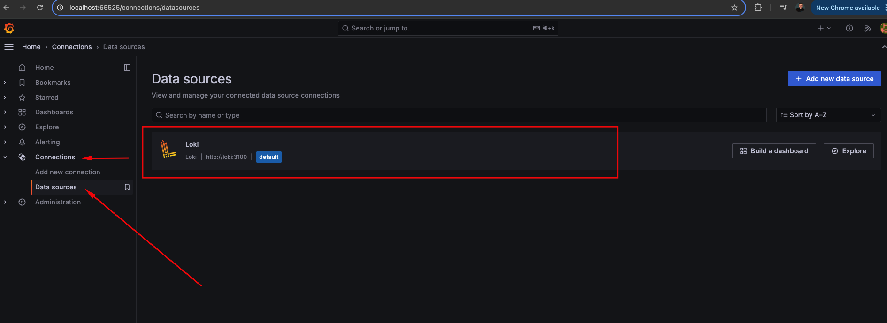

- We can check all pods logs grafana explore section.

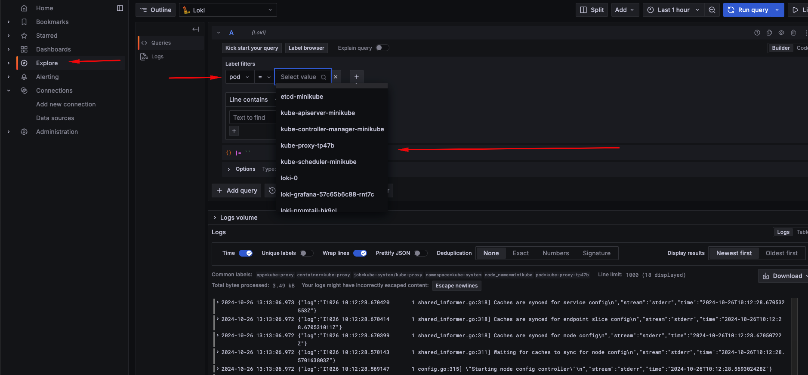
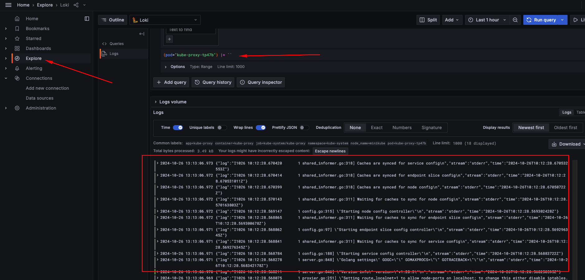

## Deploy App to Collect logs

- Lets deploy a app and collect logs by using grafana-loki

deployment.yaml

```yaml
apiVersion: apps/v1
kind: Deployment
metadata:
  name: log-generator
  labels:
    app: log-generator
spec:
  replicas: 1
  selector:
    matchLabels:
      app: log-generator
  template:
    metadata:
      labels:
        app: log-generator
    spec:
      containers:
        - name: log-generator
          image: busybox
          command:
            - /bin/sh
            - -c
            - |
              while true; do
                echo "$(date) - Test log message from log-generator"
                sleep 5
              done
```

```bash
kubectl create ns app
kubectl apply -f deployment.yaml -n app
```

- Go to grafana ui and select explore section  in left-hand-menu and select log generator pod

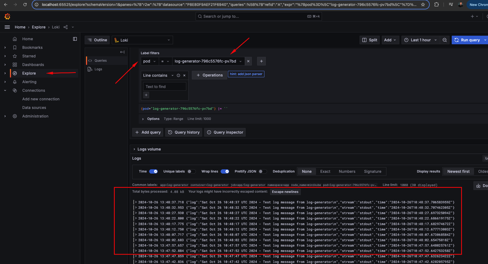
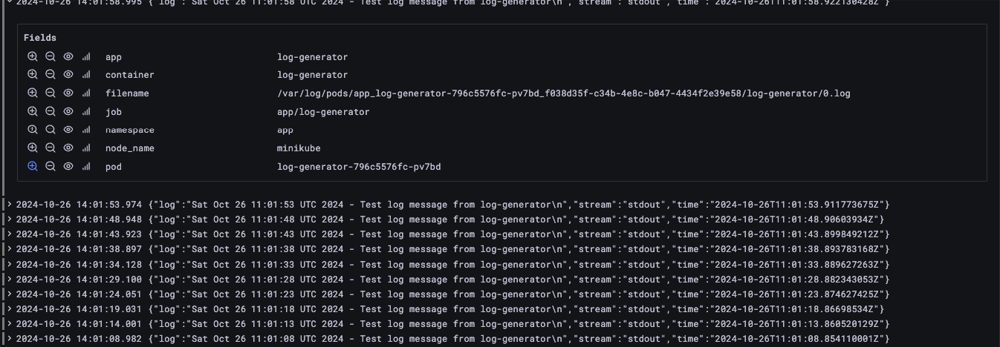

- We can add labels for spesific pod or app by manipulating promtail-config

```bash
kubectl get secret 
kubectl get secret loki-promtail -o jsonpath="{.data.promtail\.yaml}" | base64 --decode > promtail-config.yaml
```
promtail-config.yaml
```yaml
server:
  log_level: info
  log_format: logfmt
  http_listen_port: 3101
  

clients:
  - url: http://loki:3100/loki/api/v1/push

positions:
  filename: /run/promtail/positions.yaml

scrape_configs:
  # See also https://github.com/grafana/loki/blob/master/production/ksonnet/promtail/scrape_config.libsonnet for reference
  - job_name: kubernetes-pods
    pipeline_stages:
      - cri: {}                
    kubernetes_sd_configs:
      - role: pod
    relabel_configs:
      - source_labels:
          - __meta_kubernetes_pod_controller_name
        regex: ([0-9a-z-.]+?)(-[0-9a-f]{8,10})?
        action: replace
        target_label: __tmp_controller_name
      - source_labels:
          - __meta_kubernetes_pod_label_app_kubernetes_io_name
          - __meta_kubernetes_pod_label_app
          - __tmp_controller_name
          - __meta_kubernetes_pod_name
        regex: ^;*([^;]+)(;.*)?$
        action: replace
        target_label: app
      - source_labels:
          - __meta_kubernetes_pod_label_app_kubernetes_io_instance
          - __meta_kubernetes_pod_label_instance
        regex: ^;*([^;]+)(;.*)?$
        action: replace
        target_label: instance
      - source_labels:
          - __meta_kubernetes_pod_label_app_kubernetes_io_component
          - __meta_kubernetes_pod_label_component
        regex: ^;*([^;]+)(;.*)?$
        action: replace
        target_label: component
      - action: replace
        source_labels:
        - __meta_kubernetes_pod_node_name
        target_label: node_name
      - action: replace
        source_labels:
        - __meta_kubernetes_namespace
        target_label: namespace
      - action: replace
        replacement: $1
        separator: /
        source_labels:
        - namespace
        - app
        target_label: job
      - action: replace
        source_labels:
        - __meta_kubernetes_pod_name
        target_label: pod
      - action: replace
        source_labels:
        - __meta_kubernetes_pod_container_name
        target_label: container
      - action: replace
        replacement: /var/log/pods/*$1/*.log
        separator: /
        source_labels:
        - __meta_kubernetes_pod_uid
        - __meta_kubernetes_pod_container_name
        target_label: __path__
      - action: replace
        regex: true/(.*)
        replacement: /var/log/pods/*$1/*.log
        separator: /
        source_labels:
        - __meta_kubernetes_pod_annotationpresent_kubernetes_io_config_hash
        - __meta_kubernetes_pod_annotation_kubernetes_io_config_hash
        - __meta_kubernetes_pod_container_name
        target_label: __path__
limits_config:
tracing:
  enabled: false

```


- our logs format :
```bash
2024-10-26 14:19:06.065	
{"log":"Sat Oct 26 11:19:06 UTC 2024 - Test log message from log-generator\n","stream":"stdout","time":"2024-10-26T11:19:06.022721667Z"}
```

- We want to add 'time' and 'stream' section as a labels.

- Add below code-block into promtail-config.yaml

```yaml
      - match:
          selector: '{app="log-generator"}'
          stages:
            - json:
                expressions:
                  stream: stream
                  time: time
              labels:
                code:
                time:
```


- new promtail-config.yaml as below.

```yaml
server:
  log_level: info
  log_format: logfmt
  http_listen_port: 3101
  

clients:
  - url: http://loki:3100/loki/api/v1/push

positions:
  filename: /run/promtail/positions.yaml

scrape_configs:
  - job_name: kubernetes-pods
    pipeline_stages:
      - cri: {}

      - match:                                         ##first
          selector: '{app="log-generator"}'            ## app label
          stages:
            - json:
                expressions:
                  stream: stream
                  time: time
              labels:
                code:
                time:                                  ### last 
                
    kubernetes_sd_configs:
      - role: pod
    relabel_configs:
      - source_labels:
          - __meta_kubernetes_pod_controller_name
        regex: ([0-9a-z-.]+?)(-[0-9a-f]{8,10})?
        action: replace
        target_label: __tmp_controller_name
      - source_labels:
          - __meta_kubernetes_pod_label_app_kubernetes_io_name
          - __meta_kubernetes_pod_label_app
          - __tmp_controller_name
          - __meta_kubernetes_pod_name
        regex: ^;*([^;]+)(;.*)?$
        action: replace
        target_label: app
      - source_labels:
          - __meta_kubernetes_pod_label_app_kubernetes_io_instance
          - __meta_kubernetes_pod_label_instance
        regex: ^;*([^;]+)(;.*)?$
        action: replace
        target_label: instance
      - source_labels:
          - __meta_kubernetes_pod_label_app_kubernetes_io_component
          - __meta_kubernetes_pod_label_component
        regex: ^;*([^;]+)(;.*)?$
        action: replace
        target_label: component
      - action: replace
        source_labels:
        - __meta_kubernetes_pod_node_name
        target_label: node_name
      - action: replace
        source_labels:
        - __meta_kubernetes_namespace
        target_label: namespace
      - action: replace
        replacement: $1
        separator: /
        source_labels:
        - namespace
        - app
        target_label: job
      - action: replace
        source_labels:
        - __meta_kubernetes_pod_name
        target_label: pod
      - action: replace
        source_labels:
        - __meta_kubernetes_pod_container_name
        target_label: container
      - action: replace
        replacement: /var/log/pods/*$1/*.log
        separator: /
        source_labels:
        - __meta_kubernetes_pod_uid
        - __meta_kubernetes_pod_container_name
        target_label: __path__
      - action: replace
        regex: true/(.*)
        replacement: /var/log/pods/*$1/*.log
        separator: /
        source_labels:
        - __meta_kubernetes_pod_annotationpresent_kubernetes_io_config_hash
        - __meta_kubernetes_pod_annotation_kubernetes_io_config_hash
        - __meta_kubernetes_pod_container_name
        target_label: __path__
limits_config:
tracing:
  enabled: false
```

- To apply the new Promtail configuration, the Loki secret needs to be deleted and recreated with the new configuration.

```bash
kubectl delete secret loki-promtail
```
- Create secret by using new promtail-config

loki-secret.yaml

```yaml
apiVersion: v1
kind: Secret
metadata:
  name: loki-promtail
  namespace: logging
  labels:
    app: promtail
type: Opaque
stringData:
  promtail.yaml: |
    server:
      log_level: info
      log_format: logfmt
      http_listen_port: 3101

    clients:
      - url: http://loki:3100/loki/api/v1/push

    positions:
      filename: /run/promtail/positions.yaml

    scrape_configs:
      - job_name: kubernetes-pods
        pipeline_stages:
          - cri: {}
          - match:
              selector: '{app="log-generator"}'
              stages:
                - json:
                    expressions:
                      stream: stream
                      time: time
                - labels:
                    stream:
                    time:
        kubernetes_sd_configs:
          - role: pod
        relabel_configs:
          - source_labels:
              - __meta_kubernetes_pod_controller_name
            regex: ([0-9a-z-.]+?)(-[0-9a-f]{8,10})?
            action: replace
            target_label: __tmp_controller_name
          - source_labels:
              - __meta_kubernetes_pod_label_app_kubernetes_io_name
              - __meta_kubernetes_pod_label_app
              - __tmp_controller_name
              - __meta_kubernetes_pod_name
            regex: ^;*([^;]+)(;.*)?$
            action: replace
            target_label: app
          - source_labels:
              - __meta_kubernetes_pod_label_app_kubernetes_io_instance
              - __meta_kubernetes_pod_label_instance
            regex: ^;*([^;]+)(;.*)?$
            action: replace
            target_label: instance
          - source_labels:
              - __meta_kubernetes_pod_label_app_kubernetes_io_component
              - __meta_kubernetes_pod_label_component
            regex: ^;*([^;]+)(;.*)?$
            action: replace
            target_label: component
          - action: replace
            source_labels:
            - __meta_kubernetes_pod_node_name
            target_label: node_name
          - action: replace
            source_labels:
            - __meta_kubernetes_namespace
            target_label: namespace
          - action: replace
            replacement: $1
            separator: /
            source_labels:
            - namespace
            - app
            target_label: job
          - action: replace
            source_labels:
            - __meta_kubernetes_pod_name
            target_label: pod
          - action: replace
            source_labels:
            - __meta_kubernetes_pod_container_name
            target_label: container
          - action: replace
            replacement: /var/log/pods/*$1/*.log
            separator: /
            source_labels:
            - __meta_kubernetes_pod_uid
            - __meta_kubernetes_pod_container_name
            target_label: __path__
          - action: replace
            regex: true/(.*)
            replacement: /var/log/pods/*$1/*.log
            separator: /
            source_labels:
            - __meta_kubernetes_pod_annotationpresent_kubernetes_io_config_hash
            - __meta_kubernetes_pod_annotation_kubernetes_io_config_hash
            - __meta_kubernetes_pod_container_name
            target_label: __path__

    limits_config:

    tracing:
      enabled: false
```
```bash
kubectl apply -f loki-secret.yaml
```
- To allow the Promtail pod to use the new configuration file, we need to restart the pod.

```bash
kubectl delete pod <loki-promtail-pod-name>
```
- Wait until the new pod is up and running.

- Now we can see time and stream as a label in log 


## Add Dashboard Grafana to loki for checking logs

- Go to grafana webui and select dashboard left-hand-menu and click new and import
- Enter the template ID  --> 15141  and click load
- Select Loki as a data source

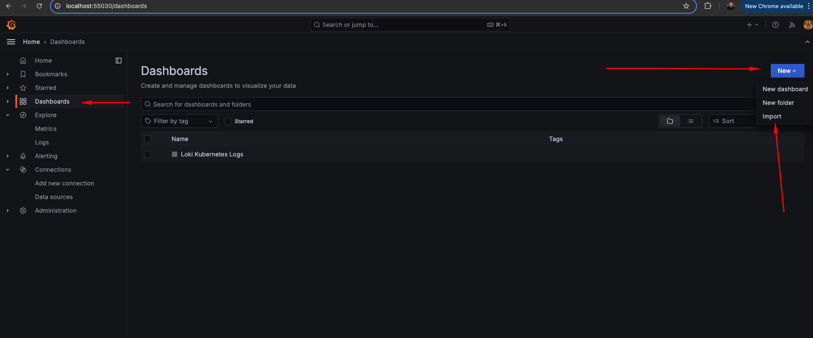
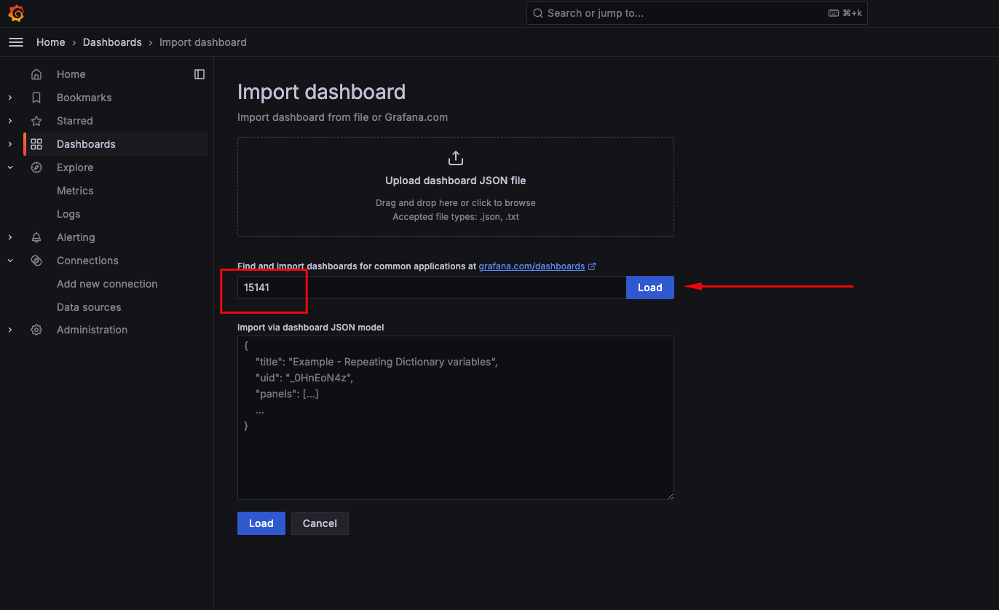
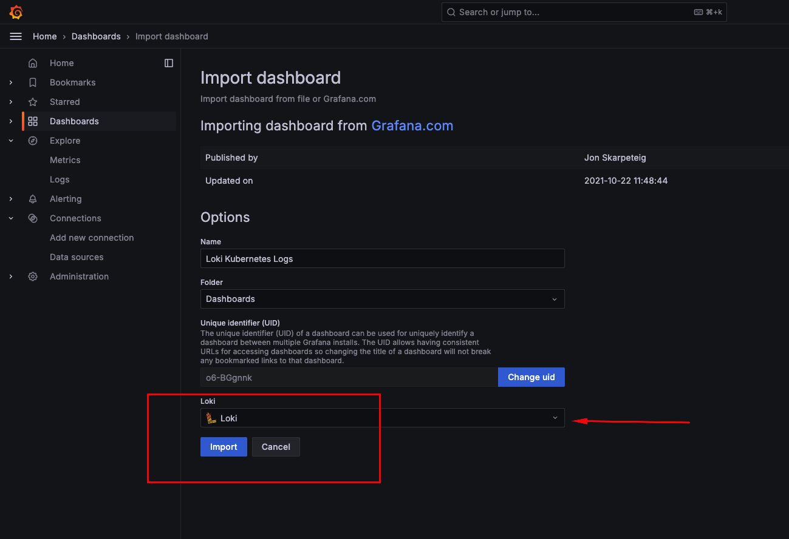
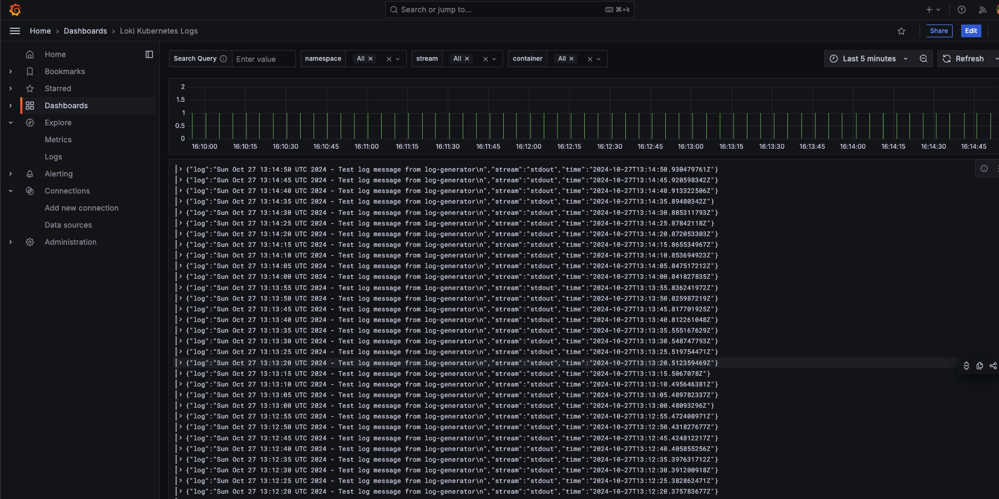
