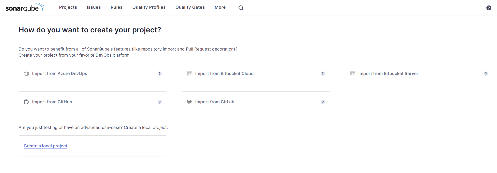

# How to Set Up SonarQube with PostgreSQL, Nginx and LDAP Using Docker Compose: A Comprehensive Guide

SonarQube is a top-tier source code quality management application that provides comprehensive code analysis and support for 17 programming languages. It is the preferred solution for static code analysis and code coverage, and it is extensively used by both developers and organizations.

This article will provide you with a step-by-step guide to establishing SonarQube using Docker Compose, which is integrated with a PostgreSQL database and a Nginx proxy to redirect traffic to port 80 on your domain.

Finally, we will configure SonarQube authentication and authorization to an LDAP server by configuring the appropriate values in `<SONARQUBE_HOME>/conf/sonar.properties`.

## Prerequisites

Before we start, ensure you have the following:

- An instance with a minimum of 2 vCPUs and 4 GB RAM.
- Docker and Docker Compose are installed on your machine.
- Open port 80
  
We may move further with the system settings now.

## System Configuration

SonarQube has to make some system adjustments because it uses Elasticsearch to store its indices in an MMap FS directory. You must ensure that:

- The process is allowed to have a maximum of 524288 memory map areas, as specified by the `vm.max_map_count` parameter.
- The value of the maximum number of open file descriptors `fs.file-max` is set to a minimum of 131072.
- The SonarQube user has a minimum capacity to open 131072 file descriptors.
- The SonarQube user has the capability to initiate a minimum of 8192 threads.

Use the steps provided below according to your operating system:

#### For Red Hat, CentOS, or Amazon Linux

```bash
sudo yum update -y
sysctl -w vm.max_map_count=524288
sysctl -w fs.file-max=131072
ulimit -n 131072
ulimit -u 8192
```

#### For Ubuntu or Debian

```bash
sudo apt update -y
sysctl -w vm.max_map_count=524288
sysctl -w fs.file-max=131072
ulimit -n 131072
ulimit -u 8192
```

### Installation

In order to establish our services, we require a `docker-compose.yml` file.

```yaml
version: "3"

services:
  sonarqube:
    image: sonarqube:latest
    container_name: sonarqube
    restart: unless-stopped
    depends_on:
      - db
    environment:
      SONAR_JDBC_URL: jdbc:postgresql://db:5432/sonar
      SONAR_JDBC_USERNAME: sonar
      SONAR_JDBC_PASSWORD: sonar
    volumes:
      - sonarqube_data:/opt/sonarqube/data
      - sonarqube_extensions:/opt/sonarqube/extensions
      - sonarqube_logs:/opt/sonarqube/logs
    ports:
      - "9000:9000"

  db:
    image: postgres:15
    container_name: postgresql
    environment:
      POSTGRES_USER: sonar
      POSTGRES_PASSWORD: sonar
      POSTGRES_DB: sonar
    volumes:
      - postgresql:/var/lib/postgresql
      - postgresql_data:/var/lib/postgresql/data

  nginx:
    image: nginx:latest
    container_name: nginx
    restart: unless-stopped
    depends_on:
      - sonarqube
    volumes:
      - ./nginx.conf:/etc/nginx/conf.d/default.conf
    ports:
      - "80:80"

volumes:
  sonarqube_data:
  sonarqube_extensions:
  sonarqube_logs:
  postgresql:
  postgresql_data:
```

### What We Have Here?

Three services (SonarQube, PostgreSQL, and Nginx) are included in this compose file.

- SonarQube Service uses the latest SonarQube image, connects to the PostgreSQL database, and exposes port 9000 for the web interface. It includes volumes for persistent data, extensions, and logs.
- PostgreSQL Service sets up a PostgreSQL database with environment variables for user credentials and includes volumes for data persistence.
- Nginx Service acts as a reverse proxy using the latest Nginx image, mapping port 80 to the host. It relies on a custom Nginx configuration file.

In order to redirect the traffic from `localhost:9000` to your domain on port 80, it is necessary to create a `nginx.conf` file. Make sure that this file is located in the same directory as the docker-compose.yml file.

```conf
server {
    listen 80;
    server_name yourdomain.com;

    location / {
        proxy_pass http://sonarqube:9000;
        proxy_set_header Host $host;
        proxy_set_header X-Real-IP $remote_addr;
        proxy_set_header X-Forwarded-For $proxy_add_x_forwarded_for;
        proxy_set_header X-Forwarded-Proto $scheme;
    }
}
```

### Running the Setup

Run the following command to start the setup:

```bash
sudo docker-compose up -d
```
Docker Compose orchestrates and executes your complete application. To access SonarQube, use the domain indicated in your `nginx.conf` file, which is `yourdomain.com`

  
### LDAP Configuration

Integrating LDAP (Lightweight Directory Access Protocol) with SonarQube is an essential process for firms seeking to centrally manage user authentication and authorization. LDAP integration enables the utilization of an already established LDAP directory, such as Active Directory, for the purpose of managing users. This streamlines administration by ensuring that there is just one authoritative source for user data. 

The main setup for LDAP integration in SonarQube is performed via the `sonar.properties` file. This file is usually located in  `<SONARQUBE_HOME>/conf/sonar.properties`

```conf
# LDAP Configuration
# Enable the LDAP feature
sonar.security.realm=LDAP

# General Configuration
ldap.url=ldap://ldap_server_ip:389
ldap.bindDn=CN=your_sonar_user,OU=Service Accounts,DC=your_domain,DC=top_level_domain
ldap.bindPassword=password_here

# User Configuration
ldap.user.baseDn=DC=your_domain,DC=top_level_domain
ldap.user.request=(&(objectClass=user)(sAMAccountName={login}))
ldap.user.realNameAttribute=cn
ldap.user.emailAttribute=mail

# Group Configuration
ldap.server1.group.baseDn=DC=your_domain,DC=top_level_domain
ldap.server1.group.request=(&(objectClass=group)(memberUid={uid}))
```

To implement the new configuration, restart the SonarQube server after saving the changes to the sonar.properties file.

```bash
sudo systemctl restart sonarqube
```

### Accessing SonarQube

Verify the LDAP configuration by attempting to log in with an LDAP user account after SonarQube has restarted. Ensure that the user attributes, such as email and name, are accurately populated from the LDAP directory.


