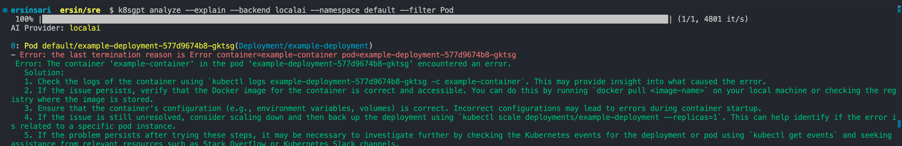

# k8sgpt

As Kubernetes continues to grow in popularity, managing and monitoring your clusters can become quite complex. That's where k8sgpt comes in. k8sgpt is a tool that uses advanced AI to make Kubernetes management easier. It helps you with tasks like monitoring your clusters and solving problems by understanding and responding to natural language commands. In this blog, I’ll look at what k8sgpt does, how it can help you, and why it might be a great addition to your Kubernetes setup.

The project already supports multiple installation options and different AI backends such as openAI,localAI,azureAI etc. In this blog, I will show you how to install and get started with K8sGPT, both the CLI tools and the Operator as well as how K8sGPT supports additional integrations.

## Installation

You can choose from several installation methods based on your operating system and personal preferences. The installation section of the documentation provides a list of these options.


```bash
https://docs.k8sgpt.ai/getting-started/installation/
```

The installation of K8sGPT requires that Homebrew is installed on your Mac.

Run the following commands:

```bash
brew tap k8sgpt-ai/k8sgpt
brew install k8sgpt
```

- To verify that K8sGPT is install correctly, you can check the version installed:

```bash
k8sgpt version
```


## K8sGPT CLI

The K8sGPT CLI is a tool that lets you manage your Kubernetes clusters using simple, natural language commands. It makes it easier to control and troubleshoot your clusters by letting you type commands.


- To view all the commands provided by K8sGPT:

```bash
k8sgpt --help
```


You can see an overview of the different commands also below link:

```bash
https://docs.k8sgpt.ai/reference/cli/
```

### Authorise an AI Backend

K8sGPT supports multiple AI providers, allowing you to choose from a variety of options to fit your needs. For example, you can use providers like OpenAI, localAI and AzureAI. By default, OpenAI is the primary provider, but keep in mind that analyzing data with OpenAI requires a minimum balance of $5. To avoid this cost and still utilize powerful AI capabilities, I opted to use LocalAI for my setup. This choice allowed me to seamlessly integrate AI without incurring additional expenses.

Ollama is an easy-to-use tool that helps you quickly start using open source large language models (LLMs). You can download Ollama from https://ollama.com/ and install it on your computer. Once installed, launch Ollama and use the command provided to download a LLM. Note that the mistral model requires ~ 4GB of disk space.

```bash
brew update
brew install ollama
brew services start ollama
ollama pull mistral
```

### Configure k8sgpt to use LocalAI using Ollama backend


```bash
k8sgpt auth add --backend localai --model mistral --baseurl http://localhost:11434/v1
```

You can list your backends with the following command:

```bash
k8sgpt auth list
```


### Install a malicious Deployment

Next, we will install a malicious Deployment into our Kubernetes cluster.This manifest is deliberately malicious as it includes an incorrect command (slep instead of sleep), causing the pod to continuously fail and enter a CrashLoopBackOff state, which makes it an ideal example for analyzing and debugging issues with K8sGPT. Here is the YAML:

deployment yaml
```yaml
apiVersion: apps/v1
kind: Deployment
metadata:
  name: example-deployment
  labels:
    app: example-app
spec:
  replicas: 1
  selector:
    matchLabels:
      app: example-app
  template:
    metadata:
      labels:
        app: example-app
    spec:
      containers:
      - name: example-container
        image: busybox
        command: ["/bin/sh", "-c", "slep 3600"]  # not slep
        ports:
        - containerPort: 80
```

service.yaml
```yaml
apiVersion: v1
kind: Service
metadata:
  name: vulnerable-service
  labels:
    app: vulnerable-app
spec:
  selector:
    app: vulnerable-app
  ports:
    - protocol: TCP
      port: 80
      targetPort: 8080
```


- Next, we will install the Deployment

```bash
kubectl apply -f deployment.yaml
kubectl apply -f service.yaml
```

Now you will see the pods throwing errors:


### Analyze your cluster by using k8s

Run the command below to get GenAI-generated insights about problems in your cluster.

```bash
k8sgpt analyze --explain --backend localai --namespace default --filter Pod
k8sgpt analyze --explain --backend localai --namespace default --filter Service
```



The analysis provided by K8sGPT identifies a CrashLoopBackOff issue with the pod, indicating that the container within the pod encountered an error. The suggested steps to troubleshoot this include checking container logs, verifying the Docker image, ensuring correct configuration, scaling the deployment, and reviewing Kubernetes events for further insights.

### Integration

Integrating K8sGPT with tools like Trivy, Grafana, or Prometheus can enhance its capabilities for Kubernetes security, monitoring, and analysis.Trivy is a vulnerability scanner for container images and file systems. Integrating K8sGPT with Trivy can help analyze vulnerabilities in your Kubernetes clusters.

You can list all available integration with the following command:

```bash
k8sgpt integration list
```


Next, we want to activate the Trivy integration:

```bash
k8sgpt integration activate trivy
```
This will install the Trivy Operator inside of your cluster

- Once the integration is activated, we can use the Vulnerability Reports created by Trivy as part of our K8sGPT analysis through k8sgpt filters:


- The filters in K8sGPT are mapped to specific analyzers in the code, which focus on extracting and examining only the most relevant information, such as the most critical vulnerabilities.

To use the VulnerabilityReport filter 

```bash
k8sgpt analyse --filter=VulnerabilityReport
```


## K8sGPT Operator

The CLI tool lets cluster admins run on-the-spot scans on their infrastructure and workloads. Meanwhile, the K8sGPT operator works continuously in your cluster, running all the time. It is built specifically for Kubernetes, using Custom Resources to create reports that are stored in your cluster as YAML files.

- To install the Operator, follow the documentation link (https://docs.k8sgpt.ai/getting-started/in-cluster-operator/) or the commands provided below:

You will  need to install the kube-prometheus-stack Helm Chart to use Grafana and Prometheus. You can do this with the following commands:

```bash
helm repo add prometheus-community https://prometheus-community.github.io/helm-charts
helm repo update
helm install prom prometheus-community/kube-prometheus-stack -n monitoring --create-namespace
```

In this setup, we instruct K8sGPT to install a ServiceMonitor, which sends scan report metrics to Prometheus and sets up a Dashboard for K8sGPT.

k8sgpt-values.yaml
```yaml
serviceAccount:
  create: true
  name: "k8sgpt"
  # -- Annotations for the managed k8sgpt workload service account
  annotations: {}
serviceMonitor:
  enabled: true
  additionalLabels:
    release: prom
  namespace: monitoring
grafanaDashboard:
  enabled: true
  # The namespace where Grafana expects to find the dashboard
  # namespace: ""
  folder:
    annotation: grafana_folder
    name: ai
  label:
    key: grafana_dashboard
    value: "1"
  # create GrafanaDashboard custom resource referencing to the configMap.
  # according to https://grafana-operator.github.io/grafana-operator/docs/examples/dashboard_from_configmap/readme/
  grafanaOperator:
    enabled: false
    matchLabels:
      dashboards: "grafana"
controllerManager:
  kubeRbacProxy:
    containerSecurityContext:
      allowPrivilegeEscalation: false
      capabilities:
        drop:
        - ALL
    image:
      repository: gcr.io/kubebuilder/kube-rbac-proxy
      tag: v0.16.0
    resources:
      limits:
        cpu: 500m
        memory: 128Mi
      requests:
        cpu: 5m
        memory: 64Mi
  manager:
    sinkWebhookTimeout: 30s
    containerSecurityContext:
      allowPrivilegeEscalation: false
      capabilities:
        drop:
        - ALL
    image:
      repository: ghcr.io/k8sgpt-ai/k8sgpt-operator
      tag: v0.1.7  # x-release-please-version
    resources:
      limits:
        cpu: 500m
        memory: 128Mi
      requests:
        cpu: 10m
        memory: 64Mi
  replicas: 1
  ## Node labels for pod assignment
  ## ref: https://kubernetes.io/docs/user-guide/node-selection/
  #
  nodeSelector: {}
kubernetesClusterDomain: cluster.local
metricsService:
  ports:
  - name: https
    port: 8443
    protocol: TCP
    targetPort: https
  type: ClusterIP
```

```bash
helm repo add k8sgpt https://charts.k8sgpt.ai/
helm repo update
helm install release k8sgpt/k8sgpt-operator -n k8sgpt-operator-system --create-namespace -f k8sgpt-values.yaml
```
 
- Then, we need to configure the K8sGPT Operator to know which version of K8sGPT to use and which AI backend:

k8sgpt-backend.yaml
```yaml
apiVersion: core.k8sgpt.ai/v1alpha1
kind: K8sGPT
metadata:
  name: k8sgpt-ollama
spec:
  ai:
    enabled: true
    model: mistral
    backend: localai
    baseUrl: http://host.docker.internal:11434/v1
  noCache: false
  filters: ["Pod", "Service"]
  repository: ghcr.io/k8sgpt-ai/k8sgpt
  version: v0.3.17
  # sink:
  #   type: slack
  #   webhook: <url>
```
- We need to apply this file to our K8sGPT cluster namespace

```bash
kubectl apply -n k8sgpt-operator-system -f k8sgpt-backend.yaml
```

- That’s all with the operator setup. The operator will watch for problems in the cluster and generate analysis results that you can view using the command below

```bash
kubectl get results -n k8sgpt-operator-system -o json | jq .
```

- During the installation of K8sGPT, we set serviceMonitor to true, which ensures that a ServiceMonitor is created to send metrics from K8sGPT to Prometheus. Once this is configured correctly, you should be able to see a new target for K8sGPT under the Prometheus targets section, specifically within the Kubernetes targets. This integration allows Prometheus to continuously monitor K8sGPT's performance and activity within the cluster, providing valuable insights through metrics.


```bash
kubectl port-forward service/prom-kube-prometheus-stack-prometheus -n monitoring 9090:9090
```

- Open localhost:9090 and navigate to Status --> Targets and then you should see the serviceMonitor with thes result:


- Lastly Go to Grafana Dashboard.

```bash
kubectl port-forward service/prom-grafana -n monitoring 3000:3000
```

- Open localhost:3000 and then navigate to Dashboards>K8sGPT Overview and then you will see the Dashboard with your results:


This blog  explained the main features of K8sGPT. First, we looked at the K8sGPT CLI, then how it works better with integrations, and finally installed the operator for continuous analysis inside the cluster with grafana dashboard.